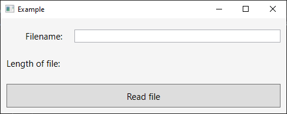
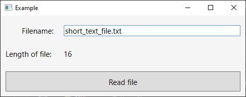
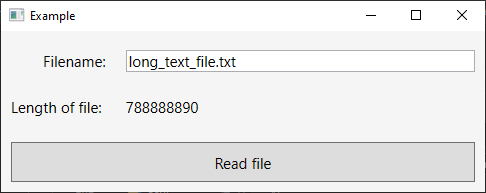
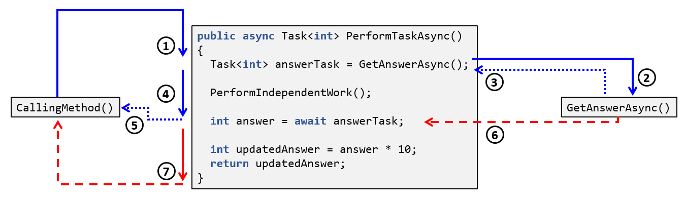
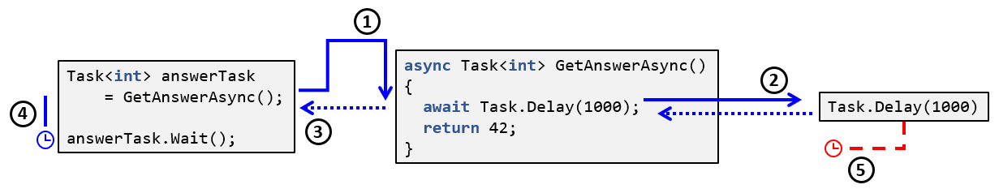

<frontmatter>
  title: Asynchronous Programming In C# Using Async/Await
  header: pagetop.md
  footer: footer.md
  head: head.md
  siteNav: mainNav.md
  pageNav: 3
</frontmatter>

<div class="website-content">

{{ booktitle | safe }}

# Asynchronous Programming In C# Using Async/Await

**Author: [Muhammad Irham Rasyidi Bin Zainal](https://github.com/xantho09)**<br>
Reviewers: [Jeffry Lum](https://github.com/j-lum)

<box id="article-toc">

* [What Is Asynchronous Programming](#what-is-asynchronous-programming)
* [Example Of Asynchronous Programming](#example-of-asynchronous-programming)
* [Basic Syntax‎](#basic-syntax)
    * [Async](#async)
    * [Await](#await)
    * [Returning Values](#returning-values)
* [Control Flow‎](#control-flow)
* [Disadvantages Of Async/Await](#disadvantages-of-asyncawait)
    * [Potential Pitfall: Deadlock](#potential-pitfall-deadlock)
    * [Additional Overhead](#additional-overhead)
* [Resources](#resources)
* [Further Reading](#further-reading)

</box>

## What Is Asynchronous Programming?

In **synchronous programming**, code is executed one step at a time, waiting for each step to be finished before proceeding to the next step. For example, if the code looks something like this:

1. Perform Task 1.
2. Perform Task 2.
3. Perform Task 3.
4. Use the result from Task 1 to perform Task 4.

Then a synchronous execution of this code will start executing Task 1 and wait for it to finish before starting Task 2. Then it will wait for Task 2 to finish before starting Task 3, and so on.

In general, this would be fine. However, if Tasks 1, 2 and 3 happen to be independent of each other, and we have a few additional threads available, we can do better:

- Since tasks 1, 2 and 3 are independent of each other, we can start all three tasks in their own separate threads without needing to wait for any individual task to finish before starting another.
- Task 4 only needs the result from Task 1 to run. So as long as Task 1 has completed, even if Tasks 2 and 3 are still running, we can start the execution of Task 4.

Our modified code can look something like this:

1. Start running Task 1 on Thread A.
2. Start running Task 2 on Thread B.
3. Start running Task 3 on Thread C.
4. Wait for Task 1 to finish.
5. Use the result from Task 1 to start Task 4 on Thread A.
6. Wait for Tasks 2, 3 and 4 to finish.

<box type="info">

Note that Tasks 1, 2 and 3 may not necessarily finish in that order (e.g. It is perfectly possible for Task 3 to finish before Tasks 1 and 2). 

</box>

This is the main idea behind **asynchronous programming**: allowing multiple processes to occur at the same time. When we start a task, the program keeps running. When the tasks finish, the program can access the results.

When used correctly, this can result in better utilization of resources at hand, allowing for better performance or program responsiveness.

There are many in-depth tutorials online about asynchronous programming, such as [Microsoft's tutorial on MSDN](https://docs.microsoft.com/en-us/dotnet/csharp/programming-guide/concepts/async/) and [Stephen Cleary's blog post](https://blog.stephencleary.com/2012/02/async-and-await.html). Therefore, this chapter will only provide an overview.

## Example Of Asynchronous Programming

To see why asynchronous programming can be useful, consider the following example:



Here, we have a simple application where the user will type in the name of a file. When the button is pressed, the application will read the specified file and display its length.

The code for the Button's logic currently looks like this:

```csharp
private void Button_Click(object sender, RoutedEventArgs e)
{
    // Get the name of the file to read.
    string filename = FilenameTextBox.Text;

    // Read the contents of the file.
    string fileContents;
    using (var reader = new StreamReader(filename))
    {
        fileContents = reader.ReadToEnd();
    }

    // Display the length of the file contents.
    OutputTextBlock.Text = fileContents.Length.ToString();
}
```

Sure enough, when you test it out with a short text file with 16 characters, it works as expected:



However, when you try out a significantly larger text file, over 700 MB large, you notice an issue: during the file-reading process, **the application completely freezes**. The user cannot interact with the text box, move or resize the window, or minimize it. Only after about 5 seconds does the operation complete, causing the application to become responsive again.



The main reason this occurs is because the `Button_Click()` is run _synchronously_ on the UI Thread. When the code execution reaches Line 10 in the above code snippet, the UI Thread needs to wait until the [`reader.ReadToEnd()`](https://docs.microsoft.com/en-us/dotnet/api/system.io.streamreader.readtoend?view=netcore-3.1) method terminates before it can proceed to the next line, causing the UI thread to be blocked. This means it cannot respond to any other actions performed by the user, resulting in the application appearing frozen.

We can avoid this by making the operation asynchronous like so:

```csharp {highlight-lines="1, 10, 12"}
private async void Button_Click(object sender, RoutedEventArgs e)
{
    // Get the name of the file to read.
    string fileName = FilenameTextBox.Text;

    string fileContents;
    using (var reader = new StreamReader(fileName))
    {
        // Start reading the contents of the file.
        Task<string> readingTask = reader.ReadToEndAsync();
        // Asynchronously wait for the task to finish.
        fileContents = await readingTask;
    }

    // Display the length of the file contents.
    OutputTextBlock.Text = fileContents.Length.ToString();
}
```

Here, we've replaced the `ReadToEnd()` method with its asynchronous counterpart, [`ReadToEndAsync()`](https://docs.microsoft.com/en-us/dotnet/api/system.io.streamreader.readtoendasync?view=netcore-3.1). This method will return a `Task<string>` object, denoting that the file reading operation has started, but may not have necessarily finished. The magic happens in the next line where we `await` that task. If the task has yet to complete, it will suspend the `Button_Click()` method and yield control to the method's caller. In other words, the execution will `return` from the `Button_Click()` method, giving control back to the UI thread while waiting for the task to complete, allowing the application to become responsive again.

When the task eventually completes, the UI thread will come back to execute the rest of the method, thus displaying the length of the file as desired.

<box type="info">

Lines 10 and 12 can actually be shortened to a single line:

```csharp {start-from=10}
fileContents = await reader.ReadToEndAsync();
```

In the example, it was written as two lines for explanatory purposes.

</box>

## Basic Syntax

Let's briefly look at the keywords and how to use them.

### Async

The `async` keyword is in a method's signature to specify that it is asynchronous. It allows the use of the `await` keyword within the method and changes how the method's return values are handled.

```csharp {highlight-lines="1"}
async Task<int> GetAnswerToLifeAsync() 
{
    // The answer shall come only after 42 seconds.
    await Task.Delay(42000);
    return 42;
}
```

Note that while it's used to specify that a method is asynchronous, _the `async` keyword by itself does not provide any asynchronous functionality to the method_; that is the job of the `await` keyword.

### Await

The `await` keyword is a unary operator that takes in an **awaitable** object. This is usually a [`Task`](https://docs.microsoft.com/en-us/dotnet/api/system.threading.tasks.task?view=netcore-3.1), representing an asynchronous operation, or a [`Task<T>`](https://docs.microsoft.com/en-us/dotnet/api/system.threading.tasks.task-1?view=netcore-3.1), representing an asynchronous opeartion that returns a value of type `T`. As mentioned previously, the `await` keyword can only be used in a method that has been marked as `async`.

`await` will check if the specified awaitable has completed. If it has, then the method will continue as per usual. If it has not, the execution will `return` from the `async` method while asynchronously waiting for the task to complete. When the task eventually completes, the remainder of the method will be executed.

```csharp {highlight-lines="12"}
void CallingMethod()
{
    Task jobTask = PerformJobAsync();
}

async Task PerformJobAsync()
{
    Task<int> answerTask = GetAnswerToLifeAsync();
    PerformIndependentWork();

    // If answerTask is not complete, return to CallingMethod().
    int answer = await answerTask;

    // After answerTask completes, this line is executed.
    Console.WriteLine("The answer is " + answer + "!");
}
```

<box type="info">

Which thread exactly executes the remainder of the method depends on the captured [`SynchronizationContext`](https://docs.microsoft.com/en-us/dotnet/api/system.threading.synchronizationcontext?view=netcore-3.1) of the awaitable object. More information can be found on [Stephen Cleary's blog post](https://blog.stephencleary.com/2012/02/async-and-await.html)

</box>

<box type="info">

It is possible to create custom awaitable types aside from `Task` and `Task<T>`. Refer to [this blog post](https://devblogs.microsoft.com/pfxteam/await-anything/) for more details.

</box>

### Returning Values

`async` methods can return `Task`, `Task<T>` or `void`, depending on the result of the asynchronous task, if any. If the task has a result of type `T` upon completion, then the return type of the `async` method is `Task<T>`. In this case, the method must return a value of type `T` _(Note: not `Task<T>`)_.


```csharp {highlight-lines="1, 7"}
async Task<int> ReadIntFromFileAsync(string filename)
{
    using (var reader = new StreamReader(filename))
    {
        string fileContents = await reader.ReadLineAsync();
        // The return value is of type int instead of Task<int>.
        return int.Parse(fileContents);
    }
}
```

If the task does not have a result, then the return type of the `async` method can either be `Task` or `void`. 

```csharp {highlight-lines="1"}
async Task WriteIntToFileAsync(string filename, int integerToWrite)
{
    using (var writer = new StreamWriter(filename))
    {
        await writer.WriteLineAsync(integerToWrite.ToString());
    }
}
```

<box type="info">

Returning a `Task` is usually favourable to returning `void`, since a `Task` is awaitable while `void` is not. However, there are situations where `void` is the preferred return type. The primary use case is event handlers, such as the Button Click event handler in the very first example.

</box>

There is a bit of a disconnect between the return type of the `async` method and the type of the value being returned, which takes some getting used to. More information on this design be found on [Stephen Cleary's blog post.](https://blog.stephencleary.com/2011/09/async-ctp-why-do-keywords-work-that-way.html)

## Control Flow

Let's take a look at an example to see the control flow of an asynchronous method as a whole:



1. The `PerformTaskAsync()` method is called by an external method, which we'll call the `CallingMethod()`. Let the thread making this call be denoted as the _"main thread"_, drawn in blue lines.
2. The method makes a call to another `async` method, `GetAnswerAsync()`.
3. `GetAnswerAsync()` will return a `Task<int>` object while it continues in the background.
4. The method continues its execution. This is performed _synchronously_ on the main thread.
5. The execution hits an `await` statement. Since the `answerTask` has yet to finish, the main thread suspends the method and `return`s to the `CallingMethod`.
6. Eventually, the `GetAnswerAsync` method finishes. The execution of the remainder of the `PerformTaskAsync` method is invoked on some thread, let's call it the _"secondary thread"_, drawn in red lines.
7. The remainder of the method gets executed on the secondary thread.

<box type="info">

As mentioned before, details on which thread executes the remainder of the method can be found on [Stephen Cleary's blog post](https://blog.stephencleary.com/2012/02/async-and-await.html).

</box>

<box type="info">

Notice how the execution of the method is synchronous until it reaches the `await` statement. This means that if the `async` method does not contain any `await` statements, the entire method will be executed synchronously. The compiler will provide a warning in such a case:

```csharp
async Task<int> NoAwaitTask()
{
    // Compiler warning:
    // This async method lacks 'await' operators and will run synchronously.
    // Consider using the 'await' operator to await non-blocking API calls,
    // or 'await Task.Run(...)' to do CPU-bound work on a background thread.

    return 42;
}
```

</box>

## Disadvantages Of Async/Await

While the use of `async` and `await` can provide the wonderful benefits of responsiveness while keeping the code readable, there are some disadvantages that come with their use.

### Potential Pitfall: Deadlock

It takes some time to understand the correct usage of `async` and `await`. If you're not careful, you could end up with a deadlock situation. Consider the following _seemingly innocent_ example:

```csharp {highlight-lines="4, 9"}
private void Button_Click(object sender, RoutedEventArgs e)
{
    Task<int> answerTask = GetAnswerAsync()
    answerTask.Wait();
}

private async Task<int> GetAnswerAsync()
{
    await Task.Delay(1000);
    return 42;
}
```

The button's event handler will synchronously wait for the `GetAnswerAsync()` task to complete. Since the task takes 1 second to complete, you might think that when the user clicks the button, the application will freeze for 1 second before continuing as per normal.

However, this isn't what happens.

- When the user clicks on the button, the event handler, `Button_Click()`, will be called by the UI Thread.
- Without going into too much detail, since the `await` statement is called from the UI Thread, the remainder of the `GetAnswerAsync()` method will be executed by the same UI Thread.
- When the awaited `Task.Delay()` task at line 9 completes, execution of the remainder of the method will resume _at the first opportunity_ that the UI Thread is available.

As a result, the control flow of the button click event goes like this:



1. `GetAnswerAsync()` is called by the UI Thread.
2. `Task.Delay()` is called and returns a `Task` object.
3. Since the delaying task has yet to finish, the UI thread suspends the method and returns to the `Button_Click()` method.
4. This line synchronously waits for the task to complete, thus **blocking the UI Thread**.
5. After 1 second, the delay task is completed. The `await` statement **waits for the UI Thread to be available** so that the remainder of the method can be executed.

And we have a deadlock! `Button_Click()` is blocking the UI Thread while waiting for the task to finish, and the task is waiting for the UI Thread to be available to execute the rest of the method. This causes the application to appear frozen forever.

Stephen Cleary explains this problem, as well as how to avoid it, in greater detail in [his blog post](https://blog.stephencleary.com/2012/07/dont-block-on-async-code.html).

### Additional Overhead

When an `async` method is compiled, it gets translated into a State Machine to maintain the behaviour of the original `async` method. Without going into too much detail, there will be some additional CPU overhead whenever an `async` method is suspended from an `await` statement.

While this overhead is usually insignificant in most situations, it may become significant when very short methods are called asynchronously, or when performance of the application needs to be prioritized.


## Resources

The following resources are in-depth tutorials that serve as a good introduction to Async/Await.

- [Asynchronous Programming with async and await](https://docs.microsoft.com/en-us/dotnet/csharp/programming-guide/concepts/async/)
- [Async and Await](https://blog.stephencleary.com/2012/02/async-and-await.html)
- [How does Async-Await work](https://arghya.xyz/articles/async-await/)
- [Getting Started With Asynchronous programming](https://ranjeet.dev/Getting-Started-With-Asynchronous-programming/)

## Further Reading

The following resources are interesting reads for a deeper understanding of Async/Await, as well as tips and best practices.

- [Long Story Short: Async/Await Best Practices in .NET](https://medium.com/@deep_blue_day/long-story-short-async-await-best-practices-in-net-1f39d7d84050)
- [Don't Block on Async Code](https://blog.stephencleary.com/2012/07/dont-block-on-async-code.html)
- [There Is No Thread](https://stackoverflow.com/questions/37419572/if-async-await-doesnt-create-any-additional-threads-then-how-does-it-make-appl)
- [Dissecting the async methods in C#](https://devblogs.microsoft.com/premier-developer/dissecting-the-async-methods-in-c/)

</div>
