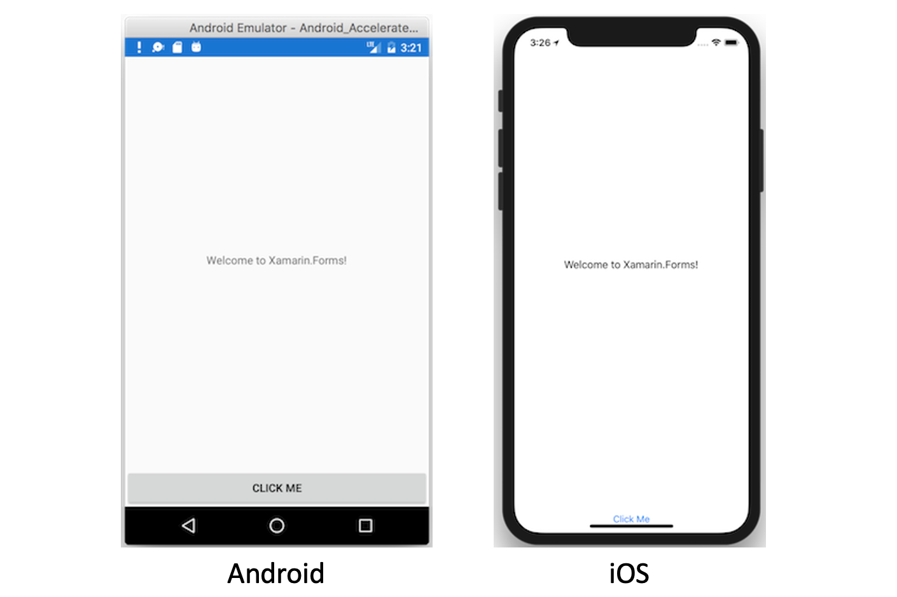

<frontmatter>
  title: Xamarin
  header: pagetop.md
  footer: footer.md
  head: head.md
  siteNav: mainNav.md
  pageNav: 3
</frontmatter>

<div class="website-content">

{{ booktitle | safe }}

# Introduction to Xamarin

**Author: [Ni Tianzhen](https://github.com/niqiukun)**

<box id="article-toc">

* [What is Xamarin‎](#what-is-xamarin)
* [How Xamarin Works?](#how-xamarin-works)
    * [Xamarin.Android and Xamarin.iOS](#xamarin.android-and-xamarin.ios)
    * [Xamarin.Forms](#xamarin.forms)
    * [Xamarin.Essentials](#xamarin.essentials)
* [Why Xamarin?‎](#why-xamarin)
    * [Complete Binding for Underlying SDKs](#complete-binding-for-underlying-sdks)
    * [Objective-C, Java, C, and C++ Interop](#objective-c-java-c-and-c-interop)
    * [Modern Language Constructs and Robust Base Class Library](#modern-language-constructs-and-robust-base-class-library)
    * [Mobile Cross-Platform Support](#mobile-cross-platform-support)
    * [Modern Integrated Development Environment (IDE)](#modern-integrated-development-environment-ide)
* [Getting Started](#getting-started)
</box>

## What is Xamarin?

**[Xamarin](https://dotnet.microsoft.com/apps/xamarin)** is an open source developer platform for building modern and performant applications on various platforms, especially Android and iOS. It is built on top of Mono, an open-source version of the .NET Framework based on the .NET ECMA standards. It is currently maintained by Microsoft and the .NET community. As one of the most established mobile app development frameworks, Xamarin offers developers the option of writing apps in C#, instead of Java and Objective-C/Swift. The architecture of Xamarin aims to achieve maximum code reuse across different platforms while maintaining near-native performance.

## How Xamarin Works?

Here is an overview of the architecture of a cross-platform Xamarin application.


*Figure 1. Overview of the architecture of a cross-platform Xamarin Application*

Xamarin allows developers to create native UI on each platform and write business logic in C# that is shared across platforms. In most cases, 80% of application code is sharable using Xamarin. A typical cross-platform Xamarin project consists of three sub-projects: **Shared Code, Xamarin.Android, and Xamarin.iOS**.

While Shared Code consists of common business logic, cross-platform UI elements (**Xamarin.Forms**) and a collection of native device features (**Xamarin.Essentials**), **Xamarin.Android** and **Xamarin.iOS** provide access to remaining native features and handle the compilation of shared code into native assemblies.

### Xamarin.Android and Xamarin.iOS

Xamarin.Android and Xamarin.iOS handle the compilation of both shared code and platform dependent code into native assemblies. The difference between the two is that while Xamarin.Android compiles C# into Intermediate Language, which is then **Just-in-Time (JIT)** compiled to a native assembly within the Mono execution environment, Xamarin.iOS compiles C# into assembly code fully **Ahead-of-Time (AOT)**.

Within the sub-projects, developers can access the complete Android or iOS SDK, wrapped with .NET APIs. This allows the entire application to be developed in C#, without writing any native code. Moreover, developers can leverage on the latest platform-specific features. For example, the `ARKit` Namespace, included in Xamarin iOS SDK, gives developers full access to ARKit of iOS SDK in C#.

Developers can also use native UI components and libraries wrapped with .NET APIs, such as Material Theme for Android and Storyboards for iOS. Alternatively, they can use Xamarin.Forms, which allows UI code to be shared across platforms.

### Xamarin.Forms

Xamarin.Forms provides a consistent API for creating UI elements across platforms. This API can be implemented in either XAML or C# and supports data-binding for patterns such as Model-View-ViewModel (MVVM).

At runtime, Xamarin.Forms utilizes platform renderers to convert the cross-platform UI elements into native controls on Android and iOS. This allows developers to get the native look, feel and performance while realizing the benefits of code sharing across platforms.

Similar to HTML and JavaScript, Xamarin.Forms separates view and logic with XAML and C#. The following code example demonstrates a sample page in Xamarin.Forms.

In `MainPage.xaml`:
```xml
<ContentPage x:Class="AppName.MainPage">
    <StackLayout>
        <Label Text="Welcome to Xamarin.Forms!" 
           HorizontalOptions="Center"
           VerticalOptions="CenterAndExpand" />
        <Button Text="Click Me" Clicked="HandleClicked" />
    </StackLayout>
</ContentPage>
```

In `MainPage.xaml.cs`:
```C#
// imports omitted

namespace AppName {
    public partial class MainPage : ContentPage {
        int count = 0;

        public MainPage() {
            InitializeComponent();
        }

        void HandleClicked(object sender, System.EventArgs e) {
            count++;
            ((Button)sender).Text = $"You clicked {count} times.";
        }
    }
}
```

The page is rendered differently into native controls:


*Figure 2. Screenshots of the rendered sample page on Android and iOS respectively*

### Xamarin.Essentials

Xamarin.Essentials is a library that provides cross-platform APIs for native device features in C#. This allows more code to be shared across different platforms. Some examples of functionality provided by Xamarin.Essentials include:

- Device info
- File system
- Accelerometer
- Phone dialer
- Text-to-speech
- Screen lock

## Why Xamarin?

While combining the abilities of native platforms, Xamarin has a number of features that win over its <tooltip content="e.g. Flutter, React Native, Kotlin Multiplatform, etc.">competitors</tooltip>:

### Complete Binding for Underlying SDKs

Xamarin contains bindings for nearly the entire underlying platform SDKs in both iOS and Android. This allows developers to build UI and business logic all in a single language - C#. Additionally, these bindings are strongly-typed, which means that they’re easy to navigate and use, and provide robust compile-time type checking and during development. Strongly-typed bindings lead to fewer runtime errors and higher-quality applications. It is a great advantage over other platforms, such as React Native, which has limited access to platform SDKs and lacks type checking if using JavaScript.

### Objective-C, Java, C, and C++ Interop

Xamarin is equally flexible as other platforms. It provides facilities for directly invoking Objective-C, Java, C, and C++ libraries, giving you the power to use a wide array of third party code. This functionality lets you use existing iOS and Android libraries written in Objective-C, Java, or C/C++. Additionally, Xamarin offers binding projects that allow you to bind native Objective-C and Java libraries using a declarative syntax.

### Modern Language Constructs and Robust Base Class Library

Xamarin allows developers to leverage on the advantages of both C# and .NET platform. 

Xamarin applications are written in **C#**, a modern language that includes significant improvements over Objective-C and Java such as dynamic language features, functional constructs such as lambdas, LINQ, parallel programming, generics, and more. You can read more about C# [here]({{baseUrl}}/contents/csharp/IntroductionToCSharp.html).

Xamarin applications use the **.NET Base Class Library (BCL)**, a large collection of classes that have comprehensive and streamlined features such as powerful XML, Database, Serialization, IO, String, and Networking support, and more. Existing C# code can be compiled for use in an app, which provides access to thousands of libraries that add functionality beyond the BCL. Yes, it is possible to reuse the code you have written for a previous Windows application, in your next mobile app.

### Mobile Cross-Platform Support

Xamarin offers sophisticated cross-platform support for the two major platforms of iOS and Android. Applications can be written to share up to 90% of their code, and Xamarin.Essentials offers a unified API to access common resources across all three platforms. Shared code can significantly reduce both development costs and time to market for mobile developers.

### Modern Integrated Development Environment (IDE)

Xamarin uses Visual Studio, a modern IDE that includes features such as code auto completion, a sophisticated project and solution management system, a comprehensive project template library, integrated source control, and more.

## Getting Started

If you are new to C#, you may follow this article to read more about C# [here]({{baseUrl}}/contents/csharp/IntroductionToCSharp.html).

If you are familiar with C#, you can follow [this guide](https://docs.microsoft.com/en-us/xamarin/get-started/installation/) to install Xamarin. After installation, a step-by-step guide to start building your first app can be found [here](https://docs.microsoft.com/en-us/xamarin/get-started/first-app/).

If you wish to develop cross-platform apps, you can follow the [Xamarin.Forms tutorials](https://docs.microsoft.com/en-us/xamarin/get-started/tutorials/). Otherwise, you can follow a quick start guide on [Xamarin.Android](https://docs.microsoft.com/en-us/xamarin/android/get-started/hello-android/hello-android-quickstart) or [Xamarin.iOS](https://docs.microsoft.com/en-us/xamarin/ios/get-started/hello-ios/hello-ios-quickstart).
