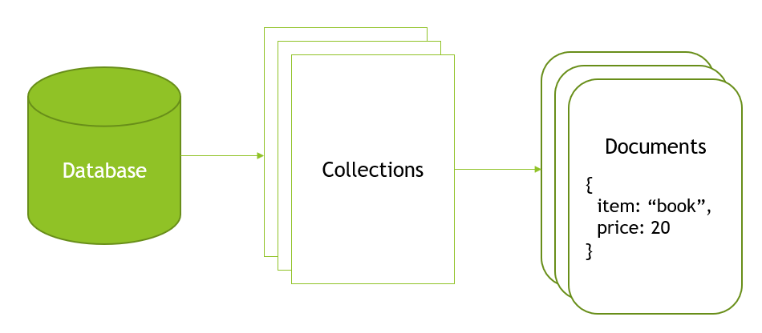
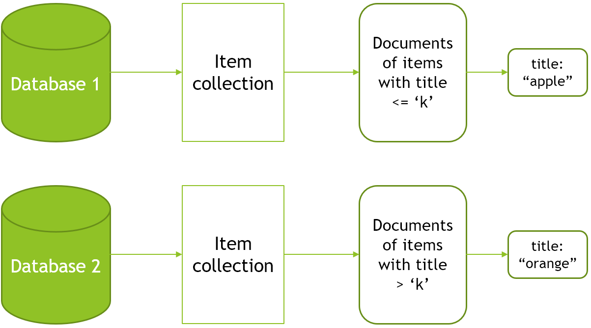
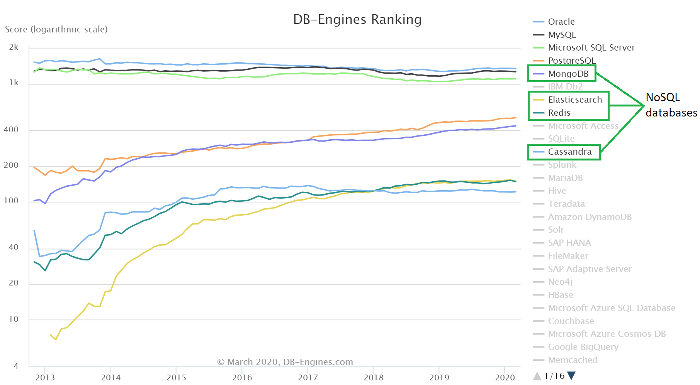

<frontmatter>
  title: Introduction to NoSQL
  header: pagetop.md
  footer: footer.md
  head: head.md
  siteNav: mainNav.md
  pageNav: 3
</frontmatter>

<div class="website-content">

{{ booktitle | safe }}

# Introduction to NoSQL

**Author(s): [Ang Ze Yu](https://github.com/ang-zeyu)**

**Reviewer(s): [Neil Brian](https://github.com/nbriannl), [James Pang](https://github.com/jamessspanggg), [Daryl Tan](https://github.com/openorclose), [Yash Chowdhary](https://github.com/yash-chowdhary)**

<box type="info">
Basic knowledge of SQL databases is assumed. If not, give the <a href="../sql/SQL.html">SQL article</a> a read first!
</box>

<box id="article-toc" style="background-color: #dee2e62b">

##### Table of contents { .no-index .border-bottom .pb-1 }

* [What is NoSQL‎](#what-is-nosql)
* [Key Characteristics of NoSQL Databases](#key-characteristics-of-nosql-databases)
  * [Powerful and Simple CRUD Operations](#1-powerful-and-simple-crud-operations)
  * [Schema-Less Data](#2-schema-less-data)
  * [Straightforward Expression of Relations in Data](#3-straightforward-expression-of-relations-in-data)
* [Why NoSQL](#why-nosql)
  * [1. Highly Suited for Iterated Development](#1-highly-suited-for-iterated-development)
  * [2. Easy Horizontal Scaling](#2-easy-horizontal-scaling)
  * [3. Widespread Adoption](#3-widespread-adoption)
* [Caveats of NoSQL‎](#caveats-of-nosql)
  * [Lack of Standardisation](#1-lack-of-standardisation)
  * [Not Suited for Complex Relational Queries‎](#2-not-suited-for-complex-relational-queries)  
* [How to get Started With NoSQL?‎](#how-to-get-started-with-nosql)

{.px-3}

</box>

---

## What is NoSQL?

**Non-Structured Query Language** <tooltip content="Some other common interpretations include 'not only SQL', 'non relational', 'no SQL'">(**NoSQL**)</tooltip> is a wide set of implementations of query technologies used to retrieve and store data in a non-tabular format.

For example, here is one such data item - a book in the catalogue of an e-commerce website, reprsented in a
<popover effect="fade" header="Javascript Object Notation" content="A commonly used data format which represents data in a simple, human and machine-readable format." placement="top">JSON</popover>
format.
 
```js
{
  type: "book",
  price: 20,
  popularity: 9.7,
}
```

To start, let's jump into the most common implementation of such databases, _document databases_.<br>
One such commonly used database is MongoDB, which is a document based database.

<box type="info" light>
<li>Other types of NoSQL databases, such as <trigger for="key-value-db">key-value databases</trigger>,
<trigger for="graph-db">graph databases</trigger>, can be viewed as extensions or reductions of document based databases.
</li>
<li>Some of these types can even be used together!</li>
</box>




In contrast to tables and table entries in SQL databases, document databases comprise of multiple collections, which in turn consists of multiple documents.

In a simplified e-commerce website for example, you may have the following collections: { id="main-example" }
- _customers_ - storing the account details of customers, their purchase histories, etc.
- _items_ - a collection of all items available for purchase (which are documents)
- _admin_ - a collection storing admin account details
- **...**

In this case, the _items_ collection which contains the catalogue of purchase items may be structured like so:

<div id="schemaless-example">

```js
[
  {
    type: "book",
    title: "about pandas",
    price: 20,
    popularity: 9.7,
    author: "panda1",
    ...
  },
  {
    type: "grocery",
    name: "cheese",
    brand: "panda",
  },
  ...
]
```

</div>

<br>
<box type="info" light>
Note that while many NoSQL databases provide a JSON interface to interact with the data,
the underlying storage implementation may be different for performance reasons.<br>
For example, MongoDB stores documents in BSON (json encoded in binary). 
</box>

<br>

## Key Characteristics of NoSQL Databases

### 1. Powerful and Simple CRUD Operations

Interaction with most document databases is achieved in a simple and intuitive _object oriented manner_,
and JSON-like queries.

Let's get back to the above [example](#main-example) of an e-commerce website. To register a new user account,
an example insert operation made in mongoDB would be like so:

```js
db.customers.insertOne({
  username: "panda",
  password: hashedPassword,
  email: "panda@pandas.com"
})
```

Like SQL databases, queries in NoSQL databases often also support more specific and powerful variants, and can
be even more succinct in some cases.

For example, to filter through items with a price of less than 30, and a popularity of more than 8,
thereafter sorting them by their price, you would make a query in MongoDB like so, intuitively matching
the structure of a typical item in the _items_ collection.

```js
db.items.find({
  price: {
    $lt: 30
  },
  popularity: {
    $gt: 8
  }
}).sort({
  price: 1 // Here 1 means ascending order
})
```

<br>

### 2. Schema-Less Data

Another key characteristic of most NoSQL databases is that they are **schema-less**.
In document databases for example, this means that each individual document has no restriction on what keys it must have,
the number of keys, the type of values and so on.

<modal header="Example items collection of an e-commerce website" id="schemaless-example-modal">
<include src="NoSQL.md#schemaless-example" />
</modal>

<box type="info" light>
Note the missing fields for the second item in the <em>items</em> collection
<trigger for="schemaless-example-modal">earlier,</trigger>
which are intentionally omitted.

<div class="mt-2">
All purchase items, regardless of their types and their fields, can still be contained in a <em>singular</em> collection.
This is an example of how a schema-less architecture can greatly simplify the organisation of data.</div>
</box>

Documents can even contain other documents, arrays, and depending on the implementation, likely anything the database can serialize and deserialize.


At the same time, NoSQL databases usually also provide some form of optional
<popover header="Schema Validation" content="A way to enforce some structure on data, and the corresponding operations on that data.">
<strong>schema validation</strong>.
</popover>

For example, in the _customers_ collection, where the fields of a customer are unlikely to
change, it can be especially helpful to enforce a strict schema on documents; 
This would prevent the unsuspecting programmer
from say, deleting a customer's password, which would be rather undesirable.

```js
// Example schema validation options in mongoDB
$jsonSchema: {
  bsonType: "object",
  require: [ "username", "password", "email" ]
  properties: {
    ...
  }
}
```

<br>

### 3. Straightforward Expression of Relations in Data

The world is full of relations. For example, a patient _is related to_ her disease record,
just as a customer _is related to_ their shopping cart.

Sometimes, the objects on both sides of the relation can contain substantial amounts of
information, and may be impossible to store as a singular field in one or the other document.

Hence, simple relations such as
<tooltip content="A type of relation where each item is only related to one other item">
_one-to-one_
</tooltip>
relations,
<tooltip content="A type of relation where each item can be related to many other items, but these other items are only ever related to one item on the other end">
_one-to-many_
</tooltip>
relations are often expressed in document databases simply in the form of embedded documents, which is made possible due to 
the schema-less characteristic of NoSQL databases.

For example, for a customer and his / her shopping cart, we may have the following:
```js
{
  username: "panda",
  cart: {
    totalPrice: 100,
    cartItems: [ ... ],
    discountCode: "panda"
  },
  email: "panda@pandas.com",
  ...
}
```

In the case of more complicated
<tooltip content="A type of relation where each item can be related to many other items, and these other items can also be related to many items on the other end">
_many-to-many_
</tooltip>
relationships, relations are commonly stored using references, to avoid duplication of data.

For example, items in an e-commerce website are related to the many customers through their carts.
In these carts, it is much more space efficient to store references to the items, than the item documents themselves.

In this example, the uniquely generated `_id` field for each item document in the items collection could be one such _reference_:
```js
{
  type: "book",
  price: 20,
  popularity: 9.7,
  _id: "9d1793bd491349n913847n93d"
}
```

In the user's cart, we would simply store these `_id` _references_, which are used to lookup the item documents in the items collection later:
```js
cart: {
  totalPrice: 100,
  cartItems: [
    "9d1793bd491349n913847n93d",
    "9d1793bd491349n913847njh8",
  ],
  discountCode: "panda"
}
```


<box type="info" light>
For this reason, many NoSQL database solutions (e.g. MongoDB) implement a unique <code>id</code> field
for each document by default.
</box>

---

## Why NoSQL?

<br>

### 1. Highly Suited for Iterated Development
Although less mature than SQL databases, NoSQL databases were designed to solve many of the emerging challenges in databases today.

One of the most consequential impacts NoSQL has had was enabling faster iterated development.
Given the highly flexible relational structure of NoSQL databases, and the schemaless format of documents 
in NoSQL, this means that developers can adapt the database quicker to changing customer and business requirements.

In contrast, tables in SQL databases necessitate predefined schema, which can be rather difficult to change later on while ensuring there are no side effects.

### 2. Easy Horizontal Scaling

Another key benefit of NoSQL databases is the ability to scale horizontally (distributing workload across
multiple servers), without discarding much of its key features.

This is largely due to the schema-less architecture of such databases, allowing data to split across
multiple servers easily and efficiently.

For example, take the following collection of items with a `title`:

```js
[
  {
    title: "Apple",
    ...
  },
  {
    title: "Orange",
    ...
  },
  ...
]
```

Assuming we don't have relations from items to themselves inside these documents,
we can split the collection like so:



As a result, the database access workload can be distributed evenly and efficiently across
multiple servers easily.

<box type="success" light>

As businesses grow, it is crucial that its databases can scale to meet greater consumer and business demands.

<div>
<tooltip content="increasing the processing power of the machine">Vertical scaling</tooltip> can only go so far until the single machine hits its limit.</div>
</box>

### 3. Widespread Adoption

<br>
<figure>

<figcaption>
<small>Most popular database technologies, as ranked by <a href="https://www.db-engines.com/en/ranking">db-engines.com</a></small>
</figcaption>
</figure>
<br>

While certainly trending behind SQL databases, NoSQL databases have been <tooltip content="Amazon uses a proprietary NoSQL database!">booming</tooltip> over the past couple of years,
due to the increasing applicability of its benefits to requirements today. 

This bodes well for the maturity and development of this evolving technology, and your potential use cases for it.

---

## Caveats of NoSQL

<br>

#### 1. Lack of Standardisation
From both a user and implementation standpoint, NoSQL databases vary from one solution to another greatly, which can incur
extra development costs in projects when there is a need to migrate to another solution, or when new developers are introduced
to the project.

This is in stark contrast to SQL, which's syntax is mostly standardised across its different <tooltip content="eg. PostgreSQL, MySQL, etc.">implementations.</tooltip>

#### 2. Not Suited for Complex Relational Queries
While NoSQL databases certainly allow for more flexibility in structuring out relations, most complex queries (eg. joins for many-to-many relations) _usually_ involve structured data that can be easily represented in tabular formats. 

In such instances, queries are often more performant in SQL equivalents.


---

## How to get Started With NoSQL?

There are many NoSQL variants out there as mentioned earlier.
For starters, it may be wise to go with the most common solution, _mongoDB_.

**Setup**

You could follow the mongoDB documentation [here](https://docs.mongodb.com/manual/installation/#mongodb-community-edition-installation-tutorials)
and learn to set up a local instance of mongoDB.

Thereafter, you should use a <trigger trigger="click" for="local-shell-advise">**local** _mongo shell_</trigger> to get familiar with mongoDB syntax.<br>
You can follow the instructions [here](https://docs.mongodb.com/manual/mongo/) to connect to your 
mongoDB instance from the shell as you had configured earlier.

<popover header="Online playgrounds" id="local-shell-advise">
<template slot="content">

There are also many online playgrounds that allow you to experiment with mongoDB queries without setting up a
local database instance and shell, such as [this](https://mongoplayground.net/).

<div>
However, to put what you've learnt into practice (bulding an application) later, I highly recommend getting your feet wet with the shell and local mongoDB instance first, since it will be necessary to set up your application drivers later on!
</div>
</template>
</popover>

**Basics**

Here are some great resources on mongoDB:
- [Key Components of MongoDB Architecture](https://www.guru99.com/what-is-mongodb.html) heading here for a quick refresher of key terminology in mongoDB.
- [Data-flair](https://data-flair.training/blogs/mongodb-create-database/) is a great starting point on <tooltip content="creating databases, collections, etc.">administration</tooltip> of
your local mongoDB instance. It also provides a higher level overview of each topic than the MongoDB documentation.
- [MongoDB documentation](https://docs.mongodb.com/manual/crud/) can be overwhelming, but it is also
a great starting point to learn and test features of mongoDB, and is the defacto reference for it.

To guide you through your journey, here are the essentials that you should go through on the above sites _in order_.

1. Basic database administration
2. CRUD operations
3. Data aggregation

**Practice**

After learning these core features and getting familiar with the syntax, you could try your hand at building
a simple project to get a good feel for NoSQL in an actual backend.

Depending on the backend language you are using, you should browse through the documentation [here](https://docs.mongodb.com/ecosystem/drivers/) for the <trigger for="which-driver">appropriate language</trigger> and learn how to connect to your
mongoDB instance from your application and utilize the features you learnt above.

<popover header="Which driver should I try first?" id="which-driver">
<template slot="content">

- Syntax for the different drivers will inevitably vary slightly from language to language. However, the core concepts stay the same.
- If you want something familiar, and you have knowledge of nodeJS, I highly recommend getting started with the
nodeJS driver which is very close to the shell syntax.
{ .pl-4 }

</template>
</popover>

**Advanced**

If you're interested in learning more about mongoDB, I recommend going through some of the following topics in order -
_Indexes, Schema validation, Sharding_ (horizontal scaling), _Replica sets_ (redundancy).

Otherwise, you could check out some other popular NoSQL databases, which can even be complementary to mongoDB.
- [Redis](https://redis.io/) - An in-memory NoSQL <popover id="key-value-db" header="Key-Value databases" content="A simpler variant of NoSQL databases where data is accessed through _keys_ and stored in corresponding _values_, which can be of many formats.">key-value</popover> database used for caching purposes.
- [Neo4j](https://neo4j.com/) - A NoSQL <popover id="graph-db" placement="top" header="Graph databases" content="Data is represented by a graph in such databases. Values are stored in the graph's nodes, while relations between these nodes are represented by the edges of the graph.">graph database</popover>.

---

