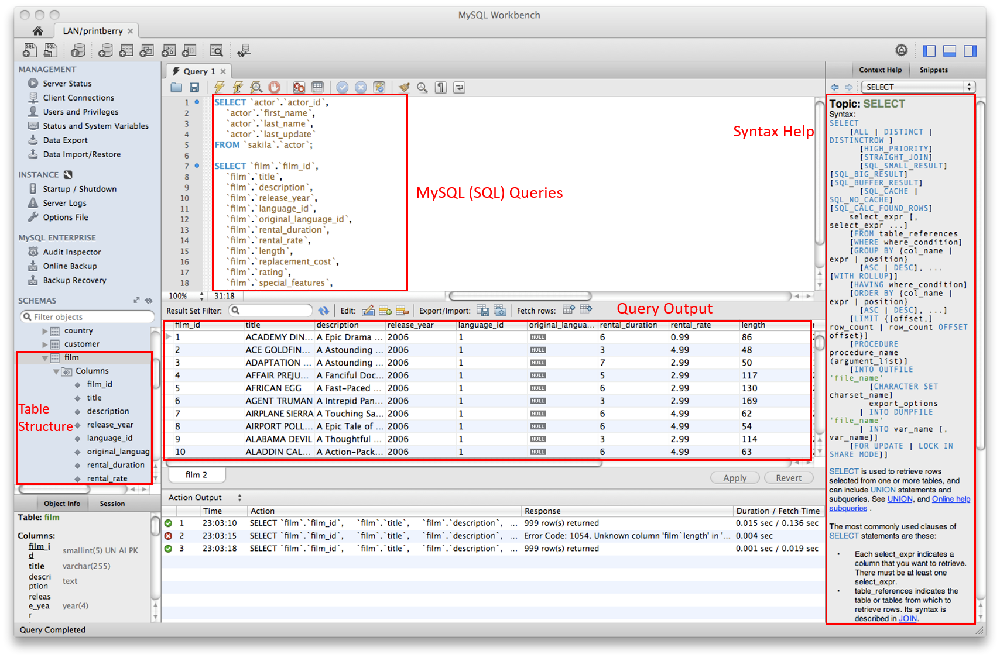
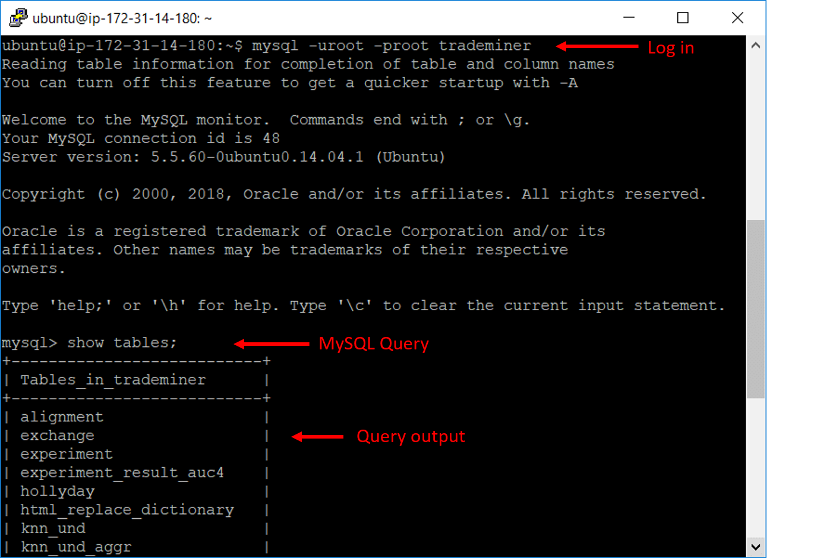
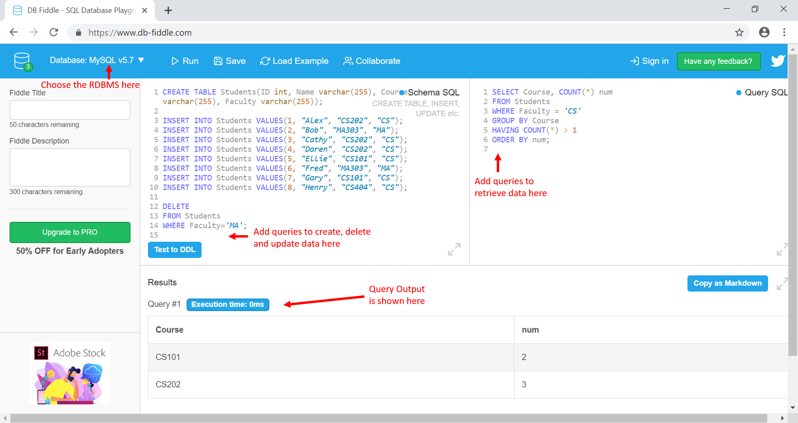

<frontmatter>
  title: Introduction to SQL
  footer: footer.md
  head: head.md
  siteNav: mainNav.md
  pageNav: 3
</frontmatter>

{{ navbar | safe }}

<div class="website-content">

# Introduction to SQL

**Author(s): [Amrut Prabhu](https://github.com/amrut-prabhu)**

Reviewers: [Ronak Lakhotia](https://github.com/RonakLakhotia), [Rahul Rajesh](https://github.com/rrtheonlyone)

## What is SQL?

A Relational Database Management System (RDBMS) is a popular database solution used by software applications to manage their data.

**Structured Query Language** (**SQL**) is a programming language that is specifically designed for interacting with an RDBMS. Unlike other languages, SQL doesn't come as a standalone installation.
Rather, RDBMSs %%like MySQL, Oracle, SQL Server and PostgreSQL%% come with an _implementation_ of SQL. Note that the syntaxes may <tooltip content="in terms of whether the syntax is case-sensitive, the format for specifying date and time, what functions are available out-of-the-box">vary</tooltip> across these RDBMSs.

These RDBMSs come with a GUI application, but can be accessed from the command line as well. Figure 1 shows MySQL Workbench GUI software and MySQL in the command line.




_Figure 1. MySQL can be accessed using the GUI or command line_ <sup>[source 1](https://www.mysql.com/products/workbench/)</sup> <sup>[source 2](https://www.researchgate.net/figure/The-MySQL-command-line-tool_fig5_328093393)</sup>

---

### How does SQL work?

SQL uses **queries** to retrieve data. Here is an example of how an SQL query is used.

Suppose we have the data table `Students` shown here:

| ID | Name  | Course | Faculty |
| -- | ----- | ------ | ------- |
| 1  | Alex  | CS202  | CS      |
| 2  | Bob   | MA303  | MA      |
| 3  | Cathy | CS202  | CS      |
| 4  | Daren | CS202  | CS      |
| 5  | Ellie | CS101  | CS      |
| 6  | Fred  | MA303  | MA      |
| 7  | Gary  | CS101  | CS      |
| 8  | Henry | CS404  | CS      |

We can use this SQL query to retrieve information from this table:
```sql
SELECT Course, COUNT(*) num
FROM Students
WHERE Faculty = 'CS'
GROUP BY Course
HAVING COUNT(*) > 1
ORDER BY num;
```

This query first filters the entries in the `Students` table such that only entries that have `CS` as the faculty are considered.
After that, it groups those entries into the 3 courses: `CS101`, `CS202` and `CS404`.
Then, it removes courses that do not have more than 1 student, i.e., `CS404` is removed from consideration.
Finally, it returns a list of courses with a count of the number of students, ordered in increasing order.
So, the output of the query is:

| Course | num |
| ------ | --- |
| CS202  | 3   |
| CS101  | 2   |

<br/>
You can see how this simple query can prove to be extremely useful for getting this information when the table has tens of entries (or many more). Apart from retrieving information, SQL can also be used for creating, deleting and manipulating data with queries like `INSERT`, `DELETE` and `UPDATE` for entries, in addition to `CREATE`, `DROP` and `ALTER` for tables as a whole.

<br/>
For example, you can set up the structure of table shown in Table 1 by executing the `CREATE TABLE` query shown here.
It creates a new data table `Students`, with 4 fields (`ID`, `Name`, `Course` and `Faculty`) and specifies their data types.

```sql
CREATE TABLE Students(ID int, Name varchar(255), Course varchar(255), Faculty varchar(255));
```

We can also remove rows containing the `MA` faculty from Table 1 with this `DELETE` query.

```sql
DELETE
FROM Students
WHERE Faculty='MA';
```

<box type="info">
  You can experiment with this example on <a href="https://www.db-fiddle.com/f/kHqV2edUGxCc1dU6vE6CmS/1">DB Fiddle</a> (shown in Figure 2 below) by entering SQL queries and then running them.
</box>


_Figure 2. Using DB Fiddle to run queries in MySQL_

---

## Why learn SQL?

Now that you have seen how SQL is used, let's take a look at some of the main reasons behind the widespread adoption of SQL and why you should learn it.

### Easy to learn

As you saw in the example in the previous section, SQL is not really that complex. It is easy to learn, even for beginners who do not have any prior experience with databases. Since it has been around for a few decades, there are many good books and online resources to learn from.
In addition, SQL and the RDBMSs have a huge support community (such as [SQL in Stack Overflow](https://stackoverflow.com/questions/tagged/sql), and the [official MySQL forum](https://forums.mysql.com/)) which can prove useful when you run into problems while using it.

### Free

One of the benefits (and reasons) for SQL's popularity is that there are free RDBMS software available %%(like MySQL, PostgreSQL and SQLite)%% as well as paid ones %%(like Microsoft SQL Server and Oracle)%% that come with more functionality.

One such example is MySQL. It is free and comes with the official [MySQL Workbench](https://dev.mysql.com/doc/workbench/en/) (shown in Figure 1 above) as well as other third party easy-to-use <tooltip content="Graphical User Interface">GUIs</tooltip>, which are less daunting to new users as compared to a <tooltip content="Command Line Interface">CLI</tooltip>.

### Highly Compatible

The RDBMSs that use SQL work on many operating systems %%(like Windows, Mac OS, Ubuntu, Red Hat among others)%% and more importantly, can be integrated with many languages. This includes programming languages like C++, Ruby, Java, Python, JavaScript (Node.js), and Go, among others.

In addition, online playgrounds like [JDoodle](https://www.jdoodle.com/execute-sql-online) and [DB Fiddle](https://www.db-fiddle.com/) (shown in Figure 1 above) make it easy to use and learn the SQL language quickly without the hassle of setting up an environment or application.

## Disadvantages

SQL is not without its problems. In general, the biggest problem is with regards to the features of SQL.

Although SQL databases use established <tooltip content="American National Standard Institutes">ANSI</tooltip> & <tooltip content="International Organization for Standardization">ISO</tooltip> standards, some RDBMSs like %%(PostgreSQL, for example)%% add proprietary extensions to standard SQL.
Due to this, the available feature set can vary according to what you're using. This can make SQL confusing and frustrating to use when switching RDBMS.

Apart from that, most **SQL** problems are not uniformly applicable across all RDBMSs that use SQL. For example, MySQL suffers from concurrency issues. Though it performs well with read operations, it *can* be problematic when there are many concurrent read-write operations. A symptom of this issue would be a sudden slowdown of a query. However, PostgreSQL deals with concurrency well by implementing <tooltip content="each query transaction is isolated from other transactions running simultaneously in the system">transactions isolation</tooltip>.

Depending on your requirements, you can also choose to use non-relational databases like <tooltip content="Stands for- not only SQL">NoSQL</tooltip> databases instead of RDBMSs (and SQL). They are known for being highly scalable and handling large volumes of data well.

---

## How to get started with SQL?

The first thing to do when getting started with SQL is to choose a RDBMS. You can either just use an online SQL playground or install a dedicated application. Our suggestion is to use either MySQL or SQLite online.

The extensive number of books and resources available for learning SQL can seem overwhelming. To overcome this issue, you can decide on which parts you want to learn, as you will likely not need to know everything to get started with using a SQL database.

Here are some recommended steps for learning SQL:

- **Understand RDBMS**: Before jumping into the SQL language, refer to this book's [<tooltip content="DataBase Management System">**DBMS**</tooltip>]({{baseUrl}}/contents/data/databases/databases.html) chapter to understand the basic database concepts. More specifically, understand the basic concepts of RDBMS by going through the [**SQL- RDBMS Concepts**](https://www.tutorialspoint.com/sql/sql-rdbms-concepts.htm) page. This is not _essential_, but will give you a better high-level understanding before diving into programming.

- **Learn SQL Syntax**:
  - The [**Guru99 SQL Tutorial for Beginners**](https://www.guru99.com/sql.html) is a good course for beginners. It is well organized and provides comprehensive information, which will ensure that you know the basics well.

  - The [**W3Schools SQL Tutorial**](https://www.w3schools.com/sql/default.asp) is a useful, interactive written tutorial in which you can run and modify SQL queries to see the examples in action.

  - In order to keep track of and remember the syntaxes that you're learning, you can refer to the [**W3Schools SQL Quick Reference Guide**](https://www.w3schools.com/sql/sql_ref_mysql.asp). This is particularly useful when you want to look up specific information quickly.

- **Use SQL in practice**: Look into different RDBMSs and decide which one you want to work with. You can start by comparing the 3 mentioned in this [**Oracle vs MySQL vs SQL Server**](https://blog.udemy.com/oracle-vs-mysql-vs-sql-server/) post and work from there. Then, set up the corresponding RDBMS and integrate it with an application. This will give you good experience and exposure to how databases are used in practice.

  In the case of MySQL, a good resource for getting started with this is [**MySQLTutorial.org**](http://www.mysqltutorial.org/). The `Interfaces` section of the website contains multiple tutorials explaining how to integrate and work with MySQL from [Node.js](http://www.mysqltutorial.org/mysql-nodejs/), [Java](http://www.mysqltutorial.org/mysql-jdbc-tutorial/), [Python](http://www.mysqltutorial.org/python-mysql/) and more.
