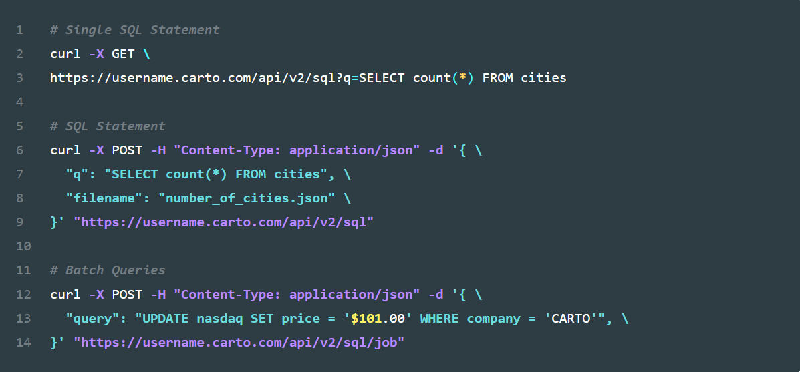

<frontmatter>
  title: Introduction to SQL
  footer: footer.md
  head: head.md
  siteNav: mainNav.md
  pageNav: 3
</frontmatter>

{{ navbar | safe }}

<div class="website-content">

# Introduction to SQL

**Author(s): [Amrut Prabhu](https://github.com/amrut-prabhu)**

Reviewers: [Ronak Lakhotia](https://github.com/RonakLakhotia), [Rahul Rajesh](https://github.com/rrtheonlyone)

## What is SQL?

A Relational Database Management System (RDBMS) is a popular database solution used by software applications to manage their data.

**Structured Query Language** (**SQL**) is a programming language that is specifically designed for interacting with an RDBMS. Unlike other languages, SQL doesn't come as a standalone installation.
Rather, RDBMSs %%like MySQL, Oracle, SQL Server and PostgreSQL%% come with an _implementation_ of SQL. Note that the syntaxes may <tooltip content="in terms of whether the syntax is case-sensitive, the format for specifying date and time, what functions are available out-of-the-box">vary</tooltip> across these RDBMSs.

---

### How does SQL work?

SQL uses **queries** to retrieve data. Here is an example of how an SQL query is used.

Suppose we have the data table `Students` shown here:

| ID | Name  | Course | Faculty |
| -- | ----- | ------ | ------- |
| 1  | Alex  | CS202  | CS      |
| 2  | Bob   | MA303  | MA      |
| 3  | Cathy | CS202  | CS      |
| 4  | Daren | CS202  | CS      |
| 5  | Ellie | CS101  | CS      |
| 6  | Fred  | MA303  | MA      |
| 7  | Gary  | CS101  | CS      |
| 8  | Henry | CS404  | CS      |

We can use this SQL query to retrieve information from this table:
```sql
SELECT Course, COUNT(*) num
FROM Students
WHERE Faculty = 'CS'
GROUP BY Course
HAVING COUNT(*) > 1
ORDER BY num;
```

This query first filters the entries in the `Students` table such that only entries that have `CS` as the faculty are considered.
After that, it groups those entries into the 3 courses: `CS101`, `CS202` and `CS404`.
Then, it removes courses that do not have more than 1 student, i.e., `CS404` is removed from consideration.
Finally, it returns a list of courses with a count of the number of students, ordered in increasing order.
So, the output of the query is:

| Course | num |
| ------ | --- |
| CS101  | 2   |
| CS202  | 3   |

You can see how this simple query can prove to be extremely useful for getting this information when the table has tens of entries (or many more). Apart from retrieving information, SQL can also be used for creating, deleting and manipulating data with queries like `INSERT`, `DELETE` and `UPDATE` for entries, in addition to `CREATE`, `DROP` and `ALTER` for tables as a whole.

For example, you can set up the structure of the table shown in Table 1 by executing the `CREATE TABLE` query shown here.
It creates a new data table `Students`, with 4 fields (`ID`, `Name`, `Course` and `Faculty`) and specifies their data types.

```sql
CREATE TABLE Students(ID int, Name varchar(255), Course varchar(255), Faculty varchar(255));
```

We can also remove rows containing the `MA` faculty from Table 1 with this `DELETE` query.

```sql
DELETE
FROM Students
WHERE Faculty='MA';
```

<box type="info">
  You can experiment with <a href="https://www.db-fiddle.com/f/kHqV2edUGxCc1dU6vE6CmS/1">this example on DB Fiddle</a> (shown in Figure 1 below) by entering SQL queries and then running them.
</box>

<center>
  

_Figure 1. Using DB Fiddle to run queries in MySQL_
</center>

**Online editors** like DB Fiddle can be used while learning SQL. However, to use SQL in application development, you need to consider other alternatives for running SQL queries:

- **RDBMS software**: RDBMS installations usually come with a <tooltip content="Graphical User Interface">GUI</tooltip> (see Figure 2), but can also be accessed from the command line (see Figure 3).

    <center>
      

    _Figure 2. MySQL (an RDBMS) can be used in the MySQL Workbench GUI application_ <sup>[source](https://www.mysql.com/products/workbench/)</sup>  

      

    _Figure 3. Logging in to the MySQL RDBMS and viewing tables from the command line_ <sup>[source](https://www.researchgate.net/figure/The-MySQL-command-line-tool_fig5_328093393)</sup>  
    </center>

- **APIs**: You can use APIs in programming languages or independent ones like [SQL API](https://carto.com/developers/sql-api/) (shown in Figure 4) to interact with databases. For example, the [SQLite3](https://www.pythoncentral.io/introduction-to-sqlite-in-python/) library can be used to interact with a database through Python.

    <center>
      

    _Figure 4. An example of how to use CARTO's SQL API, which uses a PostgreSQL database_ <sup>[source](https://carto.com/developers/sql-api/)</sup>  
    </center>

---

## Why learn SQL?

The main reason why you should learn SQL relates to the widespread adoption of SQL. As SQL is not limited to any particular operating system or programming language, it is **widely used** in the RDBMSs used by a lot of software applications (web, mobile etc.). Hence, in order to utilize almost any relational database or RDBMS available today, you need to know the SQL language.

## Disadvantage

The biggest issue in SQL is with regards to the syntax and features.
Although SQL databases use established <tooltip content="American National Standard Institutes">ANSI</tooltip> & <tooltip content="International Organization for Standardization">ISO</tooltip> standards, some RDBMSs %%(like PostgreSQL, for example)%% add proprietary extensions to standard SQL.
Due to this, the available feature set can vary according to what you're using.
Furthermore, there may be minor changes in the syntaxes across RDBMSs (case-sensitivity, for example).
These factors can make SQL confusing and frustrating to use when switching across RDBMSs, since you would have to change your SQL code.

---

## How to get started with SQL?

As you saw in the example in the previous section, SQL is not really that complex. It is easy to learn, even for beginners who do not have any prior experience with databases.

To get started with SQL, you can either just use an online SQL playground or install a RDBMS. There are many free RDBMSs available like [PostgreSQL](https://www.postgresql.org/) and [MySQL](https://dev.mysql.com/downloads/).
However, for the sole purpose of learning SQL, our suggestion is to use online editors like [DB Fiddle](https://www.db-fiddle.com/) %%(supports MySQL and SQLite)%% or [SqliteOnline](https://sqliteonline.com/) %%(supports SQLite)%% since they allow you to start learning without the hassle of setting up anything.

Here are some recommended steps for learning SQL:

1. **Understand RDBMS**: Before jumping into the SQL language, refer to this book's [<tooltip content="DataBase Management System">**DBMS**</tooltip>]({{baseUrl}}/contents/data/databases/databases.html) chapter to understand the basic database concepts. More specifically, understand the basic concepts of RDBMS by going through the [**SQL- RDBMS Concepts**](https://www.tutorialspoint.com/sql/sql-rdbms-concepts.htm) page. This is not _essential_, but will give you a better high-level understanding before diving into programming.

1. **Learn SQL Syntax**: These are some recommended resources that you can use to learn the SQL language.
    - The [**Guru99 SQL Tutorial for Beginners**](https://www.guru99.com/sql.html) is a good course for beginners. It is well organized and provides comprehensive information, which will ensure that you know the basics well.

    - The [**W3Schools SQL Tutorial**](https://www.w3schools.com/sql/default.asp) is a useful, interactive written tutorial in which you can run and modify SQL queries to see the examples in action.

    - In order to keep track of and remember the syntaxes that you're learning, you can refer to the [**W3Schools SQL Quick Reference Guide**](https://www.w3schools.com/sql/sql_ref_mysql.asp). This is particularly useful when you want to look up specific information quickly.

1. **Use SQL in practice**: Look into different RDBMSs and decide which one you want to work with. You can start by comparing the 3 mentioned in this [**Oracle vs MySQL vs SQL Server**](https://blog.udemy.com/oracle-vs-mysql-vs-sql-server/) post and work from there. Then, set up the corresponding RDBMS and integrate it with an application. This will give you good experience and exposure to how databases are used in practice.

    In the case of MySQL, a good resource for getting started with this is [**MySQLTutorial.org**](http://www.mysqltutorial.org/). The `Interfaces` section of the website contains multiple tutorials explaining how to integrate and work with MySQL from [Node.js](http://www.mysqltutorial.org/mysql-nodejs/), [Java](http://www.mysqltutorial.org/mysql-jdbc-tutorial/), [Python](http://www.mysqltutorial.org/python-mysql/) and more.
