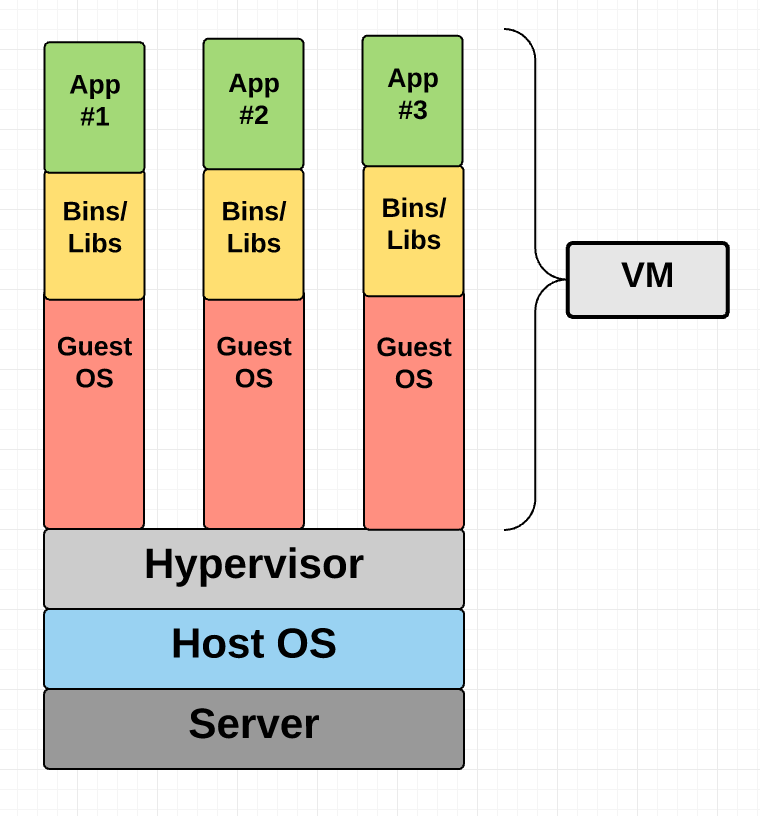
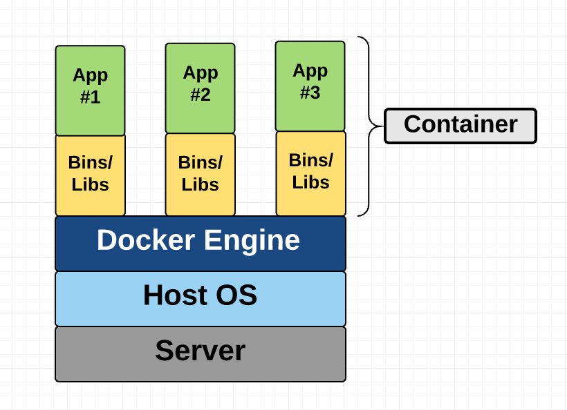

<frontmatter>
  title: DevOps
  footer: footer.md
  head: head.md
  siteNav: mainNav.md
  pageNav: 3
</frontmatter>

{{ navbar | safe }}

<div class="website-content">

# Docker

Authors: [Rahul Rajesh](https://github.com/rrtheonlyone)

### 1. What is Docker?

Docker is a platform that is used to develop, deploy and run applications inside containers. This article will discuss some of the key ideas behind Docker, the reasons to use Docker and some resources to guide you in this process.

#### 1.1 Virtual Machine (VM)

Before the rise of Docker, people used VMs. A VM is an emulation of a real computer that executes program like a real computer. A VM is used to isolate an application and its dependancies into a self-contained unit that can run anywhere.



With reference to the above diagram, VMs run on top of a physical machine using a “hypervisor”. A VM is able to provide virtual hardware, a kernel (i.e. OS) and user space. A Windows user can use a VM to run an application that is only supported on OSX for example. 

#### 1.2 Container

As mentioned above, Docker uses Containers, not VMs. The one big difference between containers and VMs is that containers *share* the host system’s kernel with other containers 



This diagram shows you that containers package up just the user space, and not
the kernel or virtual hardware like a VM does. Each container gets its own
isolated user space to allow multiple containers to run on a single host
machine. The operating system level architecture is being shared across containers. 

### 2. Why learn Docker?

Docker is a powerful tool that is rapidly gaining popularity. Many leading companies (e.g. Spotify, Nginx, ElasticSearch etc.) are using Docker for their deployment.
Here are some of the many advantages that docker provides:

- **Rapid application deployment** – containers include the minimal runtime requirements of the application, reducing their size and allowing them to be deployed quickly.
- **Portability across machines** – an application and all its dependencies can be bundled into a single container that is independent from the host version of Linux kernel, platform distribution, or deployment model. This container can be transfered to another machine that runs Docker, and executed there without compatibility issues.
- **Version control and component reuse** – you can track successive versions of a container, inspect differences, or roll-back to previous versions. Containers reuse components from the preceding layers, which makes them noticeably lightweight.
- **Sharing** – you can use a remote repository to share your container with others.Red Hat provides a registry for this purpose, and it is also possible to configure your own private repository.
- **Lightweight footprint and minimal overhead** – Docker images are typically very small, which facilitates rapid delivery and reduces the time to deploy new application containers.
- **Simplified maintenance** – Docker reduces effort and risk of problems with application dependencies.

Let us take a detailed look at some of the above advantages.

#### 2.1 Docker is lightweight 
 
As we have discussed, Docker uses makes use of Containers that share the host
system's kernel with other containers. It runs a discrete process, taking no more memory than any other executable, making it lightweight.  

Unlike virtual machines, containers do not have the high overhead and hence enable more efficient usage of the underlying system and resources.


#### 2.2 Docker allows for sharing and reuse

Docker is a service that is designed to automate and deploy containers. When you
run a container, you will start out with a base docker image. A docker
image is a file, comprised of multiple layers, used to execute code in a Docker 
container. 

When you update configurations or install applications in your container, the
corresponding docker image gets updated as well. This image can then be shared
across multiple machines by different people! This way you dont have to
repeatedly install the same software or reconfigure a container from scratch on
a new machine.

On top of this, there is this website known as the Docker hub:
https://hub.docker.com/. This is basically a collection of over 100,000 docker
images uploaded by the community. You can use this website to load in a base
image with all the configurations you already need. You can also share your
custom images on this site for others!

#### 2.3 Docker is easy to get started with 

Despite its complicated architecture, it is not difficult for a complete beginner to get started with Docker.
We have covered how docker hub provides various images for someone to use. On
top of this, Docker also provides in-built automation of deployment through what
is known as a docker file. 

A simple example of a docker file is as follows:
```
# our base image
FROM python:3-onbuild

# specify the port number the container should expose
EXPOSE 5000

# run the application
CMD ["python", "./app.py"]
```

This file helps to load in a onbuild python3 image - an onbuild image is a
specific image that is able to copy an existing server and run it automatically.
The docker file also allows bash commands to be run as you can see from the last
line above.

There are plenty of guides out there that show you the extended functionality a
docker file can provide. Even if you are a complete beginner, it is not
difficult to run an Docker file that someone else has built. Many of the docker
hub images also provide sample docker file builds!

On top of all this, Docker has excellent documentation on their website and
anyone can learn the ropes by reading through the website.

#### 2.4 Docker allows for Continuous Integration and Testing

The fact that you can have images and dockerfiles that automate your
deployment make Docker an ideal tool when doing testing. You can enable docker
in your TRAVIS Continous Integration pipeless to do testing for your
application. 

Docker containers will provide an isolated environment for the
testing of said application and will always run it on the same configured
setting. Even if your application gets updated, the Docker container will still
be able to rollback and test backwards compatibility on an older image.

If you need to perform an upgrade during a product’s release cycle, you can easily make the necessary changes to Docker containers, test them, and implement the same changes to your existing containers. Docker allows you to build, test, and release images that can be deployed across multiple servers. Even if a new security patch is available, the process remains the same. You can apply the patch, test it, and release it to production.

#### 2.5 Docker gives security

From a security point of view, Docker ensures that applications that are running on containers are completely segregated and isolated from each other, granting you complete control over traffic flow and management. No Docker container can look into processes running inside another container. 

This is ideal especially when you dont want Users to exploit vulnerabilities
between different applications. Docker's isolation ensures that this is not even
a factor to consider.

### 3.0 When to use docker?

Despite all the abovementioned advantages, it still may not be completely clear
as to why we need Docker. There are certain situations where it is ideal to make
use of Docker and 'containerization'.

Some situations you may want to use Docker is as follows:

**Learning new technologies**: To get started with a new tool without spending time on installation and configuration, Docker offers an isolated and disposable environment. Many projects maintain Docker images with their applications already installed and configured. For example, if you want to check out a distributed tracing system like Zipkin, you can have a working setup on localhost simply by running:
    
```
sudo docker run -d -p 9411:9411 openzipkin/zipkin
```

**Basic use cases**: Pulling images from Docker Hub is also a good solution if your application is basic or standard enough to work with a default Docker image. Cases such as hosting a website using a LAMP stack, using a reverse proxy, or setting up a Minecraft server often have an official or well-supported image available on DockerHub. If the default configuration in these images is acceptable for your needs, then pulling the image can save a lot of time that would otherwise be spent setting up your environment and installing the necessary tools.

**Developer teams**: If you have developers working with different setups, Docker provides a convenient way to have local development environments that closely match the production environment, without needing to ssh into a remote box.

There are many more use cases with Docker. If you face a devOps related problem,
there is a good chance that docker may provide some solution to it!

### Further Reading / References
- [Advantages of Docker](https://access.redhat.com/documentation/en-us/red_hat_enterprise_linux/7/html/7.0_release_notes/sect-red_hat_enterprise_linux-7.0_release_notes-linux_containers_with_docker_format-advantages_of_using_docker) 
- [Introduction to Docker - step-by-step](https://medium.freecodecamp.org/a-beginner-friendly-introduction-to-containers-vms-and-docker-79a9e3e119b) - step by step introduction covering VMs and Containers
- [Definitions dealing with Docker](https://www.edureka.co/blog/what-is-docker-container) - some important terminology related to Docker
- [When to use Docker?](https://www.linode.com/docs/applications/containers/when-and-why-to-use-docker/) - some tips on when to go with Docker
</div>
