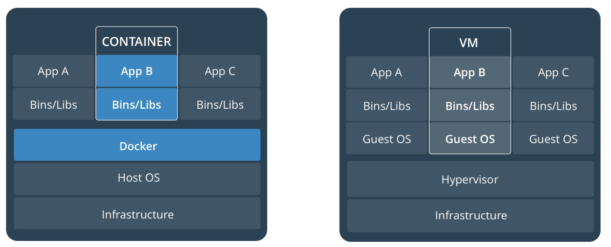
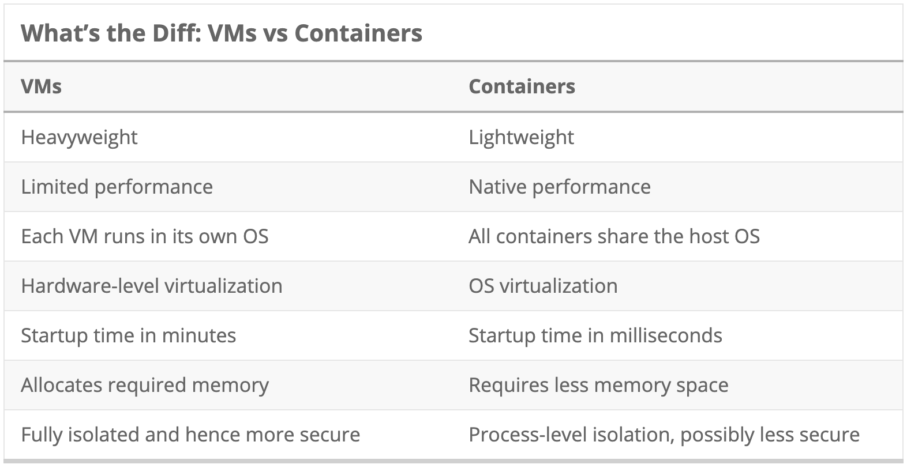
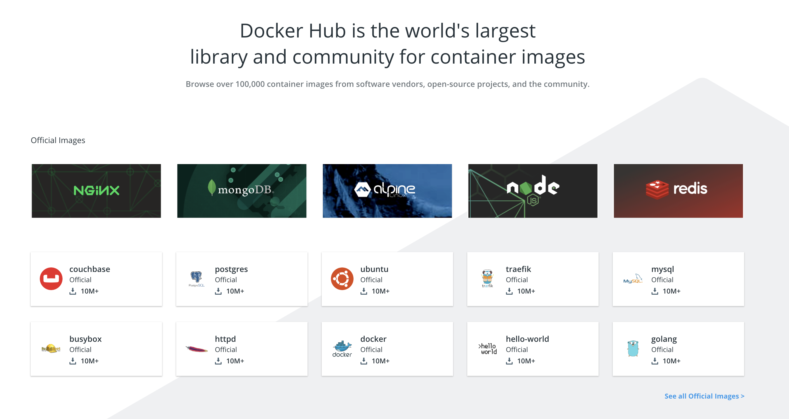

<frontmatter>
  title: DevOps
  footer: footer.md
  head: head.md
  siteNav: mainNav.md
  pageNav: 3
</frontmatter>

{{ navbar | safe }}

<div class="website-content">

# Docker

Authors: [Rahul Rajesh](https://github.com/rrtheonlyone)

In today’s age, web applications are becoming more complex. Web applications of recent times are starting to move from a monolithic architecture to one that is based off of microservices. 

<box type="info">
A Microservices architecture is when you split your application into a set of smaller, interconnected services that each have a specific role (as opposed to one big application). Read up more about it <a href="https://articles.microservices.com/monolithic-vs-microservices-architecture-5c4848858f59">here.</a>
</box>

With the increasing complexity of these applications, deployment starts to become a concern. Instead of running one service, some applications will require you to run a few services at the same time. There also needs to be configurations setup for each of these services. Applications like Docker help to make deployment a seamless process. This article provides an introduction to Docker along with the advantages that it is able to provide.

### What is Docker?


<sub>_Figure 1. Docker Logo_ [(source)](https://www.theverge.com/circuitbreaker/2018/5/25/17386716/docker-kubernetes-containers-explained)</sub>

Docker is a platform that is used to develop, deploy and run applications inside “containers”.

> A container is a standard unit of software that packages up code and all its dependencies so the application runs quickly and reliably from one computing environment to another. <sub>--[Docker Website](https://www.docker.com/resources/what-container)</sub>

The idea of containers is not so different from Virtual Machines (VM). Before the rise of Docker, people used VMs. A VM is an emulation of a real computer that is used to isolate an application and its dependencies into a self-contained unit that can run anywhere.  For example, you could use a VM to run an application on a Linux system even though you are running Windows.

However, a container posses some advantages over a VM. With reference to the [Docker Documentation](https://docs.docker.com/get-started/), a container runs natively on Linux and shares the kernel of the host machine with other containers. It runs a discrete process, taking no more memory than any other executable, making it lightweight.

By contrast, a virtual machine (VM) runs a full-blown “guest” operating system with virtual access to host resources through a hypervisor. In general, VMs provide an environment with more resources than most applications need. The diagram below gives a depiction of this:



<sub>_Figure 2. Difference between a container and a VM_ [(source)](https://docs.docker.com/get-started)</sub>

The idea behind Docker is to spin up a lightweight container that is able to execute services quickly without the overhead of a full-blown VM. With this in mind, let us move onto the the reasons to switch over to Docker. The subtleties between a container and VM will become more clear as you read the next few sections.

### Why learn Docker?

Docker is a powerful tool that is rapidly gaining popularity. These are some statistics for Docker:


<sub>_Figure 3. Usage of Docker_ [(source)](https://www.docker.com/company)</sub>

Many leading companies (e.g. Spotify, Nginx, ElasticSearch etc.) are using Docker for their deployment!

If the numbers aren't enough to convince you to get started on Docker, as compiled by [RedHat](https://access.redhat.com/documentation/en-us/red_hat_enterprise_linux/7/html/7.0_release_notes/sect-red_hat_enterprise_linux-7.0_release_notes-linux_containers_with_docker_format-advantages_of_using_docker) here are some of the notable advantages that Docker is able to provide:

- **Rapid application deployment** – containers include the minimal runtime requirements of the application, reducing their size and allowing them to be deployed quickly.
- **Portability across machines** – an application and all its dependencies can be bundled into a single container that is independent from the host version of Linux kernel, platform distribution, or deployment model. This container can be transferred to another machine that runs Docker, and executed there without compatibility issues.
- **Version control and component reuse** – you can track successive versions of a container, inspect differences, or roll-back to previous versions. Containers reuse components from the preceding layers, which makes them noticeably lightweight.
- **Sharing** – you can use a remote repository to share your container with others.Red Hat provides a registry for this purpose, and it is also possible to configure your own private repository.
- **Lightweight footprint and minimal overhead** – Docker images are typically very small, which facilitates rapid delivery and reduces the time to deploy new application containers.
- **Simplified maintenance** – Docker reduces effort and risk of problems with application dependencies.

<box type="danger">
As you can read from above, Docker is undeniably a powerful tool that can alleviate your deployment troubles. However, be aware that Docker is not a one-size-fits-all solution to your problems. Docker also has its limitations e.g. refer to this <a href="https://www.channelfutures.com/open-source/when-not-to-use-docker-understanding-the-limitations-of-containers/">article</a>. Carefully consider your use case before turning to Docker.
</box>

Now that we have a good idea of how Docker works and a summary of the notable advantages it is able to provide, let us take a closer look at some of the unique features that Docker is able to provide.

#### Benefit: Docker is lightweight 
 
We have discussed above that Docker makes use of a container instead of a full-fledged VM to run your application. We have briefly covered the differences between a VM and a container above.

The table below lists some of the differences between a VM and a container:



<sub>_Figure 4. VM vs Container_ [(source)](https://www.backblaze.com/blog/vm-vs-containers/)</sub>

The image listed previously in the “What is Docker” section helps to give a pictorial representation of the points listed above in the table. To summarise, a Docker container shares the host OS and runs a discrete process on your operating system (much like any other application). As a result, Docker has a minimal footprint and is much more lightweight. This also makes it faster to run.

#### Benefit: Docker allows for sharing and reuse

Docker containers require a base image to run. An image corresponds to the service you want e.g. python image / ubuntu image etc. An image helps to define what you want your packaged application and its dependencies to look like.

One of the reasons why Docker is so great is that it provides a shared resource known as the [Docker Hub](https://hub.docker.com/) to download prebuilt images. The docker hub has over a hundred thousand images created by the community that are readily available for use. 



<sub>_Figure 5. Docker Hub_ [(source)](https://hub.docker.com/)</sub>

Hence, no matter what your use case is, there is a good chance that someone else has already built an image for it on the Docker Hub. With Docker, you do not have to spend hours thinking about how to configure your images. On top of that, you are free to augment existing images to fit you exact needs. You can then, share your new image back to the Docker Hub for others to use! 

#### Benefit: Docker is accessible

On top of the abovementioned advantages, Docker has made it much easier for anyone from developers to system admins to take advantage of containers to quickly build and run applications. Docker allows anyone to package an application on their laptop which in turn can run unmodified on any public cloud or private cloud. Hence the mantra, “build once, run anywhere”.

Docker is able to do this through what is known as a DockerFile. A DockerFile is  where you write the instructions to build a Docker image. Once a DockerFile is set-up, run `docker build` to build the container. 

An example of a simple DockerFile is as follows:

```bash
#FROM - Image to start building on.
FROM ubuntu:14.04

#RUN - Runs a command in the container
RUN echo "Hello Docker!" > /tmp/hello_docker.txt

#CMD - Identifies the command that should be used by default when running the image as a container.
CMD ["cat", "/tmp/hello_docker.txt"]
```

As you can see from above, a DockerFile is a series of instructions that is used to build the container. You start with a base image (ubuntu for the example above) and then add more “layers” to the image, with layers representing a portion of the images file system that either adds to or replaces the layer above it. 

For the example used, the layers are simple bash commands that help print “Hello Docker”. A DockerFile is also able to do much more than this! It can install specific dependencies, it can run a couple of servers, set up configuration files etc. There are plenty of guides available out there that covers the fundamentals behind getting started with this (refer to next section for some links).

As a result, Docker is easy to get started with. Once you have configured a DockerFile, you can reuse it everywhere else to run your container! The process for creating a DockerFile is also made easier due to the plethora of resources available and the Docker Hub.

#### Benefit: Docker is modular and scalable

As mentioned earlier, Docker makes it much easier to deploy an application that is using a microservices based architecture. For example, you may have Postgres database running in one container, Redis server in another and a Python Flask application in another. Docker makes it much easier to group these containers together and scale/update individual components easily in the future.

In order to provide a little more clarity to this, let us consider a simple blog application that is running using Nginx, WordPress and MariaDB. We can organise this as follows:


<sub>_Figure 6. Docker Architecture_ [(source)](https://rubygarage.org/blog/advantages-of-using-docker-for-microservices)</sub>

Each of the above services is encapsulated in a container using Docker. Docker provides an added functionality called `docker-compose` that allows you to run all the containers at once. `docker-compose` also has added advantages:
- Preserve volume data when containers are created
- Only recreate containers that have changed
- Variables and moving a composition between environments

The set-up to use `docker-compose` involves the creation of a YAML file. Detailed information on this is available [here](https://docs.docker.com/compose/overview/).

### How to use Docker?

At this point, you would have realised the advantages that Docker is able to give you and might be considering to switch over to Docker for your own projects. 

Here are some resources that would aid you in this process:
- https://docs.docker.com/get-started/
- https://scotch.io/tutorials/getting-started-with-docker
- https://medium.freecodecamp.org/a-beginner-friendly-introduction-to-containers-vms-and-docker-79a9e3e119b 

### Additional tools - Docker Swarm and Kubernetes

If you have managed to familiarise yourself with the functionality that Docker is able to provide and have used Docker for your own projects, here are some additional tools that you might want to look into that make use of Docker.

Kubernetes is open-source platform created by Google for container deployment operations, scaling up and down, and automation across the clusters of hosts. It is a tool that can help you manage many docker containers. You can read up more about it in their official documentation [here](https://kubernetes.io/docs/tutorials/kubernetes-basics/)

Docker Swarm is another alternate tool that is Docker’s own native clustering solution for Docker containers. It monitors the number of containers spread across clusters of servers and is a way to create clustered docker application without additional hardware. The [docker official documentation](https://docs.docker.com/get-started/part4/) gives more information on this.

### Conclusion / Further Readings

In a nutshell, Docker is a lightweight solution to run you application in an isolated environment. Docker provides a convenient out-of-the-box setup to deploy your applications and has added functionality to deploy complex microservices based applications.

Apart from those listed in the article, here are some further readings/references to get moving with Docker:
- [Full Guide on multiple aspects of docker](https://docker-curriculum.com/)
- [Video Series on Docker](https://medium.freecodecamp.org/docker-quick-start-video-tutorials-1dfc575522a0)
- [Internals of Docker](http://docker-saigon.github.io/post/Docker-Internals/)
- [List of books to read on Docker](https://github.com/eduleboss/the-best-docker-books)

</div>
