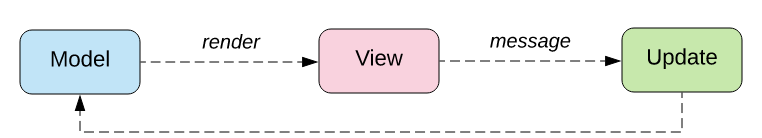

<frontmatter>
  title: Introduction to Elm
  header: pagetop.md
  footer: footer.md
  head: head.md
  siteNav: mainNav.md
  pageNav: 3
</frontmatter>

<div class="website-content">

{{ booktitle | safe }}

# Introduction to Elm

**Author(s): [Daryl Tan](https://github.com/openorclose)** <br>
**Reviewer(s): [Alfred Yip](https://github.com/alyip98)** <br>

## What is Elm?

[Elm](https://elm-lang.org/) is a statically typed, functional programming language that compiles to JavaScript and promises no runtime exceptions. You can use it to build reliable and maintainable applications for the web.


## Why Learn Elm?

Languages like Haskell and OCaml from the [ML family](https://en.wikipedia.org/wiki/ML_(programming_language)) have been well known to be maintainable and mostly error-free in practice. Their compilers catch bugs well before they can make it into production. However, these functional programming languages are also well known to have a steep learning curve.

JavaScript, the standard language for web development, has a rather low learning curve but is considerably more difficult to maintain. To solve this, people write tests, add type annotations to JavaScript, and even try to adopt functional programming patterns like immutability to increase maintanability.

Elm tries to be the best of both worlds. Its functional core provides maintainability, and it tries to greatly reduce the barriers to learning functional programming by simplifying concepts and having a really pleasant compiler.

### Benefit: Handling All Cases
Like many functional programming languages, you get the "if it compiles it works" feeling in Elm.

If your code can produce more than one result (e.g. converting a string in to an integer can either fail or succeed), Elm's compiler forces you to account for all cases in order to compile.

---

Let's say you have an array, and you try to access its 10th element. What happens if there is no such element?

Some languages like JavaScript will give you `undefined`, and your code might very well continue to execute and only error out in a completely separate function, making it a pain to debug.

Other languages, like Java and Haskell, will throw a form of `IndexOutOfBoundsException`. That's ideal for you as a developer since you know exactly at which line this error occurs.

However, this doesn't make for a good user experience. What if you forget to test an edge case?

---

In Elm, you will **never** run into these errors.

Elm forces you to handle both cases of the array access in your code:
- the element exists
- the element doesn't exist.

If you don't handle them, your code won't compile!


### Benefit: Friendly Compiler

Elm's compiler strives to be as friendly as possible, and offers as many hints as she can to help you fix errors. If nothing else, you should try Elm just to see how great error messages can be.

Here's a quick look at some of them:

- Cyclic dependencies:
```
-- IMPORT CYCLE ----------------------------------------------------------------

Your module imports form a cycle:

    ┌─────┐
    │    Bar
    │     ↓
    │    Foo
    └─────┘

Learn more about why this is disallowed and how to break cycles
here:<https://elm-lang.org/0.19.0/import-cycles>
```

- Wrong argument types:

```
> String.join 4 ["Hello", "World"]
-- TYPE MISMATCH ---------------------------------------------------------- REPL

The 1st argument to `join` is not what I expect:

3|   String.join 4 ["Hello", "World"]
                 ^
This argument is a number of type:

    number

But `join` needs the 1st argument to be:

    String

Hint: Try using String.fromInt to convert it to a string?
```

- Syntax errors, e.g. if you try to import modules with the JavaScript syntax:

```
> import * from 'Util'
-- EXPECTING IMPORT NAME -------------------------------------------------- REPL

I was parsing an `import` until I got stuck here:

2| import * from 'Util'
          ^
I was expecting to see a module name next, like in these examples:

    import Dict
    import Maybe
    import Html.Attributes as A
    import Json.Decode exposing (..)

Notice that the module names all start with capital letters. That is required!

Read <https://elm-lang.org/0.19.1/imports> to learn more.
```

### Benefit: Canonical Coding Style

Like in Go, Elm has largely managed to avoid the style wars of older languages by having introduced a recommended style guide and code formatter (`elm-format`) early on.

`elm-format` has no configuration, eliminating code style discussions with your team, and increasing the consistency of Elm code you see out in the wild.

In particular, the style guide aims to reduce version control diffs. Here's an example of the recommended style for a `Record` in Elm (a `Record` is like a JavaScript object):

```elm
person =
    { age = 18
    , firstName = "John"
    , lastName = "Doe"
    }
```

Note how if you were to add a new field `favoriteLanguage` to `person`, there would only be a one line diff:

```elm
person =
    { age = 18
    , firstName = "John"
    , lastName = "Doe"
    , favoriteLanguage = "PHP"
    }
```

If you're not used to this style (JavaScript achieves this reduced code diff via [trailing commas](https://developer.mozilla.org/en-US/docs/Web/JavaScript/Reference/Trailing_commas) for example), don't worry. You can code however you're used to and then run `elm-format` to format your code automatically!

That's the benefit of having one recommended style guide and using `elm-format`.

Further reading:
- [Official style guide](https://elm-lang.org/docs/style-guide)
- [elm-format](https://github.com/avh4/elm-format)

### Benefit: Package Ecosystem

You can share your package, or use any of the packages available at https://package.elm-lang.org/.

All packages there are written in Elm and therefore are safe (since Elm code cannot produce any side effects).

Furthermore, Elm has automatic enforced semantic versioning. Whenever you push an update to your package, Elm analyses your code, and depending on whether you have any breaking changes, updates the patch, minor, or major version accordingly. This makes both package maintainers and users happy: maintainers don't have to worry about choosing new versions, and users can know that as long as the major version doesn't change, there won't be any breaking changes.

### Benefit: Fast Compiles and Small Bundles

Elm's compiler is really fast. Its creator focused on compile times in its last two releases (0.19 and 0.19.1) which brought compile times for 100k LOC projects down to only 10s. If your project has less than 10k LOC, compilation should take no more than 1s.

Examples of LOC vs compile times [here](https://discourse.elm-lang.org/t/how-are-0-19-compile-times-for-50k-loc-projects/3680).

Lastly, Elm bundle size is small. Since Elm's functions are pure, tree-shaking can be done automatically. You can safely import a 1kLOC package only to use a one-liner function, and Elm can help you remove the 999 lines during compilation.

### Benefit: The Elm Way

You may have noticed that Elm really likes the "only one way to do it" philosophy. You don't get to choose your package versions, and you don't get to configure `elm-format`. This is all done on purpose: to simplify developers' lives.

In fact, when other languages have gone on and added more features in newer versions, Elm has gone the other direction and removed many language features for the sake of simplicity.

## The Elm Architecture



Elm doesn't allow side effects, so to build web apps, you use The Elm Architecture. It's similar to the model-view-controller design pattern.

You provide Elm with three items:

- an initial state your app is in
- a view function that takes in a state, and returns a HTML representation of that state
- an update function that takes in a state and a message. The function then can use information provided in the message to returns a new state.

Here's a minimal example (anything after `--` is a comment) :

```elm
module Main exposing (main)

import Browser
import Html exposing (Html, button, text)
import Html.Events exposing (onClick)

-- our initial state is a single number 1
initialModel = 1

-- if we get the message string "increment", we return a new number, model+1
-- else we don't update it, and return the same model
update msg model =
    case msg of
        "increment" -> model + 1
        _ -> model

-- we take in a model, and display the number it represents on a button element.
-- when the button is clicked, it sends the message string "increment" to Elm.
-- which will get passed to our `update` function.
view model = button [ onClick "increment" ] [ text (String.fromInt model) ]

-- now we glue it all together!
main =
    Browser.sandbox
        { init = initialModel
        , view = view
        , update = update
        }
```

View it on the elm playground [here](https://ellie-app.com/88GSdxWWVFza1).

Most Elm apps are written this way, you just keep adding stuff into your model, view, and update as you grow your app.

The main benefit of this is that your app becomes more maintainable. There is only ever one single source of truth.

## How to Get Started with Elm?
Play with Elm without installation, using the Elm playground [Ellie](https://ellie-app.com/).

After that, you can follow the official [Elm guide](https://guide.elm-lang.org/).

View the official documentation along with documentation for all available Elm packages [here](https://package.elm-lang.org/).

Elm has a small but very helpful community. Join the [Elm Slack](https://elmlang.herokuapp.com/) or the [Elm Discourse](https://discourse.elm-lang.org/).

If you're interested, the [official Elm blog](https://elm-lang.org/news) has really interesting posts on their design philosophies.

</div>