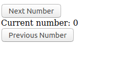

<frontmatter>
  title: Introduction to Elm
  header: pagetop.md
  footer: footer.md
  head: head.md
  siteNav: mainNav.md
  pageNav: 3
</frontmatter>

<div class="website-content">

{{ booktitle | safe }}

# Introduction to Elm

**Author(s): [Daryl Tan](https://github.com/openorclose)** <br>

## What is Elm?

[Elm](https://elm-lang.org/) is a statically typed, functional programming language that compiles to JavaScript and promises no runtime exceptions. You can use it to build 


## Why Learn Elm?

Languages like Haskell and OCaml from the [ML family](https://en.wikipedia.org/wiki/ML_(programming_language)) have been well known to be maintainable and mostly error-free in practice. Their compilers catch bugs well before they can make it into production. However, these functional programming languages are also well known to have a steep learning curve.

JavaScript, the standard language for web development, has a rather low learning curve but is considerably more difficult to maintain. To solve this, people write tests, add type annotations to JavaScript, and even try to adopt functional programming patterns like immutability to increase maintanability.

Elm tries to be the best of both worlds. Its functional core provides maintainability, and it tries to greatly reduce the barriers to learning functional programming by simplifying concepts and having a really pleasant compiler.

### Benefit: Handling All Cases
Like many functional programming languages, you get the "if it compiles it works" feeling in Elm.

If your code can produce more than one result (e.g. converting a string in to an integer can either fail or succeed), Elm's compiler forces you to account for all cases in order to compile.

---

Let's say you have an array, and you try to access its 10th element. What happens if there is no such element?

Some languages like JavaScript will give you `undefined`, and your code might very well continue to execute and only error out in a completely separate function, making it a pain to debug.

Other languages, like Java and Haskell, will throw a form of `IndexOutOfBoundsException`. That's ideal for you as a developer since you know exactly at which line this error occurs.

However, this doesn't make for a good user experience. What if you forget to test an edge case?

---

In Elm, you will **never** run into these errors.

Elm forces you to handle both cases of the array access in your code:
- the element exists
- the element doesn't exist.

If you don't handle them, your code won't compile!


### Benefit: Friendly Compiler

Elm's compiler strives to be as friendly as possible, and offers as many hints as she can to help you fix errors. If nothing else, you should try Elm just to see how great error messages can be.

Here's a quick look at some of them:

- Cyclic dependencies:
```
-- IMPORT CYCLE ----------------------------------------------------------------

Your module imports form a cycle:

    ┌─────┐
    │    Bar
    │     ↓
    │    Foo
    └─────┘

Learn more about why this is disallowed and how to break cycles
here:<https://elm-lang.org/0.19.0/import-cycles>
```

- Wrong argument types:

```
> String.join 4 ["Hello", "World"]
-- TYPE MISMATCH ---------------------------------------------------------- REPL

The 1st argument to `join` is not what I expect:

3|   String.join 4 ["Hello", "World"]
                 ^
This argument is a number of type:

    number

But `join` needs the 1st argument to be:

    String

Hint: Try using String.fromInt to convert it to a string?
```

- Syntax errors, e.g. if you try to import modules with the JavaScript syntax:

```
> import * from 'Util'
-- EXPECTING IMPORT NAME -------------------------------------------------- REPL

I was parsing an `import` until I got stuck here:

2| import * from 'Util'
          ^
I was expecting to see a module name next, like in these examples:

    import Dict
    import Maybe
    import Html.Attributes as A
    import Json.Decode exposing (..)

Notice that the module names all start with capital letters. That is required!

Read <https://elm-lang.org/0.19.1/imports> to learn more.
```

### Benefit: Canonical Coding Style

Like in Go, Elm has largely managed to avoid the style wars of older languages by having introduced a recommended style guide and code formatter (`elm-format`) early on.

`elm-format` has no configuration, eliminating code style discussions with your team, and increasing the consistency of Elm code you see out in the wild.

In particular, the style guide aims to reduce version control diffs. Here's an example of the recommended style for a `Record` in Elm (a `Record` is like a JavaScript object):

```elm
person =
    { age = 18
    , firstName = "John"
    , lastName = "Doe"
    }
```

Note how if you were to add a new field `favoriteLanguage` to `person`, there would only be a one line diff:

```elm
person =
    { age = 18
    , firstName = "John"
    , lastName = "Doe"
    , favoriteLanguage = "PHP"
    }
```

If you're not used to this style (JavaScript achieves this reduced code diff via [trailing commas](https://developer.mozilla.org/en-US/docs/Web/JavaScript/Reference/Trailing_commas) for example), don't worry. You can code however you're used to and then run `elm-format` to format your code automatically!

That's the benefit of having one recommended style guide and using `elm-format`.

Further reading:
- [Official style guide](https://elm-lang.org/docs/style-guide)
- [elm-format](https://github.com/avh4/elm-format)

### Benefit: Package Ecosystem

You can share your package, or use any of the packages available at https://package.elm-lang.org/.

All packages there are written in Elm and therefore are safe (since Elm code cannot produce any side effects).

Furthermore, Elm has automatic enforced semantic versioning. Whenever you push an update to your package, Elm analyses your code, and depending on whether you have any breaking changes, updates the patch, minor, or major version accordingly. This makes both package maintainers and users happy: maintainers don't have to worry about choosing new versions, and users can know that as long as the major version doesn't change, there won't be any breaking changes.

### Benefit: Fast Compiles and Small Bundles

Elm's compiler is really fast. Its creator focused on compile times in its last two releases (0.19 and 0.19.1) which brought compile times for 100k LOC projects down to only 10s. If your project has less than 10k LOC, compilation should take no more than 1s.

Examples of LOC vs compile times [here](https://discourse.elm-lang.org/t/how-are-0-19-compile-times-for-50k-loc-projects/3680).

Lastly, Elm bundle size is small. Since Elm's functions are pure, tree-shaking can be done automatically. You can safely import a 1kLOC package only to use a one-liner function, and Elm can help you remove the 999 lines during compilation.

### Benefit: The Elm Way

You may have noticed that Elm really likes the "only one way to do it" philosophy. You don't get to choose your package versions, and you don't get to configure `elm-format`. This is all done on purpose: to simplify developers' lives.

In fact, when other languages have gone on and added more features in newer versions, Elm has gone the other direction and removed many language features for the sake of simplicity.

## Basic Syntax

Before showing how to build a simple app in Elm, let's learn some basic syntax.

### Names

All Elm module names start with an uppercase letter (e.g. `Html`, `Array`), while all Elm variables/functions start with a lowercase letter (e.g. `filter`, `min`).

### Function Definitions

Let's define a function `sum` that takes two arguments and adds them:

```elm
sum left right = left + right
```

All values in Elm are immutable, so no need for a special keyword to initialise them.

To declare a function, put the function name and its parameters on the left of `=` and the expression you wish to evaluate on the right.

### Function Application

Since Elm is a functional programming lanugage, function application is the core of the language and therefore has the cleanest syntax. Separate your function and its arguments with spaces and that's it:

```elm
sum 3 4
```

The above expression sums the values `3` amd `4` using the `sum` function.

### Lists

Using the `[]` syntax, we can create `List`s, which are like Linked Lists in other languages:

```elm
numbers = [1, 2, 3]
```

### Records

A `Record` is a data structure that helps you organize your data. For example, you could store a point with x and y coordinates using a list:

```elm
point = [0, 0]
```

But you might come back to your code weeks later and wonder what the above meant. Using records allows you to label your data to be more explicit:

```elm
point =
    { x = 0
    , y = 0
    }
```
---
With the above syntax, we are now ready to build our first real-world Elm app using The Elm Architecture!

<variable name="appdescription">

Let's build an app to teach children to count. It will have a HTML div containing an initial number 0, a button to increase the number by 1, and lastly a button to decrease the number by 1.
</variable>

{{appdescription}}
## The Elm Architecture

Like the Model-View-Controller pattern, The Elm Architecture has the following:

- Model
- Update
- View

### View

To start, let's focus on the view and build only the user interface, so model and update are not needed.

---

Creating HTML elements in Elm is like doing anything else in Elm: you use functions.

- The `text` function takes in one argument: a `String`, and returns a HTML text node.
- The `div` function takes in two arguments: a list of attributes, and a list of all its children elements, and returns a HTML div element.

So to display "Hello world!", we define your `view` function as follows:

```elm
view _ = div [] [text "Hello World!"]
```

This div has no attributes, so the empty list `[]` is passed as the first argument. The div contains one child element, the text node, so the list containing the single text node is passed as the second argument.

<box type="tip">

Ignore the underscore `_` for now. Elm requires the `view` function to take in one argument, but we do not do anything with the argument right now. The `_` tells Elm that we are not going to use that argument.
</box>

Now we hook it up to Elm using `Browser.sandbox`:

```elm
view _ = div [] [text "Hello World!"]
main =
    Browser.sandbox
        { init = ()
        , view = view
        , update = never
        }
```

`Browser.sandbox` (the function `sandbox` from the module `Browser`) is a function that takes in one argument: a `Record` of your initial model, view function, and update function and creates something your users can see in the browser. Since we are only dealing with the `view` for now, let's ignore the `init` and `update` fields.

<box type="info">

If you're curious, () is vaguely like a `null` value. And `never` is a function that, as its name suggests, can never be executed! Perfect for telling the compiler "I well never use this".
</box>

Here's the rather uninspiring result:

> Hello world!

---

Now, let's build our real app. To refresh your memory, here's the description again:

{{appdescription}}

We translate it into Elm:
```elm
view _ = 
    div []
        [ button [] [ text "Next Number" ]
        , div [] [ text "Current Number: 0" ]
        , button [] [ text "Previous Number" ]
        ]

main =
    Browser.sandbox
        { init = ()
        , view = view
        , update = never
        }
```

The `button` function works like `div`, taking in two arguments: a list of attributes, and a list of all its children elements, and returning a HTML button element.

And now we have a HTML div containing 3 elements: a button, another div with the current number, and another button.

Here's the result:



### Model and Update: Adding Interactivity

It's all good that we have nice buttons that users can click on, but they don't do anything useful yet.

Let's fix that by keeping track of our application **state**, and tell Elm how to update this state via the update function.

Let's create our initial model state using a `Record`:

```elm
initialModel = { currentNumber = 0 }
```
We create a record with one field `currentNumber`, representing our initial model.

Now we create our update function:
```elm
update message model =
    if message.action == "next" then
        { model | currentNumber = model.currentNumber + 1 }
    else
        { model | currentNumber = model.currentNumber - 1 }
```

Our update function takes in two arguments: a message that helps our function decide what to do to a model, and the model itself. It then returns a new updated model.

`message` is a `Record` with one string field `action`. We access the field `action`'s value with `message.action`.

Then, we return a new model with:

```elm
{ model | currentNumber = model.currentNumber + 1 }
```

This is Elm's `Record` update syntax. It takes in a record on the left side of `|`, and produces a **new record**. This new record contains all the same fields and values of the old record, except that whatever fields and values you specify on the right of `|` will be used instead of the old ones.

Next, we need to change our view function.

Remember our old view function:

```elm
view _ = 
    div []
        [ button [] [ text "Next Number" ]
        , div [] [ text "Current Number: 0" ]
        , button [] [ text "Previous Number" ]
        ]
```

Let's change it to make use of our model:

```elm
view model = 
    div []
        [ button [onClick { action = "next" }] [ text "Next Number" ]
        , div [] [ text ("Current number: "
            ++ (String.fromInt model.currentNumber)) ]
        , button [onClick { action = "prev" }] [ text "Previous Number" ]
        ]
```

And we finally find out what that previously unknown argument was for. The view function takes in a model, and returns a representation of it in HTML. We didn't have to use it previously as we produced the same user interface no matter the model.

---

Let's look at the line
```elm
text ("Current number: "
            ++ (String.fromInt model.currentNumber))
```
Instead of always showing `0`, we now show whatever is our current number in our model. We do this by first converting it into a string with `String.fromInt`, and then doing string concatenation with the `++` operator.

Now look at this line:
```elm
button [onClick { action = "next" }] [ text "Next Number" ]
```
Remember how the first argument to `button` is a list of attributes? Now we pass in a list containing one attribute created by `onClick`. The `onClick` function takes in one argument: the message to pass to our update function, and returns a HTML attribute.

Now, whenever the `Next Number` button is clicked, the record `{ action = "next" }` is passed to the update function. Elm updates the model, and then updates the view accordingly. This update-model-view cycle then repeats:


<box type="info">

If you've used Redux or other similar state management tools, you may find all this quite similar.

The Elm Architecture has been proven to be a great way to write scalable apps due to the separation of concerns and immutable state, and so tools like Redux were created to mimic this in JavaScript.

Of course, in JavaScript, you have to take care to not mutate any state whereas Elm makes it impossible to do so.
</box>

Finally, we update our `main` to use our newly-defined `initialModel` and `update`:

```elm
main =
    Browser.sandbox
        { init = initialModel
        , view = view
        , update = update
        }
```


And there you have it! You can view the final result here in the Elm playground:

https://ellie-app.com/87q5N9KfdFqa1

---

## More Syntax

You may have noticed how there was no mention of the word "type" in the previous section. This is because I wanted to introduce The Elm Architecture, the core of Elm in a way that should be understandable to beginners to functional programming.

Let's take a look again at what we ended up with:

```elm
initialModel =
    { currentNumber = 0 }

view model = 
    div []
        [ button [onClick { action = "next" }] [ text "Next Number" ]
        , div [] [ text ("Current number: "
            ++ (String.fromInt model.currentNumber)) ]
        , button [onClick { action = "prev" }] [ text "Previous Number" ]
        ]

update message model =
    if message.action == "nxet" then
        { model | currentNumber = model.currentNumber + 1 }
    else
        { model | currentNumber = model.currentNumber - 1 }

main =
    Browser.sandbox
        { init = initialModel
        , view = view
        , update = update
        }
```

I lied. I made a slight modification, the line `if message.action == "nxet" then` contains a typo in "next". Our code still compiles and runs, but when you click the button "Next Number" it decrements the number instead!

**This is bad**! We *want* our code to fail to compile when bugs like these occur. That's the whole point of using Elm after all!

The problem with our code above was that we used **strings** to represent our message. Elm doesn't execute your code at compile time, so it can't tell when you have a typo in your string. It just knows that a string was expected, and a string was provided, and happily compiles your code.

We can solve this this using **custom types**.

### Custom Types

In their simplest form, custom types resemble enums in Java:

```elm
type Direction = Up | Down | Left | Right
```

So whenever we see the type `Direction`, we know (and the compiler knows) that there are only four possible values. 

If you want to display a `Direction` to your user, you first need to convert it into a string. You can do this with a `case` expression:

```elm
dirToString direction =
    case direction of
        Up -> "Up"
        Down -> "Down"
        Left -> "Left"
        Right -> "Right"
```

Now, if you forget to account for one case, like:
```elm
dirToString direction =
    case direction of
        Up -> "Up"
        Down -> "Down"
        Left -> "Left"
```
The compiler will tell you to fix it:
```
This `case` does not have branches for all possibilities:

11|>    case direction of
12|>        Up -> "Up"
13|>        Down -> "Down"
14|>        Left -> "Left"

Missing possibilities include:

    Right

I would have to crash if I saw one of those. Add branches for them!

Hint: If you want to write the code for each branch later, use `Debug.todo` as a
placeholder. Read <https://elm-lang.org/0.19.1/missing-patterns> for more
guidance on this workflow.
```

---

How can we use this newfound knowledge to improve our app?

We know we have two possible message types: one to go to the next number, and one to go to the previous number.

Let's represent this using custom types:

```elm
type Message = Next | Previous
```

and change the `update` and `view` functions accordingly:

```elm
type Message = Next | Previous
view model = 
    div []
        [ button [onClick Next] [ text "Next Number" ]
        , div [] [ text ("Current number: "
            ++ (String.fromInt model.currentNumber)) ]
        , button [onClick Previous] [ text "Previous Number" ]
        ]

update message model =
    case message of
        Next -> { model | currentNumber = model.currentNumber + 1 }
        Previous -> { model | currentNumber = model.currentNumber - 1 }
```

Now if you make the same typo in `Next` as before, the compiler will correctly give you an error!


## How to Get Started with Elm?
Play with Elm without installation, using the Elm playground [Ellie](https://ellie-app.com/).

After that, you can follow the official [Elm guide](https://guide.elm-lang.org/).

View the official documentation along with documentation for all available Elm packages [here](https://package.elm-lang.org/).

Elm has a small but very helpful community. Join the [Elm Slack](https://elmlang.herokuapp.com/) or the [Elm Discourse](https://discourse.elm-lang.org/).

If you're interested, the [official Elm blog](https://elm-lang.org/news) has really interesting posts on their design philosophies.

</div>