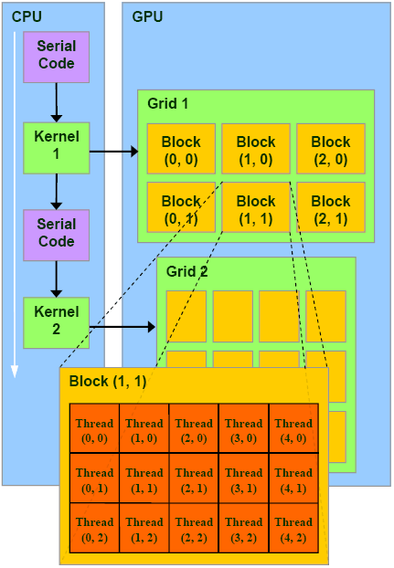

<frontmatter>
  title: An Introduction to CUDA
  footer: footer.md
  head: head.md
</frontmatter>

{{ navbar | safe }}

# An Introduction to CUDA

###### Author: [Pierce Anderson Fu](https://github.com/PierceAndy)

- [Disclaimer](#-0-disclaimer)
- [CUDA](#-1-cuda)
    - [What is CUDA?](#-11-what-is-cuda)
    - [CUDA Terminologies](#-12-cuda-terminologies)
        - [Host](#host)
        - [Host code](#host-code)
        - [Device](#device)
        - [Device code](#device-code)
        - [Streaming Multiprocessors (SMs)](#streaming-multiprocessors-sms)
        - [Kernels](#kernels)
        - [Threads](#threads)
        - [Blocks](#blocks)
        - [Grids](#grids)
            - [NVIDIA's official word on Kernels, Threads, Blocks, and Grids](#nvidias-official-word-on-kernels-threads-blocks-and-grids)
    - [Kernel Implementations in C](#-13-kernel-implementations-in-c)
        - [Keywords that let kernels get indexes of running threads](#-131-keywords-that-let-kernels-get-indexes-of-running-threads)
            - [gridDim](#griddim)
            - [blockDim](#blockdim)
            - [blockIdx](#blockidx)
            - [threadIdx](#threadidx)
    - [Introductory Tutorial](#-14-introductory-tutorial)
- [PyCUDA](#-2-pycuda)
    - [What is PyCUDA?](#-21-what-is-pycuda)
    - [Does this mean not having to use C, and coding entirely in Python?](#-22-does-this-mean-not-having-to-use-c-and-coding-entirely-in-python)
    - [So Why bother with PyCUDA?](#-23-so-why-bother-with-pycuda)
    - [Installing PyCUDA](#-24-installing-pycuda)
    - [Minor PyCUDA Terminologies](#-25-minor-pycuda-terminologies)
        - [dtoh](#dtoh)
        - [htod](#htod)
    - [Introductory Tutorial](#-26-introductory-tutorial)
- [CUDA vs OpenCL](#-3-cuda-vs-opencl)
    - [What is OpenCL?](#-31-what-is-opencl)
    - [Differences between CUDA and OpenCL](#-32-differences-between-cuda-and-opencl)
- [Further Readings](#-4-further-readings)
- [References](#-5-references)

## § 0. Disclaimer

This learning resource assumes that you understand what GPGPU is.

If not, find out more about GPGPU at [se-edu's learning resource on GPGPU](gpgpu.md).

## § 1. CUDA

### § 1.1 What is CUDA?

CUDA is a parallel computing platform and programming model from NVIDIA.<sup>[[1]](#footnote1)</sup>

It allows us to use a CUDA-enabled GPU for GPGPU. The list of GPUs that support CUDA can be found here: https://developer.nvidia.com/cuda-gpus.

### § 1.2 CUDA Terminologies

#### Host
Refers to CPU and its memory

#### Host code
Code that runs on CPU

#### Device
Refers to GPU and its memory

#### Device code
Code that runs on GPU

#### Streaming Multiprocessors (SMs)
CUDA GPUs have many parallel processors grouped into SMs

Each SM can run multiple concurrent thread blocks that execute independently from each other.

#### Kernels
CUDA C extends C by allowing the programmer to define C functions, called kernels, that are run by the GPU.

When called, kernels are executed `N` times in parallel by `N` different CUDA threads, as opposed to only once like regular C functions.<sup>[[2]](#footnote2)</sup>

CUDA executes kernels using a grid of blocks of threads.

#### Threads
An execution of a kernel with a given index.

Each thread uses its index to access elements in array such that the collection of all threads cooperatively processes the entire data set.<sup>[[3]](#footnote3)</sup>

#### Blocks
A logical group of threads.

The threads in a block can be arranged into 1D, 2D, or 3D arrays, and can be identified using 1D (`x`), 2D (`x`, `y`), or 3D (`x`, `y`, `z`) indexes, respectively.

Each block is atomically assigned to and run by a single SM. A single block will never be split up, and it will never be processed by more than one SM. However, note that it isn't a one-to-one relationship, and one SM can concurrently process more than one block. There is no synchronization between blocks, and they are executed independently from each other.<sup>[[3]](#footnote3)</sup>

#### Grids
A logical group of blocks.

The blocks in a grid can be arranged into 1D, or 2D arrays, and can be identified using 1D (`x`), or 2D (`x`, `y`) indexes, respectively.

##### NVIDIA's official word on Kernels, Threads, Blocks, and Grids
> When a CUDA program on the host CPU invokes a kernel grid, the blocks of the grid are enumerated and distributed to multiprocessors with available execution capacity. The threads of a thread block execute concurrently on one multiprocessor, and multiple thread blocks can execute concurrently on one multiprocessor. As thread blocks terminate, new blocks are launched on the vacated multiprocessors.<sup>[[4]](#footnote4)</sup>



### § 1.3 Kernel Implementations in C
A kernel is defined using the `__global__` declaration specifier. This tells the CUDA C++ compiler that this is a function that runs on the GPU and can be called from CPU code.

The number of CUDA threads that execute that kernel for a given kernel call is specified using the `<<<...>>>` execution configuration.<sup>[[2]](#footnote2)</sup> A kernel called `myKernel` can be launched with the following syntax in C:

`myKernel<<<numBlocks, numThreadsPerBlock>>>(args)`

> ##### Definitions:
>
> *`numBlocks`* refers to the number of thread blocks in the grid.
>
> *`numThreadsPerBlock`* refers to the number of threads in each thread block.

Note that different GPUs work optimally with different dimension parameters.<sup>[[5]](#footnote5)</sup>

Each thread that executes the kernel is given a unique thread ID that is accessible within the kernel through the built-in `threadIdx` variable.

As an illustration, the following sample code adds two vectors `A` and `B` of size `N` and stores the result into vector `results`:<sup>[[2]](#footnote2)</sup>

```
// Kernel definition
__global__ void VecAdd(float* A, float* B, float* results)
{
    int i = threadIdx.x;
    results[i] = A[i] + B[i];
}

int main()
{
    ...
    // Kernel invocation of 1D block with N threads
    VecAdd<<<1, N>>>(A, B, results);
    ...
}
```

#### § 1.3.1 Keywords that let kernels get indexes of running threads

##### `gridDim`
Dimensions of the grid in blocks.

First dimension of blocks is accessed with `gridDim.x`, and second dimension is accessed with `gridDim.y`. `gridDim.z` is unused as blocks can either be 1D or 2D only.

##### `blockDim`
Dimensions of the block in threads.

First dimension of threads is accessed with `gridDim.x`, second dimension is accessed with `gridDim.y`, and third dimension is accessed with `gridDim.z`.

##### `blockIdx`
Block index within the grid. Is grid-level unique.

##### `threadIdx`
Thread index within the block. Is block-level unique.

For instance, the index of a thread in a 1D grid of a 1D block of threads can be determined using

`blockIdx.x * blockDim.x + threadIdx.x`

### § 1.4 Introductory Tutorial

Refer to the excellent tutorial by the Chief Technologist for GPU Computing Software at NVIDIA here: [An Even Easier Introduction to CUDA](https://devblogs.nvidia.com/parallelforall/even-easier-introduction-cuda/).

Should you have trouble understanding any terms, you can refer to [section 1.2 of this guide on CUDA terminologies](#-12-cuda-terminologies).

## § 2. PyCUDA

### § 2.1 What is PyCUDA?
PyCUDA lets you access NVIDIA‘s CUDA parallel computation API from Python.<sup>[[6]](#footnote6)</sup>

### § 2.2 Does this mean not having to use C, and coding entirely in Python?
Not entirely so.

While kernels will have to be written in CUDA C, PyCUDA has helper interfaces that make it easier to write CUDA code (e.g. with memory management and cleanup). However, with the right helpers, you can write CUDA code without needing to write any C code at all. For instance, [see this example from the Wiki that performs a 2D fast Fourier transform (FFT) without any CUDA C code](https://wiki.tiker.net/PyCuda/Examples/2DFFT).<sup>[[7]](#footnote7)</sup>

### § 2.3 So Why bother with PyCUDA?
- Object cleanup tied to lifetime of objects. This idiom, often called [RAII](https://en.wikipedia.org/wiki/Resource_Acquisition_Is_Initialization) in C++, makes it much easier to write correct, leak- and crash-free code. PyCUDA knows about dependencies, too, so (for example) it won’t detach from a context before all memory allocated in it is also freed.<sup>[[6]](#footnote6)</sup>
- Convenience. Abstractions like pycuda.driver.SourceModule and pycuda.gpuarray.GPUArray make CUDA programming even more convenient than with NVIDIA’s C-based runtime.<sup>[[6]](#footnote6)</sup>
- Completeness. PyCUDA puts the full power of CUDA’s driver API at your disposal, if you wish.<sup>[[6]](#footnote6)</sup>
- Automatic Error Checking. All CUDA errors are automatically translated into Python exceptions.<sup>[[6]](#footnote6)</sup>
- Speed. PyCUDA’s base layer is written in C++, so all the niceties above are virtually free.<sup>[[6]](#footnote6)</sup>
- Helpful [documentation](https://documen.tician.de/pycuda/) and [Wiki](https://wiki.tiker.net/PyCuda).<sup>[[6]](#footnote6)</sup>
- [Open sourced on GitHub](https://github.com/inducer/pycuda).

Thus, if you're not familiar with C, it would be easier to learn about CUDA through PyCUDA, especially if you have prior experience with Python.

### § 2.4 Installing PyCUDA

Official installation instructions here: https://wiki.tiker.net/PyCuda/Installation

### § 2.5 Minor PyCUDA Terminologies

#### dtoh
Device to host, *i.e.* GPU to CPU.

#### htod
Host to device, *i.e.* CPU to GPU.

### § 2.6 Introductory Tutorial

Official tutorial here: https://documen.tician.de/pycuda/tutorial.html

> ##### Note:
>
> While still useful and relevant, this tutorial was originally written in 2008, and contains some outdated information.
>
> Specifically, the point about how "most nVidia [*sic*] devices only support single precision" is incorrect. All NVIDIA GPUs since GT200 (released in Sep 2008), with compute capability 1.3 or higher, provide hardware support for double precision floating point values and operations.<sup>[[8]](#footnote8)</sup>
>
> You can find out the compute capability of your NVIDIA card from the [official website](https://developer.nvidia.com/cuda-gpus) or [this table from Wikipedia](https://en.wikipedia.org/wiki/CUDA#GPUs_supported).
>
> You can also find out more about the features and specifications of each compute capability version from the [official documentation](http://docs.nvidia.com/cuda/cuda-c-programming-guide/index.html#compute-capabilities) or [these tables from Wikipedia](https://en.wikipedia.org/wiki/CUDA#Version_features_and_specifications).

## § 3. CUDA vs OpenCL

### § 3.1 What is OpenCL?
OpenCL (Open Computing Language) is an open standard for cross-platform, parallel programming of diverse processors found in personal computers, servers, mobile devices and embedded platforms.<sup>[[9]](#footnote9)</sup>

### § 3.2 Differences between CUDA and OpenCL
First and foremost, the most distinctive difference is in how CUDA is proprietary to NVIDIA, whereas OpenCL, while owned by the Khronos Group, is open-sourced. The implications are that if you have an NVIDIA GPU, it supports both CUDA and OpenCL, but if not, and you're using an AMD GPU, it only supports OpenCL.

Additionally, they use different terms. For instance, what NIVIDIA refers to as a "thread", OpenCL refers to as a "work item".

This topic is widely covered. Here are some good references on what the differences are, and what the implications are when choosing one over the other:
- https://wiki.tiker.net/CudaVsOpenCL
- http://create.pro/blog/opencl-vs-cuda/
- https://streamcomputing.eu/blog/2010-04-22/difference-between-cuda-and-opencl/

## § 4. Further Readings
- [Official CUDA C developer resources](https://developer.nvidia.com/cuda-zone)
- [Official CUDA C programming guide](http://docs.nvidia.com/cuda/cuda-c-programming-guide)
- [Lightning talk slides: GPU Programming Made Easy with Python](https://github.com/nus-oss/lightningtalks/issues/44)
- [se-edu's learning resource on GPGPU](gpgpu.md)

## § 5. References

<a name="footnote1">[1]</a>: http://www.nvidia.com/object/cuda_home_new.html<br />
<a name="footnote2">[2]</a>: http://docs.nvidia.com/cuda/cuda-c-programming-guide/#kernels<br />
<a name="footnote3">[3]</a>: https://llpanorama.wordpress.com/2008/06/11/threads-and-blocks-and-grids-oh-my/<br />
<a name="footnote4">[4]</a>: http://docs.nvidia.com/cuda/cuda-c-programming-guide/#hardware-implementation<br />
<a name="footnote5">[5]</a>: http://docs.nvidia.com/gameworks/content/developertools/desktop/analysis/report/cudaexperiments/kernellevel/achievedoccupancy.htm<br />
<a name="footnote6">[6]</a>: https://mathema.tician.de/software/pycuda/<br />
<a name="footnote7">[7]</a>: http://stackoverflow.com/a/5957647<br />
<a name="footnote8">[8]</a>: https://developer.nvidia.com/cuda-faq#Programming<br />
<a name="footnote9">[9]</a>: https://www.khronos.org/opencl/<br />
