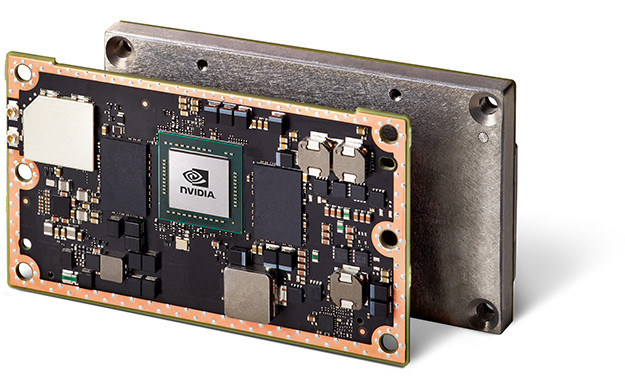
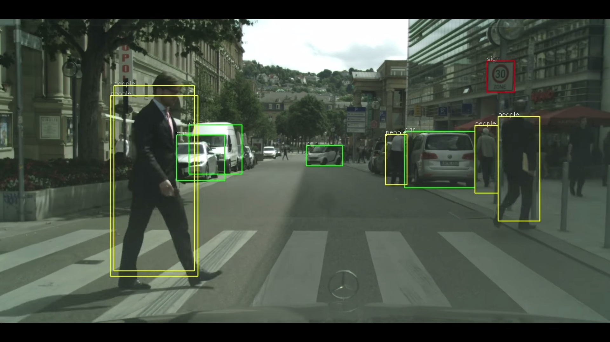

<frontmatter>
  title: An Introduction to GPGPU
  footer: footer.md
  head: head.md
  siteNav: mainNav.md
  pageNav: 3
</frontmatter>

{{ navbar | safe }}

# An Introduction to GPGPU

###### Authors: [Pierce Anderson Fu](https://github.com/PierceAndy), [Nguyen Quoc Bao](https://github.com/bqnguyen94)

- [GPGPU](#-1-gpgpu)
    - [What is GPGPU?](#-11-what-is-gpgpu)
    - [Why bother with parallel processing?](#-12-why-bother-with-parallel-processing)
    - [Aren't multicore CPUs enough?](#-13-arent-multicore-cpus-enough)
    - [What are the challenges with GPGPU?](#-14-what-are-the-challenges-with-gpgpu)
    - [Implementations](#-15-implementations)
    - [GPGPU in action](#-16-gpgpu-in-action)
- [Further Readings](#-2-further-readings)
- [References](#-3-references)

## § 1. GPGPU

### § 1.1 What is GPGPU?
GPGPU stands for General-purpose computing on graphics processing units. It is the use of a graphics processing unit (GPU), which typically handles computation only for computer graphics, to perform computation in applications traditionally handled by the central processing unit (CPU).[[1]](#footnote1)

Simply put, it's a kind of parallel processing where we're trying to exploit the data-parallel hardware on GPUs to improve the throughput of our computers.

### § 1.2 Why bother with parallel processing?
Moore's law is the observation made by Gordon Moore that the density of transistors in an integrated circuit board doubles approximately every two years. It has long been co-opted by the semiconductor industry as a target, and consumers have taken this growth for granted.

Because it suggests exponential growth, it is unsustainable and it cannot be expected to continue indefinitely. In the words of Moore himself, "It can't continue forever.".[[2]](#footnote2) There are hard physical limits to this scaling such as heat dissipation rate[[3]](#footnote3) and size of microprocessor features.[[4]](#footnote4)

As software engineers, this means that free and regular performance gains can no longer be expected.[[5]](#footnote5) To fully exploit CPU throughput gains, we need to code differently.

### § 1.3 Aren't multicore CPUs enough?
Between CPUs and GPUs, there are differences in **scale** and **architecture**.
- In terms of **scale**, CPUs only have several cores while GPUs house up to thousands of cores.
- In terms of **architecture**, CPUs are designed to handle sequential processing and branches effectively, while GPUs excel at performing simpler computations on large amounts of data.

This means that CPUs and GPUs excel at different tasks. You'll typically want to utilize GPGPU on tasks that are data parallel and compute intensive (e.g. graphics, matrix operations).

> ##### Definitions:
>
> *Data parallelism* refers to how a processor executes the same operation on different data elements simultaneously.
>
> *Compute intensive* refers to how the algorithm will have to process lots of data elements.

### § 1.4 What are the challenges with GPGPU?
Not all problems are inherently parallelizable.

The SIMT (Single Instruction, Multiple Threads) architecture of GPUs means that they don't handle branches and inter-thread communication well.

### § 1.5 Implementations

- CUDA: [Official website](http://www.nvidia.com/object/cuda_home_new.html)
- OpenCL: [Official website](https://www.khronos.org/opencl/)

### § 1.6 GPGPU in action
The benefits of GPGPU are even more pronounced when it comes to embedded systems and Internet of Things (IoT) applications, where computing power is often compromised for physical space, weight, and power consumption. For instance, NVIDIA's Jetson TX2, a computation processor board that delivers the processing capability of the Pascal GPU architecture in a package the size of a business card[[6]](#footnote6). The Pascal architecture is used in many desktop computers, data centres, and supercomputers[[7]](#footnote7). Along with its small form factor, this makes the Jetson ideal for embedded systems that require intensive processing power.

*[NVIDIA Jetson TX2 embedded system-on-module with Thermal Transfer Plate (TTP)](https://devblogs.nvidia.com/jetson-tx2-delivers-twice-intelligence-edge/)*

Packed with a NVIDIA Pascal GPU with 256 CUDA cores at maximally 1300 MHz[[6]](#footnote6), the TX2 is capable of intensive parallel computational tasks such as real-time vision processing or deploying deep neural networks, allowing mobile platforms to solve complex, real-world problems.

*[CES 2016: NVIDIA DRIVENet Demo - Visualizing a Self-Driving Future](https://www.youtube.com/watch?v=HJ58dbd5g8g)*

Compatible with a range of components and large ecosystem products[[8]](#footnote8), the Jetson platform is now widely used for deploying vision and neural network processing onboard mobile platforms like self-driving cars, autonomous robots, drones, IoT, handheld medical devices, etc[[9]](#footnote9).

## § 2. Further Readings
- [How concurrency is the next big change in software development since OO](http://www.gotw.ca/publications/concurrency-ddj.htm)
- [Official CUDA C programming guide: What GPUs excel at processing, and why](http://docs.nvidia.com/cuda/cuda-c-programming-guide/#from-graphics-processing-to-general-purpose-parallel-computing)
- [Official CUDA C programming guide: Architecture of NVIDIA GPUs](http://docs.nvidia.com/cuda/cuda-c-programming-guide/#simt-architecture)
- [Lightning talk slides: An Introduction to GPGPU](https://github.com/nus-oss/lightningtalks/issues/10)
- [se-edu's learning resource on CUDA](cuda.html)

## § 3. References

<a name="footnote1">[1]</a>: https://en.wikipedia.org/wiki/General-purpose_computing_on_graphics_processing_units 
<a name="footnote2">[2]</a>: http://www.techworld.com/news/operating-systems/moores-law-is-dead-says-gordon-moore-3576581/ 
<a name="footnote3">[3]</a>: http://theory.physics.lehigh.edu/rotkin/newdata/mypreprs/spie-09b.pdf 
<a name="footnote4">[4]</a>: https://arstechnica.com/gadgets/2016/07/itrs-roadmap-2021-moores-law/ 
<a name="footnote5">[5]</a>: http://www.gotw.ca/publications/concurrency-ddj.htm 
<a name="footnote6">[6]</a>: https://www.nvidia.com/en-us/autonomous-machines/embedded-systems-dev-kits-modules/ 
<a name="footnote7">[7]</a>: https://en.wikipedia.org/wiki/Tegra#Tegra_X1/ 
<a name="footnote8">[8]</a>: https://elinux.org/Jetson_TX2#Ecosystem_Products 
<a name="footnote9">[9]</a>: https://developer.nvidia.com/embedded/learn/success-stories 

