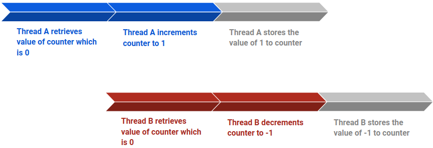

<frontmatter>
  title: Java Concurrency
  header: pagetop.md
  footer: footer.md
  head: head.md
  siteNav: mainNav.md
  pageNav: 3
</frontmatter>

<div class="website-content">

{{ booktitle | safe }}

# Java Concurrency

Authors: Vivek Lakshmanan

* [What is Java Concurrency](#what-is-java-concurrency)
* [Getting started](#getting-started)
    * [Understanding Threads](#understanding-threads)
    * [Creating and Starting Threads](#creating-and-starting-threads)
    * [Operations on Threads](#operations-on-threads)
    * [Thread Interference](#thread-interference)
    * [Executors](#executors)
* [Disadvantages of Java Concurrency](#disadvantages-of-java-concurrency)
* [Resources](#resources)
    * [Further Reading](#further-reading)

## What is Java Concurrency
_Concurrency_ is the ability to run several programs or several parts of a program **out-of-order**, in an **interleaved fashion**. Simply put, if a program is running concurrently, the processor will execute one part of the program, pause it, execute another part and repeat. 

As such, Java Concurrency enables you to perform tasks using multi-threading in your code and therefore:
1. improving responsiveness
1. allowing you to better utilize resources 

Do note that _Concurrency_ often gets confused with _Parallelism_ which is **a different property altogether**. _Parallelism_ is where parts of the program are executed at the **same time**, for example, on a multi-core processor. This [StackOverflow post](https://stackoverflow.com/questions/4844637/what-is-the-difference-between-concurrency-parallelism-and-asynchronous-methods/36604522#36604522) explains this in much greater detail.

## Getting Started
There are many tutorials that cover Java Concurrency in-depth, such as the [Java tutorial by Oracle](https://docs.oracle.com/javase/tutorial/essential/concurrency/). Instead, this chapter will provide an overview and things to take note of.

### Understanding Threads
First off, a process is simply a program in execution. It contains at least one thread and has it's own memory space.

A thread: 
* is a lightweight process that exists within a process 
* is an independent path of execution through program code 
* has its own call stack and can access shared data of other threads in the same process. 

### Creating and Starting Threads
There are two ways to create a thread in Java:
 
1. Extend the `Thread` class
1. Implement the `Runnable` interface

After which, override the `run()` method which contains the code that will be executed when the thread starts. 

Depending on how you created the `Thread` you can either create the class that extends the `Thread` class or pass the class that implements the `Runnable` interface into the `Thread` constructor and then start it.

When deciding which method to use to create a `Thread`, it is always advisable to implement the `Runnable` interface as this results in composition which will allow your code to be more loosely coupled as compared to inheritance. Furthermore, you can extend another class if need be. Shown below are the two ways to create a `Thread`. 

Extending the `Thread` class:
```java
public class AnotherThread extends Thread {
    @Override
    public void run() {
        System.out.println("This class extends the Thread class");
    }
}
```

Implemeting the `Runnable` interface:
```java
public class MyRunnable implements Runnable {
    @Override
    public void run() {
        System.out.println("This class implements the Runnable interface");
    }
}
```

Do note that this is only for illustration and can be simplified using lambdas.

### Operations on Threads
After creating and starting threads, you can carry out operations on them. There are several such operations you can use to manipulate threads:

* Making a thread sleep for a given amount of time. This is useful for pausing the execution of a thread for a certain amount of time to free up resources for other threads or delaying the execution of the thread.  
```java
try {
    Thread.sleep(1000);
} catch (InterruptedException e){
    // handle interruption
}
```

* Joining one thread to the current thread. This will pause the execution of the current thread and cause it to wait until the newly joined thread has finished it's execution. This is useful in cases where there is a need for the results of another thread before moving on.
```java
try {
    thread2.join();
} catch (InterruptedException e) {
    // handle interruption
}
```

### Thread Interference
Since threads share the resources of the process they exist in, there will inevitably be conflicts when using shared resources due to the unpredictable nature of threads. When threads try to write to the same resource, thread interference occurs. To illustrate this problem, here's a sequence of execution for two threads, A and B, that increment and decrement a counter variable respectively:

1. Thread A retrieves the value of counter and increments it to a value of 1
2. Thread B then retrieves the values of counter, which is still 0, and decrements it to a value of -1
3. Thread A stores the value of 1 to the counter variable
4. Thread B stores the value of -1 to the counter variable and overwrites the previous value stored by Thread A



Without thread interference, the expected value of the counter variable would be 0, since one thread increments it while the other decrements it. But with thread interference, the value of counter is simply the value written by the last thread. This is due to the unpredictable nature of threads as there is no way to know when the operating system switches between the two threads. 

To solve this issue of interference, the keyword `synchronized` is used to ensure that method or block of code can only be accessed by one thread at a time. This is done through the use of the intrinsic lock system, a mechanism put in place by Java to control access to a shared resource. Simply put, each object has it's own intrinsic lock which:
* is acquired by the thread that works on it
* prevents any other thread from working on it while it's lock has been acquired

This can be illustrated by the following image where once Thread 2 (T2) acquires the lock for the synchronized block of code, the other two threads (T1 and T3) must wait for the synchronized block of code to release it's lock once T2 to complete its execution:


For a deeper look, see the [Java Synchronisation](JavaSynchronization.html) section.

### Executors
While it is easy to create one or two threads and run them, it becomes a problem when your application requires creating 20 or 30 threads for running tasks concurrently. This is where the `Executors` class comes in. It helps you with:

1. **Thread Creation**<br>
It provides various methods for creating threads, more specifically a pool of threads, to run tasks concurrently.

1. **Thread Management**<br>
It manages the life cycle of the threads in the thread pool. You don’t need to worry about whether the threads in the thread pool are active, busy or dead before submitting a task for execution. 

1. **Task submission and execution**<br>
It provides methods for submitting tasks for execution in the thread pool, and also allows you to decide when the tasks will be executed. For example, a task can be submitted to be executed instantly, scheduled to be executed later or even executed periodically. Tasks are submitted to a thread pool via an internal queue called the `Blocking Queue`. If there are more tasks than the number of active threads, they are queued until a thread becomes available. New tasks are rejected if the blocking queue is full.

The `Executors` class provides convenient factory methods for creating the `ExecutorService` class. This class manages the lifecycle of tasks in various ways by assigning a `ThreadPool` to it. Different thread pools manage tasks in different ways along with their own advantages and disadvantages. Some of these include:

* `CachedThreadPool` - Creates new threads as they are needed. This would prove useful for short-lived tasks but otherwise would be resource intensive as it would create too many threads.

* `FixedThreadPool` -  A thread pool with a fixed number of threads. If all threads are active when a new task is submitted, they will be queued until a thread becomes available. This can come in handy when you know exactly how many threads you need, though that may be tricky by itself.

* `ThreadPoolExecutor` - This thread pool implementation adds the ability to configure parameters such as the maximum number of threads it can hold and how long to keep extra threads alive.
 
Shown below is an image to illustrate how `ExecutorService` and `ThreadPools` are connected (Do note that the `Executor` is not in the image as it creates the `ExecutorService`):

 
A simple example of using the `Executors` class is shown below where after passing in the task to be executed, it is automatically managed by the `ExecutorService`. For a more detailed look at the workflow of the `ExecutorService`, see this [in-depth tutorial](https://www.callicoder.com/java-executor-service-and-thread-pool-tutorial/).  
```java
ExecutorService executor = Executors.newFixedThreadPool(10); 
executor.execute(() -> {  
    System.out.println("Hello from: " + Thread.currentThread().getName());
});
executor.shutdown(); // Remember to shutdown the thread.
```
And the corresponding output would be `Hello from: pool-1-thread-1`.

## Disadvantages of Java Concurrency
As the saying goes, _there is no free lunch_. While concurrency provides great benefits as mentioned above, it does come with several issues such as:

* **A more complex design**<br>
Due to the creation of multiple threads and the problem of thread interference, the design becomes more complex as much more work is done to manage these threads such that no problem occurs when the application runs. For instance, take a look at these two implementations of the `Singleton` design pattern: 

Concurrent implementation where you have to ensure that thread interference does not happen
```java
public class Singleton{
    private static Singleton singleton;
    // Create a lock so only one thread can access this object at a time.
    private static final Lock lock = new ReentrantLock();  
    
    private Singleton() {
        //...
    }
     
    public static Singleton getSingleton() {
        // This thread has acquired this object, so lock to ensure other threads don't interfere.
        lock.lock();  
        try {
            if (singleton == null) {
                singleton = new Singleton();
            }
        } finally {
            // Release lock once you're done so others can access this object.
            lock.unlock();  
        }
        return singleton;
     }
}
```

Vs the usual implementation
```java
public class Singleton {
    private static Singleton singleton;
    
    private Singleton() {
        //...
    }
     
    public static Singleton getSingleton() {
        if (singleton == null) { 
            singleton = new Singleton();
        }
        return singleton;
    }
}
```  

* **Harder debugging and testing process**<br>
The unpredictable nature of threads result in errors that can be hard to detect, reproduce and fix as these errors don't crop up consistently like normal errors do.

* **Context switching overhead**<br>
When a CPU switches from executing one thread to executing another, the CPU needs to save the state of the current thread, and load the state of the next thread to execute, making this process of context switching very expensive.

## Resources
The following resources are the many in-depth tutorials that will help you get a better grasp of concurrency in Java.

* [Seven part series on the basics of Concurrency in Java](https://baptiste-wicht.com/posts/2010/05/java-concurrency-part-1-threads.html)
* [High-level overview of Concurrency in Java by Vogella](http://www.vogella.com/tutorials/JavaConcurrency/article.html#concurrency)
* [Concurrency best practices](https://www.javacodegeeks.com/2015/09/concurrency-best-practices.html)
* [Java 101: Understanding Java threads](https://www.javaworld.com/article/2074217/java-concurrency/java-101--understanding-java-threads--part-1--introducing-threads-and-runnables.html)
* [Java Concurrency / Multithreading Tutorial by Jenkov](http://tutorials.jenkov.com/java-concurrency/index.html)
* [Java Concurrency Tutorial by tutorialspoint](https://www.tutorialspoint.com/java_concurrency/concurrency_overview.htm)

### Further Reading
The following resources are interesting reads for a deeper understanding.

* [What is the difference between a process and a thread in Java?](https://beginnersbook.com/2015/01/what-is-the-difference-between-a-process-and-a-thread-in-java/)
* [Computer Science Stack Exchange Post on the difference between Concurrency and Parallelism](https://cs.stackexchange.com/questions/19987/difference-between-parallel-and-concurrent-programming)
* [Java Locks and Atomic Variables Tutorial](https://www.callicoder.com/java-locks-and-atomic-variables-tutorial/)
* [A comparison between concurrency in Golang and Java](https://www.quora.com/What-is-the-advantage-of-Googles-Golang-over-Java-and-Scala)

</div>
