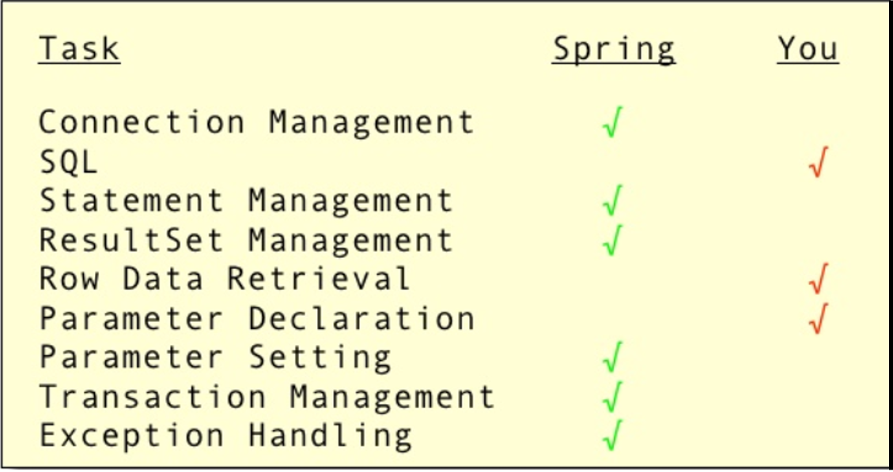

<frontmatter>
  title: Introduction to Spring Framework
  header: pagetop.md
  footer: footer.md
  head: head.md
  siteNav: mainNav.md
  pageNav: 3
</frontmatter>

<div class="website-content">

{{ booktitle | safe }}

# Introduction to Spring Framework

**Authors: [Liu Yiwen](https://github.com/0blivious)** <br>
Reviewers: []()

<box type="info">
This chapter assumes that the reader has a basic knowledge of Java enterprise.
</box>

<box id="article-toc">

* [What is Spring Framework‎](#what-is-spring-framework)
* [Core Features](#core-features)
  * [The IOC Container](#the-ioc-container)
  * [Spring JDBCTemplate](#spring-jdbctemplate)
  * [Spring AOP](#spring-aop)
* [Why use Spring‎](#why-use-spring)
* [How to get started‎](#how-to-get-started)
</box>

## What is Spring Framework?

The [official website](https://docs.spring.io/spring/docs/current/spring-framework-reference/overview.html) describes Spring Framework as follows:

>*Spring Framework* is an open-source framework to create Java enterprise applications.
>It provides foundational support for different application architectures, including messaging, transactional data and persistence, and web.

## Core Features

### The IoC Container

The Spring IoC container is at the core of the Spring Framework. The container will create the objects, wire them together,
configure them, and manage their complete life cycle from creation till destruction. The Spring container uses dependency injection (DI)
to manage the components that make up an application.
    
In the Spring framework, the IoC container is represented by the interface ApplicationContext. In order to assemble beans,
the container uses configuration metadata, which can be in the form of XML configuration or annotations.

Below is one way to manually instantiate a container:
```
    ApplicationContext context = new ClassPathXmlApplicationContext("applicationContext.xml");
```
   
We can then perform dependency injection by using the external XML file.
It makes our code loosely coupled and easier for testing. For example, we can have a simple Employee class
containing two fields id and name with its setters and getters and a method to display these informations.
```java
    package com.company;  
  
    public class Employee {  
       private int id;  
       private String name;  
       private String city;  
  
       public int getId() {  
           return id;  
       }  
       public void setId(int id) {  
           this.id = id;  
       }  
       public String getName() {  
           return name;  
       }  
       public void setName(String name) {  
           this.name = name;  
       }  
       void display(){  
           System.out.println(id+" "+name);  
       }
    }
```
    
And the corresponding `applicationContext.xml` file could be:
```
    <?xml version="1.0" encoding="UTF-8"?>  
    <beans  
    xmlns="http://www.springframework.org/schema/beans"  
    xmlns:xsi="http://www.w3.org/2001/XMLSchema-instance"  
    xmlns:p="http://www.springframework.org/schema/p"  
    xsi:schemaLocation="http://www.springframework.org/schema/beans  
                http://www.springframework.org/schema/beans/spring-beans-3.0.xsd">  
  
    <bean id="obj" class="com.company.Employee">  
    <property name="id">  
    <value>20</value>  
    </property>  
    <property name="name">  
    <value>Amy</value>  
    </property>  
    </bean>  
    </beans>
```
We are providing the information into the bean by this file. The property element invokes the setter method. The value subelement of property will assign the specified value.
   
To better understand how this dependency injection work, we can have a `Test.java` looks like the following:
```java
    public class Test {  
        public static void main(String[] args) {   
            Resource r=new ClassPathResource("applicationContext.xml");  
            BeanFactory factory=new XmlBeanFactory(r);  
          
            Employee e=(Employee)factory.getBean("obj");  
            s.display();
        }  
    }  
```
The out put of the above code will be `20 Amy`.

### Spring JdbcTemplate

Spring JdbcTemplate is a powerful mechanism to connect to the database and execute SQL queries. It internally uses
JDBC API, but eliminates a lot of problems of it.
    
The problems of traditional JDBC API are listed as follows:
- We need to write a lot of code before and after executing the query, such as creating connection,
statement, closing resultset, connection etc.
- We need to perform exception handling code on the database logic.
- We need to handle transaction.
- Repetition of all these codes from one to another database logic is a time consuming task.

Spring JdbcTemplate eliminates all the above mentioned problems of JDBC API.
It provides you methods to write the queries directly, so it saves a lot of work and time.


### Spring AOP

Aspect Oriented Programming (AOP) compliments OOPs in the sense that it provides modularity in aspect instead of class.
AOP breaks the program logic into distinct parts called concerns. A cross-cutting concern is a concern that can affect
the whole application and should be centralized in one location in code as much as possible. Examples of these concerns
include transaction management, authentication, logging, security etc.

By separating application business logic from system services, Spring Framework supports Aspect Oriented Programming
and enables cohesive development. It provides the way to dynamically add the
cross-cutting concern before, after or around the actual logic using simple
pluggable configurations. It also allows easier to maintainance of the code. You can add/remove concerns
without recompiling complete sourcecode simply by changing configuration file by applying aspects using XML configuration.

## Why use Spring?

Spring makes programming Java quicker, easier, and safer for everybody.
Like all other general Java frameworks, Spring helps us focus on the core task rather than the boilerplate associated with it.
Apart from that, Spring has other advantages like:

### Benefit 1: Modularity

Spring provides different modules to achieve different services and functionality for development of application.
These modules are designed in such a way that no module is dependent on the others, except Spring core module.
Thus, we can optionally include one or more Spring projects depending on the need.

### Benefit 2: Versatile

Spring is designed to be used with all other frameworks of Java, you can use ORM, Struts, Hibernate and other frameworks
of Java together with Spring. Spring framework do not impose any restriction on the frameworks to be used together.

### Benefit 3: Strong Community Support
Spring is an open source framework led by Pivotal Software and backed by a large consortium of organizations and individual
developers. This has meant that it remains contextual and often futuristic, as evident by the number of projects under its umbrella.

### Benefit 4: Usability
One of the key aspects of any framework's popularity is how easy it is for developers to use it.
Spring through multiple configuration options and Convention over Configuration makes it really easy for developers to
start and then configure exactly what they need.
Projects like Spring Boot have made bootstrapping a complex Spring project almost trivial. Not to mention, it has excellent documentation and tutorials to help anyone get on-boarded.

## How to get started‎

The official website is a great place to get started. It includes:
- [Spring Quickstart Guide](https://spring.io/quickstart)
- [Spring Projects Overview](https://spring.io/projects)

Here are some external resources that can be useful:
- [Baeldung](https://www.baeldung.com/)
- [Spring Tutorial](https://www.tutorialspoint.com/spring/index.htm)

If you need help with Spring, you can get support from Spring's community of millions of developers:
- [Spring Community](https://spring.io/community)
- [Stack Overflow](https://stackoverflow.com/questions/tagged/spring)
- [Gitter](https://gitter.im/spring-projects/home)

</div>
