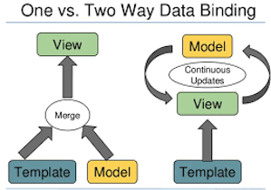

<frontmatter>
  title: Introduction to Angular
  footer: footer.md
  head: head.md
  siteNav: mainNav.md
  pageNav: 3
</frontmatter>

{{ navbar | safe }}

<div class="website-content">

# Introduction to Angular

**Author: [Ronak Lakhotia](https://github.com/RonakLakhotia)**                                                              
Reviewers: [Tan Heng Yeow](https://github.com/tanhengyeow), [Jacob Li PengCheng](https://github.com/jacoblipech)

## What is Angular?

It's [official website](https://angular.io/docs) describes Angular as follows:

>Angular is a platform that makes it easy to build applications with the web. Angular combines declarative templates, dependency injection, end to end tooling, and integrated best practices to solve development challenges. Angular empowers developers to build applications that live on the web, mobile, or the desktop.

Let us understand some key terms in that definition starting with what _declarative templates_ means.
Consider a simple web application that displays the name of a person as shown below.

<iframe src="https://stackblitz.com/edit/angular-3qy4j2?embed=1&file=src/app/app.component.ts&view=preview" style="width:85%; height:380px; border:0; border-radius: 4px; overflow:hidden;" sandbox="allow-modals allow-forms allow-popups allow-scripts allow-same-origin"></iframe> 

<box type="info">
    The sandbox above is editable. You can enter your name in the text box and see how the UI is automatically updated. You can also view and edit the code by clicking on the Both button. 
</box>

The UI of an Angular app is defined in _templates_ which contain a mix of HTML code and HTML-like custom tags.
  
The templates used in Angular are _declarative_ because they describe _what_ the view should look like rather than giving instructions on _how_ to construct the view. In the above example, we declare what we want displayed (i.e., name) and Angular renders the view. A noteworthy feature about these templates is their _dynamic behavior_.
You will notice that as you change the name in the text box, the name rendered on the app is also updated. This is because the UI and the application data are automatically synchronized by Angular as explained [here](https://angular.io/guide/template-syntax#binding-syntax-an-overview).

Along with the the templates, Angular makes use of _Components_. They contain the behavior instructions written in TypeScript language, which will look as follows.  

```typescript
@Component({
  selector: 'app-heroes',
  templateUrl: './heroes.component.html',
  styleUrls: ['./heroes.component.css']
})
export class HeroesComponent {
  hero: Hero = {
    name: 'John Doe'
  };
  constructor() { }
}
```

The `@Component` tag is used to mark a component. It provides the metadata that determines how the component is processed during runtime.

* The use of `selector: app-heroes` is how identifies this component in a template and renders it.  
* The `hero.name` used in the template, refers to the name property defined in the above component.

Now let us look at what **Dependency Injection**(DI) means. Dependencies are services that a class needs in order to perform it's function. We can visualize this with the help of an example.

<center>


_Figure 1. What is a dependency?_ <sup>[source](https://medium.freecodecamp.org/a-quick-intro-to-dependency-injection-what-it-is-and-when-to-use-it-7578c84fa88f)</sup>
</center>

Dependency injection is a way of providing a class with the required services. The official website claims that the DI framework increases the "efficiency and modularity" of an app. Given below is a an injectable service class.
 
```typescript
import { Injectable } from '@angular/core';
import { HEROES } from './mock-heroes';
@Injectable({
  providedIn: 'root',
})
export class HeroService {
  getHeroes() { return HEROES; }
}
```
The `HeroesComponent` declared previously, can make use of this `HeroService` by injecting the dependency in it's constructor as a parameter.

```
constructor(heroService: HeroService) {
 this.heroes = heroService.getHeroes();
}
```

In the above example, we write the `getHeroes` method only once in the service class and we can access this method from any component by injecting the service in the constructor.
This explains how DI increases "efficiency and modularity".

Declarative Templates and Dependency Injection are only a couple of noteworthy features of Angular. A more comprehensive [list](https://angular.io/features) is available on the official website. 
 
## Why Angular?

Now that we know what Angular is, let us look at some benefits it has to offer.

### Benefit 1: Angular provides Good Tooling Services.

Angular provides developers with tools that enforce "best practices". Let us look at some of these tools.

* **TypeScript** - Angular applications are built using the TypeScript language, a superset of JavaScript.
TypeScript provides <tooltip content="Static typing involves type checking during compile-time as opposed to run-time. Types are associated with variables not values.">static typing</tooltip>.
This helps the compiler show warnings about any potential errors in the code, before the app runs. Consider the following example: 

    ```typescript
    function add(x : number, y : number) : number {
        return x + y;
    }
    add('a', 'b'); // compiler flags an error
    ```
    In the code above, parameters `x` and `y` are declared to have the type `number`. Thus, the compiler shows an error when the function is called with strings as inputs to the function.
    Another advantage is that TypeScript provides code completion using <tooltip content="IntelliSense provides active hints as code is added">IntelliSense</tooltip>.
    
* **Angular CLI** - The [official documentation](https://angular.io/cli) claims that the Command-line Interface can be used to develop and maintain applications. It can be used to enforce "best practices" amongst developers.
    
    The Angular CLI has out-of-the-box integration with <tooltip content="Codelyzer is a set of rules for static code analysis of Angular projects">**Codelyzer**</tooltip>.
    Codelyzer helps developers write high quality code by linting it against the [official Angular style guide](https://angular.io/guide/styleguide).
        
    With the CLI we can also perform the following commands to ease the development process. You can refer to the official documentation for a complete list of the CLI commands.
     - Generate a new Angular application with - `ng new`
     - Generate Angular files - `ng generate`
     - Build our application for deployment - `ng build`

This [article](https://medium.freecodecamp.org/best-practices-for-a-clean-and-performant-angular-application-288e7b39eb6f) provides a comprehensive list of best tooling services offered by Angular.
 
### Benefit 2: Angular allows Cross-platform development.

Using the modern versions of Angular, developers can build applications that live on the web, mobile, or the desktop.

* **Progressive Web Apps** - PWAs are web-based applications that contain most of the benefits of a typical mobile app. The [official documentation](https://developers.google.com/web/progressive-web-apps/) by Google describes PWAs to be reliable, fast and engaging. Given it's "best practices", Angular is a good choice to build PWAs.
This [article](https://medium.com/@nsmirnova/creating-pwa-with-angular-5-part-2-progressifying-the-application-449e3a706129) is a good place to learn the basics of building PWAs using Angular.

* **Native Apps** - Angular can be used to build <tooltip content="a smartphone application that is coded in a specific programming language, such as Swift for iOS or Java for Android operating systems">native mobile applications</tooltip>. There are many frameworks such as [NativeScript](https://www.nativescript.org/) and [Ionic](https://ionicframework.com/)
that can be integrated with Angular for mobile application development. The [official Ionic website](https://ionicframework.com/docs/intro) claims that "integration with the Angular ecosystem is a breeze".

* **Desktop Apps** - With Angular you can create desktop applications across Mac, Windows and Linux systems. A common approach used by many developers is to use [Electron](https://electronjs.org/), a framework maintained by Github. You can install the Electron framework in your Angular project with the help of the CLI and start building cross-platform applications.

### Benefit 3: Angular provides two-way data binding.

As explained previously, Angular divides the application into the Model, View and Controller architecture. Data binding establishes the connection between the Model and View components. There are two types of data binding as explained below.



Angular uses two-way data binding as opposed to popular tools like React that use one way data binding. How does this help?

It ensures the exchange of data between the View and Model in a bi-directional manner. If the User Input changes, data in the backend is updated by Angular. Additionally, if the Model state (data) changes, the UI is updated automatically. This means reduced coding for developers.

One-way data binding (used in React) involves uni-directional communication. If the model is changed, the changes are reflected in the UI. However, if the UI element changes the model state is not updated. Developers must provide this synchronization code. 

This [article](https://medium.com/@preethi.s/angular-custom-two-way-data-binding-3e618309d6c7) on Medium provides a good introduction to two-way data binding in Angular.

### When not to use Angular?

Like any other framework/library, Angular has its share of disadvantages.

1. **Steep Learning curve** - Angular requires you to learn many concepts, such as directives, modules, components, services, dependency injection, pipes, and most importantly TypeScript. 
The large number of new concepts can be confusing to newcomers.

2. **Opinionated Framework** - Angular is opinionated about how you structure your code. This means it provides you with a set of tools to build your application. Angular expects you to use these tools as much as you can. While libraries like React allow you to integrate any third party services in your application.

You can refer to this [article](https://jsreport.io/why-is-react-more-popular-than-angular/) that points out the benefits other tools like React have over Angular.
    
### Angular when compared with other popular frontend frameworks

There are alternate frontend frameworks and libraries that developers may prefer over Angular. <a href="https://reactjs.org/">React</a>, a Javascript library, and <a href="https://vuejs.org/">Vue</a>, a Javascript framework, are two such examples.

React is a popular Javascript library, open sourced by Facebook. The ease of learning React is a key advantage.
It also provides more flexibility to developers as it allows integration of third party libraries.
Similarly, Vue offers us some advantages, like flexibility, simplistic structure and ease of integration.

Every framework/library has its own pros and cons. The framework/library you choose depends on the requirements of the application. Below are a few resources that give a brief comparison between the popular frontend frameworks/libraries.

1. [React vs Angular vs Vue](https://medium.com/@TechMagic/reactjs-vs-angular5-vs-vue-js-what-to-choose-in-2018-b91e028fa91d) - A brief comparison between the three most popular frontend tools.
2. [Why use Vue](https://medium.com/@brainmobi/advantages-of-using-vue-js-for-your-web-applications-7e460cadfffc) - Advantages of using Vue.
3. [Angular vs React](https://programmingwithmosh.com/react/react-vs-angular/) - A comprehensive comparison between React and Angular.

## How to get started with Angular?

Angular is not the easiest framework to work with. However, it is reliable and is used by many developers. Given below are a few steps that will help you ease into the Angular environment.

1. The official [Angular](https://angular.io/guide/quickstart) website offers a good tutorial to get started with the new framework. This guide will show you how to build and run a simple Angular application.

2. This article on [freeCodeCamp](https://medium.freecodecamp.org/want-to-learn-angular-heres-our-free-33-part-course-by-dan-wahlin-fc2ff27ab451) is a good place to start writing simple applications using the features that Angular has to offer.

3. You should also start learning [TypeScript](https://www.typescriptlang.org/docs/home.html) and get comfortable with the language.

The Angular community is big, and help is readily available via searching on Google and Stack Overflow.
There are many online resources and tutorials too.

- [Angular Components - Ten Basic Concepts](https://angularfirebase.com/lessons/angular-components-basics-top-ten/) - A QuickStart on Angular's Component driven architecture.
- [StackOverflow Questions](https://stackoverflow.com/questions/tagged/angular?sort=votes&pageSize=50) - Top voted questions on Angular.
- [Angular in depth](https://blog.angularindepth.com/) - Advanced concepts in Angular explained.
- [Different versions of Angular](https://www.simplilearn.com/angularjs-vs-angular-2-vs-angular-4-differences-article) - Differences between the varipus versions of Angular.

</div>
