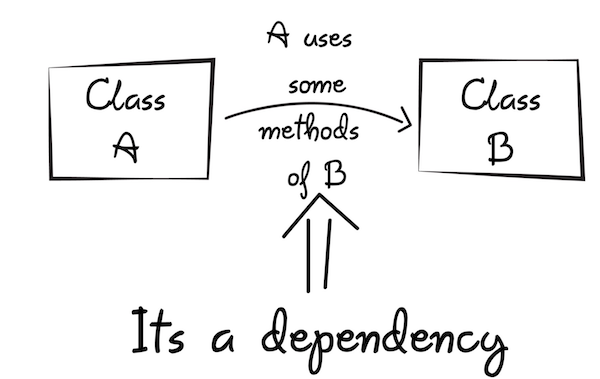

<frontmatter>
  title: Introduction to Angular
  header: pagetop.md
  footer: footer.md
  head: head.md
  siteNav: mainNav.md
  pageNav: 3
</frontmatter>

<div class="website-content">

{{ booktitle | safe }}

# Introduction to Angular

**Author: [Ronak Lakhotia](https://github.com/RonakLakhotia)**                                                              
Reviewers: [Tan Heng Yeow](https://github.com/tanhengyeow), [Jacob Li PengCheng](https://github.com/jacoblipech)

## What is Angular?

The [official website](https://angular.io/docs) describes Angular as follows:

>*Angular* is a platform that makes it easy to build applications with the web. Angular combines declarative templates, dependency injection, end to end tooling, and integrated best practices to solve development challenges. Angular empowers developers to build applications that live on the web, mobile, or the desktop.

Let us understand some key terms in that definition starting with _declarative templates_.

### Declarative Templates and Components

Consider a simple web application that displays the name of a person as shown below.

<iframe src="https://stackblitz.com/edit/angular-3qy4j2?embed=1&file=src/app/app.component.ts&view=preview" style="width:85%; height:380px; border:0; border-radius: 4px; overflow:hidden;" sandbox="allow-modals allow-forms allow-popups allow-scripts allow-same-origin"></iframe> 

<box type="info">
    The sandbox allows you to edit the code of the web application. You can enter your name in the text box and see how the UI is automatically updated. You can also view and edit the code by clicking on the "Both" button. 
</box>

The UI of an Angular app is defined in _templates_ which contain a mix of HTML code and HTML-like [custom tags](https://angular.io/guide/elements). The template for the above example (defined in `person.component.html`) is given below:

``` html
<h1>About Me!</h1>
<h2>Hello World! My name is {person.name}</h2>
<div>
<label>NAME: <input [(ngModel)]="person.name"/></label>
</div>
```
  
The templates used in Angular are _declarative_ because they describe _what_ the view should look like rather than give instructions on _how_ to construct the view. In the above example, we declare what we want to display (i.e., name) and Angular renders the view. A noteworthy feature about the UI rendered by Angular is its _dynamic behavior_.
You will notice that as you change the name in the text box, the name rendered on the app is also updated. This is because the UI and the application data are automatically synchronized by Angular as explained [here](https://angular.io/guide/template-syntax#binding-syntax-an-overview).

Angular organizes the instructions (written in _TypeScript_) that describe _how_ the view must rendered, into _Components_. Given below is the component file `person.component.ts` of the `PersonComponent` :  

```typescript
@Component({
  selector: 'app-person',
  templateUrl: './person.component.html',
  styleUrls: ['./person.component.css']
})
export class PersonComponent {
  person: Person = {
    name: 'John Doe'
  };
  constructor() { }
}
```

The `@Component` tag is used to mark a component. It provides the metadata that determines how the component is processed during runtime.

* The use of `selector: app-person` is how Angular identifies this component in a template. This is an example of a custom tag used in Angular templates. The following code constitutes the template of `app.component.html`.

    ```html
    <h1>Person Data</h1>
    <app-person></app-person>
    <hr/>
    ```

    Angular identifies the `<app-person>` tag, instantiates the `PersonComponent` and renders the view defined by the template `./person.component.html`.

* The `person.name` used in the template `./person.component.html`, refers to the name property defined in the above component.

### Dependency Injection

Now let us look at what _Dependency Injection_ (DI) means. Dependencies are _services_ that a class needs in order to perform its function. We can visualize this with the help of an example.

<center>


_Figure 1. What is a dependency?_ (source: [freecodecamp](https://medium.freecodecamp.org/a-quick-intro-to-dependency-injection-what-it-is-and-when-to-use-it-7578c84fa88f))
</center>

Dependency injection is a way of providing a class with the required services. Given below is an injectable service class.
 
```typescript
import { Injectable } from '@angular/core';
import { PERSONS } from './mock-persons';
@Injectable({
  providedIn: 'root',
})
export class PersonService {
  getPersons() { return PERSONS; }
}
```

The `PersonComponent` declared previously, can make use of this `PersonService` by injecting the dependency in its constructor as a parameter.

```
constructor(personService: PersonService) {
 this.persons = personService.getPersons();
}
```

In the above example, we write the `getPersons` method only once in the service class and we can access this method from any component by injecting the service in the constructor.
This way of using DI increases the efficiency and modularity (as per the [Angular official website](https://angular.io/guide/dependency-injection)).

Declarative Templates and Dependency Injection are only a couple of noteworthy features of Angular. A more comprehensive [list](https://angular.io/features) is available on the official website. 
 
## Why use Angular?

Now that we know what Angular is, let us look at some benefits it has to offer.

### Benefit 1: Good Tooling Services

Angular provides developers with tools that enforce "best practices". Let us look at some of these tools.

* **TypeScript** - Angular applications are built using the TypeScript language, a superset of JavaScript.
TypeScript provides <tooltip content="Static typing involves type checking during compile-time as opposed to run-time. Types are associated with variables not values.">static typing</tooltip>.
This helps the compiler show warnings about any potential errors in the code, before the app runs. Consider the following example: 

    ```typescript
    function add(x : number, y : number) : number {
        return x + y;
    }
    add('a', 'b'); // compiler flags an error
    ```
    In the code above, parameters `x` and `y` are declared to have the type `number`. Thus, the compiler shows an error when the function is called with strings as inputs to the function.
    
    Another advantage of TypeScript is _Type Inference_ - TypeScript makes typing a bit easier and less explicit by the usage of type inference. Let us see how.
    
    ```typescript
    let a = "some text";
    let b = 123;
    a = b; // Compiler Error: Type 'number' is not assignable to type 'string'
    ```    
    
    In the above code snippet, we are not explicitly defining `a: string` with a type annotation. TypeScript infers the type of the variable based on the value assigned to the variable. The value of `a` is a string and hence the type of `a` is inferred as `string`.
    Similarly, the type of `b` is inferred as `number`. Therefore, while inferring types, the compiler flags an error saying a `number` type cannot be assigned to a `string` type.
    
    You can read this [article](https://medium.com/tech-tajawal/typescript-why-should-one-use-it-a539faa92010) to learn more about the features that TypeScript has to offer.
    
* **Angular CLI** - Angular CLI stands for Angular Command Line Interface. It is a command line tool for managing Angular apps. 
    With the CLI you can perform the following commands to ease the development process.
     - Generate a new Angular application with - `ng new`
     - Generate Angular files - `ng generate`
     - Build your application for deployment - `ng build`
     
    You can refer to the [official documentation](https://cli.angular.io/) for a complete list of the CLI commands.
    
    The Angular CLI also helps developers follow good development practices. For example, 
    The Angular CLI has out-of-the-box integration with <tooltip content="Codelyzer is an open source tool that checks whether the pre-defined coding guidelines have been followed">**Codelyzer**</tooltip>.
    Codelyzer lints your code against the [official Angular style guide](https://angular.io/guide/styleguide). With Angular CLI, you can simply run the command `ng lint` to get an analysis of whether your code follows the "best practices".
        

This [article](https://medium.freecodecamp.org/best-practices-for-a-clean-and-performant-angular-application-288e7b39eb6f) provides a comprehensive list of best tooling services offered by Angular.
 
### Benefit 2:  Cross-Platform Development

Using the modern versions of Angular, developers can build applications that live on the web, mobile, or the desktop.

* **Progressive Web Apps** - PWAs are web-based applications that contain most of the benefits of a typical mobile app. The [official documentation](https://developers.google.com/web/progressive-web-apps/) written by Google describes PWAs to be reliable, fast and engaging. With Angular you can develop PWAs and provide an immersive user experience.
This [article](https://medium.com/@nsmirnova/creating-pwa-with-angular-5-e36ea2378b5d) is a good place to learn the basics of building PWAs using Angular.

* **Native Apps** - Angular can be used to build <tooltip content="a smartphone application that is coded in a specific programming language, such as Swift for iOS or Java for Android operating systems">native mobile applications</tooltip>. There are many frameworks such as [NativeScript](https://www.nativescript.org/) and [Ionic](https://ionicframework.com/)
that can be integrated with Angular for mobile application development. As per the [official Ionic website](https://ionicframework.com/docs/intro), it is easy to integrate Ionic with the Angular.

* **Desktop Apps** - With Angular you can create desktop applications across Mac, Windows and Linux systems. In order for your application to be compatible with the different Operating Systems, you can use the <tooltip content="Electron is a framework that provides a set of APIs to interact with the Windows, OS X, and Linux operating systems. It makes cross-platform development easier.">[Electron](https://electronjs.org/)</tooltip> framework.
You can integrate the Electron framework in your project using the Angular CLI and start building your application.
This [article](https://medium.com/@yannmjl/how-to-build-native-cross-platform-desktop-apps-with-angular-electron-bd1d6e3919b2) is a good introduction to building desktop apps with Angular and Electron.

### Benefit 3: Two-way Data Binding

Web apps have two main components, a _View_ and a _Model_. The View component is responsible for displaying data (i.e., the part users see). The Model is concerned with the logic implementation of the application. It updates and retrieves the data to and from the database.
_Data binding_ refers to the exchange of data between the View and Model components. There are two types of data binding as shown below.

<center>


_Figure 2. Types of data binding_ ([source](https://osmangoni.info/posts/one-way-and-two-way-data-binding/))
</center>

Some frameworks like [React](https://reactjs.org/docs/thinking-in-react.html) provide one-way data binding i.e., when there is a change to the Model, the View updates automatically.
However, if the app allows users to change data through the view (e.g., entering your name in the textbox), the developer has to write code to propagate that change to the Model.

In contrast, Angular provides data binding in both ways. That means even changes to the View can be propagated to the Model automatically, without writing extra code for that.

This [article](https://medium.com/@preethi.s/angular-custom-two-way-data-binding-3e618309d6c7) on Medium provides a good introduction to two-way data binding in Angular.

## Disadvantages of Angular

Like any other framework/library, Angular has its share of disadvantages.

1. **Steep Learning Curve:** <br/>
Angular requires you to learn many concepts, such as _directives_, modules, components, services and many more. The large number of new concepts can be confusing to newcomers. Additionally, Angular requires you to learn a new language, TypeScript.

2. **Opinionated Framework:**<br/>
Angular is opinionated about how you structure your code. This means that Angular provides you defaults for building applications. For instance, there are in-built services to perform data fetching, state management and much more. It is also opinionated about the development language as it requires you to use TypeScript.<br/>
In contrast, React allows you to integrate any third party services in your application.
    
## Comparison with other popular frontend frameworks

[React]("https://reactjs.org/") and [Vue]("https://vuejs.org/") are two popular alternatives to Angular.

React is a popular Javascript library, open sourced by Facebook. The ease of learning React is a key advantage over Angular.
It also provides more flexibility as it allows integration of third party libraries.

Vue, another open-source JavaScript framework, offers some advantages over Angular, like increased flexibility, simple structure and ease of integration. This makes it easier to learn Vue as compared to Angular or React.

Below are a few resources that give a brief comparison between these popular frontend frameworks.

1. [React vs Angular vs Vue](https://medium.com/@TechMagic/reactjs-vs-angular5-vs-vue-js-what-to-choose-in-2018-b91e028fa91d) - A brief comparison between the three most popular frontend tools.
2. [Why use Vue](https://medium.com/@brainmobi/advantages-of-using-vue-js-for-your-web-applications-7e460cadfffc) - Advantages of using Vue.
3. [Angular vs React](https://programmingwithmosh.com/react/react-vs-angular/) - A comprehensive comparison between React and Angular.

## How to get started with Angular?

Given below are a few steps that will help you ease into the Angular environment:

1. [Different versions of Angular](https://www.simplilearn.com/angularjs-vs-angular-2-vs-angular-4-differences-article) - Before you start learning Angular, you must have a clear idea of its different versions.

2. [Start learning TypeScript](https://www.typescriptlang.org/docs/home.html) - Development in Angular relies heavily on TypeScript. You can start learning the basics of the new language from its official website.

3. [The official Angular website](https://angular.io/guide/quickstart) - offers a good tutorial to get started. It shows you how to build and run a simple "Hello World" application in Angular.

4. [Build your first Angular app](https://scrimba.com/g/gyourfirstangularapp) - You are recommended to complete this course taught by an Angular expert. It teaches you the important concepts of Angular in the form of interactive tutorials.

5. [StackOverflow Questions on Angular](https://stackoverflow.com/questions/tagged/angular?sort=votes&pageSize=50) - You can also refer to this list of top voted questions on Angular if you need help while developing your own Angular application.
