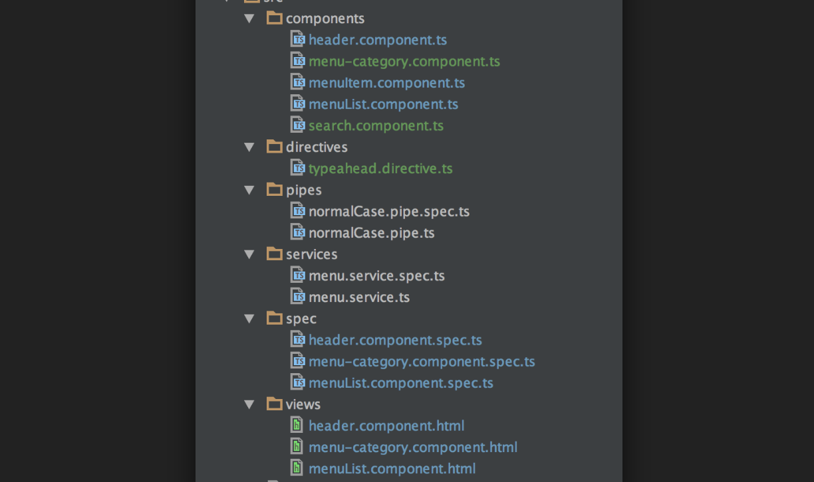

<frontmatter>
  title: Introduction to Angular
  footer: footer.md
  head: head.md
  siteNav: mainNav.md
  pageNav: 3
</frontmatter>

{{ navbar | safe }}

<div class="website-content">

# Introduction to Angular

**Author: [Ronak Lakhotia](https://github.com/RonakLakhotia)**                                                              
Reviewers: [Tan Heng Yeow](https://github.com/tanhengyeow), [Jacob Li PengCheng](https://github.com/jacoblipech)

## What is Angular?

Angular, according to the [official website](https://angular.io/docs), is described as follows:

>Angular is a platform that makes it easy to build applications with the web. Angular combines declarative templates, dependency injection, end to end tooling, and integrated best practices to solve development challenges. Angular empowers developers to build applications that live on the web, mobile, or the desktop.

Let us understand some of the key terms used in the above description with the help of a Hello World example:

```html
<h2>Hello World</h2>
<div><span>id: </span>{{hero.id}}</div>
<div>
  <label>name:
    <input text="hero.name" placeholder="name"/>
  </label>
</div>
```

As seen from the above example, HTML is used to define the Angular templates. HTML is a **Declarative markup language** and only requires you to declare the view. Angular takes care of how that view is rendered.
Let's look into some TypeScript code to further explain the Hello World example.

```typescript
@Component({
  selector: 'app-heroes',
  templateUrl: './heroes.component.html',
  styleUrls: ['./heroes.component.css']
})
export class HeroesComponent {
  hero: Hero = {
    name: 'Windstorm'
  };
  heroes: Hero[];
  constructor(heroService: HeroService) {
    this.heroes = heroService.getHeroes();
  }
}
```

In Angular we use the `@Component` tag to mark a class as a component. It provides the metadata that determines how the component is processed during runtime.

* The use of `selector: app-heroes` is how Angular knows what to do when it sees a `<app-heroes>` tag in HTML.
* The `template` property controls what HTML gets rendered when this component is loaded.
* The `hero.name` used in the HTML code, refers to the name property defined in this component.

Another important concept introduced before was **Dependency Injection**(DI). The official website defines it as a "design pattern" which increases an applications "efficiency and modularity". Let's look into an example.

```typescript
import { Injectable } from '@angular/core';
import { HEROES } from './mock-heroes';
@Injectable({
  // we declare that this service should be created by the root application injector.
  providedIn: 'root',
})
export class HeroService {
  getHeroes() { return HEROES; }
}
```
The above code snippet declares an injectable service class that provides a list of heroes. The `HeroesComponent` declared previously, makes use of this `HeroService` by injecting the dependency in it's constructor as a parameter.
The DI framework lets you supply data to any component from the injectable service class. This explains how it increases "efficiency and modularity".

Declarative Templates and Dependency Injection are only a couple of unique features of Angular. A more comprehensive [list](https://angular.io/features) is available on the official website. 

<box type="info">
Google recently announced Long-Term Support (LTS) for Angular as it plans to further scale up the Angular ecosystem. 
</box> 

## Why Angular?

The official description of Angular pointed out some key advantages of the framework. Let's look into them in more detail.

### Benefit 1: Angular provides a Simplified MVC pattern.

Angular framework uses the [MVC](https://blog.angular-university.io/why-angular-angular-vs-jquery-a-beginner-friendly-explanation-on-the-advantages-of-angular-and-mvc/) (Model-View-Controller) structure. The HTML represents the View component. Next to it, we have the `component.ts` files. This is the controller. Essentially, it can choose what data to push to our view (`.html`). 
In Angular, the Model will be our services, which we can access through our controller. Services are a way to retrieve, update and process data to and from the backend.



Most frameworks require developers to split the application into multiple MVC components. The developer is required to write code that connects these components. However, Angular saves you that time. As explained on the official [website](https://blog.angular-university.io/why-angular-angular-vs-jquery-a-beginner-friendly-explanation-on-the-advantages-of-angular-and-mvc/), everything happens under the hood. Angular ensures automatic synchronization between the components.

### Benefit 2: Angular provides two-way data binding.

As explained previously, Angular divides the application into the Model, View and Controller architecture. Data binding establishes the connection between the Model and View components. There are two types of data binding as explained below.


Angular uses two-way data binding as opposed to popular tools like React that use one way data binding. How does this help?

It ensures the exchange of data between the View and Model in a bi-directional manner. If the User Input changes, data in the backend is updated by Angular. Additionally, if the Model state (data) changes, the UI is updated automatically. This means reduced coding for developers.

One-way data binding (used in React) involves uni-directional communication. If the model is changed, the changes are reflected in the UI. However, if the UI element changes the model state is not updated. Developers must provide this synchronization code. 

This [article](https://medium.com/@preethi.s/angular-custom-two-way-data-binding-3e618309d6c7) on Medium provides a good introduction to two-way data binding in Angular.

### Benefit 3: Angular CLI provides for ease of development.

In 2016 the Angular team announced the Angular CLI, a command-line interface (CLI) to automate your development workflow using versions Angular 2 and above.
It is recommended to use Angular CLI as you don't need to spend time installing and configuring the required dependencies.

`npm install -g @angular/cli`

Running the above command installs the Angular CLI and gives you more control over your project.
With Angular CLI developers can generate Angular files, execute applications and even run end to end tests.

[source](https://www.amadousall.com/why-you-should-use-angular-cli/)

### When not to use Angular?

Like any other framework/library, Angular has its share of disadvantages.

1. **Steep Learning curve** - Angular requires you to learn many concepts, such as directives, modules, components, services, dependency injection, pipes, and most importantly TypeScript. 
The large number of new concepts can be confusing to newcomers.

2. **Opinionated Framework** - Angular is opinionated about how you structure your code. This means it provides you with a set of tools to build your application. Angular expects you to use these tools as much as you can. While libraries like React allow you to integrate any third party services in your application.

You can refer to this [article](https://jsreport.io/why-is-react-more-popular-than-angular/) that points out the benefits other tools like React have over Angular.
    
### Angular when compared with other popular frontend frameworks

There are many frontend frameworks and libraries out there that developers may prefer over Angular. <a href="https://reactjs.org/">React</a>, a Javascript library, and <a href="https://vuejs.org/">Vue</a>, a Javascript framework, are two such examples.

React is a popular Javascript library, open sourced by Facebook. The ease of learning React is a key advantage.
React provides more flexibility to developers as it allows integration of third party libraries.
Similarly, Vue offers us some advantages, like flexibility, simplistic structure and ease of integration.

Every framework/library has its own pros and cons. The tool you choose depends on the requirements of the application. Below are a few resources that give a brief comparison between the popular frontend frameworks/libraries.

1. [React vs Angular vs Vue](https://medium.com/@TechMagic/reactjs-vs-angular5-vs-vue-js-what-to-choose-in-2018-b91e028fa91d) - A brief comparison between the three most popular frontend tools.
2. [Why use Vue](https://medium.com/@brainmobi/advantages-of-using-vue-js-for-your-web-applications-7e460cadfffc) - Advantages of using Vue.
3. [Angular vs React](https://programmingwithmosh.com/react/react-vs-angular/) - A comprehensive comparison between React and Angular.

## How to get started with Angular?

Angular is not the easiest framework to work with. However, it is reliable and is used by many developers. Given below are a few steps that will help you ease into the Angular environment.

1. The official [Angular](https://angular.io/guide/quickstart) website offers a good tutorial to get started with the new framework. This guide will show you how to build and run a simple Angular application.

2. This article on [freeCodeCamp](https://medium.freecodecamp.org/want-to-learn-angular-heres-our-free-33-part-course-by-dan-wahlin-fc2ff27ab451) is a good place to start writing simple applications using the features that Angular has to offer.

3. You should also start learning [TypeScript](https://www.typescriptlang.org/docs/home.html) and get comfortable with the new language.

The Angular community is big, and help is readily available via searching on Google and Stack Overflow.
There are many online resources and tutorials that can help you ease into the Angular world.

- [How to Build Native Cross-Platform Desktop Apps with Angular & Electron](https://medium.com/@yannmjl/how-to-build-native-cross-platform-desktop-apps-with-angular-electron-bd1d6e3919b2)
- [Angular Components - Ten Basic Concepts](https://angularfirebase.com/lessons/angular-components-basics-top-ten/) - A QuickStart on Angular's Component driven architecture.
- [StackOverflow Questions](https://stackoverflow.com/questions/tagged/angular?sort=votes&pageSize=50) - Top voted questions on Angular.
- [Angular in depth](https://blog.angularindepth.com/) - Advanced concepts in Angular explained.
- [Different versions of Angular](https://www.simplilearn.com/angularjs-vs-angular-2-vs-angular-4-differences-article) - Differences between the varipus versions of Angular.

</div>
