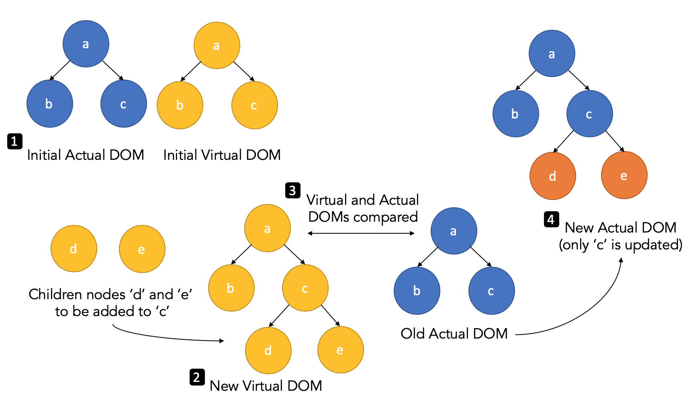

<frontmatter>
  title: Introduction to React
  header: pagetop.md
  footer: footer.md
  head: head.md
  siteNav: mainNav.md
  pageNav: 3
</frontmatter>

<div class="website-content">
  
{{ booktitle | safe }}

# Introduction to React

**Author: [Aadyaa Maddi](https://github.com/amad-person)** <br>
Reviewers: [Amrut Prabhu](https://github.com/amrut-prabhu), [Marvin Chin](https://github.com/marvinchin)

## What is React?

The [official website](https://reactjs.org/tutorial/tutorial.html#what-is-react) describes React as follows:

>*React* is a declarative, efficient, and flexible JavaScript library for building user interfaces. It lets you compose complex UIs from small and isolated pieces of code called 'components'. 

## React Features

Let us understand some key features of React with the help of an example. A web application that displays the name of a person is given below:  

<iframe src="https://codesandbox.io/embed/8kxx088nx2?fontsize=12&view=preview" style="width:100%; height:400px; border:0; border-radius: 4px; overflow:hidden;" sandbox="allow-modals allow-forms allow-popups allow-scripts allow-same-origin"></iframe>

<box type="info">
    The sandbox above is editable. You can change the name using the textbox in the application and see how the UI automatically gets updated. You can view the application code by clicking the blue button next to "React: An Introductory Example". 
</box>

### Declarative Framework

The UI of a React application is defined using a mix of HTML code and HTML-like syntax, called [JSX](https://reactjs.org/docs/introducing-jsx.html). The main view of the application above (defined in the `App.render()` method in `index.js`) is given as follows:

```jsx
<div className="App">
  <h1>Person Data</h1>
  <PersonComponent
    name={this.state.name}
    changeHandler={this.handleChange}
  />
</div>
```

In the above example, we declare what we want to display (i.e. `name`) and React renders the appropriate view based on the updated application data. This is known as the <tooltip content="Declarative programming focuses on what the program should accomplish without specifying how the program should achieve the result.">*declarative*</tooltip> approach. With the declarative approach, you just need to specify *what* you want to show in the UI when the application data changes, rather than giving instructions on *how* to update the UI. 

### Components

React encapsulates application views and relevant data and logic for updating the views using *components*. A combination of components that exchange information with one another is used to build the UI of a React application. 

For example, the application above is divided into two components: 

1. **App**

    The `App` component (defined in `index.js`) contains the main view of the application. It stores the application data (i.e. `name`) in an object called *`state`* and has a method to update the it every time the value in the textbox changes. It passes the application data and the method to the `PersonComponent`.
    
    ```jsx
    class App extends Component {
      state = {
        name: "John Doe"
      };
    
      handleChange = event => {
        this.setState({
          name: event.target.value
        });
      };
    
      render() {
        return (
          <div className="App">
            <h1>Person Data</h1>
            <PersonComponent
              name={this.state.name}
              changeHandler={this.handleChange}
            />
          </div>
        );
      }
    }
    ```

2. **PersonComponent**

    `PersonComponent` (defined in `personComponent.js`) renders the details of the person. It accepts input from the `App` component in the form of *`props`*.
    
    ```jsx
    const PersonComponent = props => {
      return (
        <div className="Person">
          <h2>About Me</h2>
          <p>My name is {props.name}.</p>
          <label htmlFor="name">Name: </label>
          <input id="name" onChange={props.changeHandler} value={props.name} />
        </div>
      );
    };
    ```

As you can see, React components are just JavaScript functions that accept arbitrary input and return a declarative view describing what should appear in the application's UI. 

### One-Way Data Binding

*Data binding* refers to the exchange of information between the application data and the UI. React provides *one-way* data binding. In applications that use one-way data binding, changes to the application data are automatically reflected in the UI. However, changes to the UI need to be manually propagated to the application data. 

In the above application, you can see that the UI is updated whenever a different name is entered in the textbox. These updates do not happen in a single step - the application data is first updated using the `handleChange()` method, and then the UI is updated to reflect these changes. 

## Why use React?

Now that we know what React is, let us look at some benefits it has to offer.

### Benefit 1: Better Performance

Web applications can have a lot of user interaction and data updates, which results in changes being made to the <tooltip content="The Document Object Model, or the 'DOM', is an interface to web pages. It represents the page as nodes and objects, allowing programs to read and manipulate the page's content, structure, and styles.">DOM</tooltip>. Adding and removing DOM nodes isn't slow, but the performance-bottleneck arises because the browser needs to <tooltip content="A reflow occurs when the structure of the DOM tree changes, and a repaint occurs on style changes. These operations can get quite expensive for large DOM trees.">*[reflow and repaint](https://www.phpied.com/rendering-repaint-reflowrelayout-restyle/)*</tooltip> the UI every time the DOM is changed.

React minimizes this update time by using a *virtual DOM*. The virtual DOM is a JavaScript object that is kept in the memory of your application.


_Figure 1. How React's actual DOM gets updated._

As shown in Figure 1 above, updates to the UI will first be made to the virtual DOM. Then, React will compare the virtual DOM with the actual DOM using a *[diffing algorithm](https://reactjs.org/docs/reconciliation.html#the-diffing-algorithm)*. 
Finally, React updates the actual DOM only in places it differs with the virtual DOM. It batches multiple changes together and updates the actual DOM in one go, minimizing update time. 

### Benefit 2: Abstraction

The traditional <tooltip content="Imperative programming focuses on explicitly describing how a program operates.">*imperative*</tooltip> approach of building a web application requires you to describe how you want your UI to change when your application data changes. 

Most web applications usually have to interact with a lot of DOM elements and events. Also, different browsers have variations in their implementations of the <tooltip content="The core DOM consists of the properties and methods of the DOM (nodeName, getElementById(), etc).">[core DOM](https://quirksmode.org/dom/core/)</tooltip>, <tooltip content="The events system consists of different kinds of events that the DOM supports (blur, change, etc).">[events system](https://www.quirksmode.org/dom/events/index.html)</tooltip> and even [styles](https://www.quirksmode.org/dom/w3c_css.html) that can be applied to DOM elements! If you want your application to work across different browsers, you would need to manually take care of these variations with the imperative approach. 

React's declarative approach simplifies this process because it abstracts the complexity of interacting with the actual DOM elements and events. For example, the virtual DOM helps React abstract browser-specific operations on DOM elements. Additionally, React provides its own [events system](https://reactjs.org/docs/events.html) so that events can work in the same way across different browsers.

### Benefit 3: Testability

A React application is made up of a combination of components. Components are independent from each other, and like functions, they map the same input to the same output. This makes it easy to write unit tests for your application.

Additionally, React only allows data to flow downwards (one-way data binding) using `state` and `props`, which makes your application [easier to debug](https://reactjs.org/docs/design-principles.html#debugging) as you can be sure that the data updates the UI, and never the other way around. 

### Other Advantages of React

Besides the three main benefits explained above, React has the following advantages:
 - React is not an <tooltip content="An opiniated framework guides or locks you into their preferred way of doing things.">*opinionated*</tooltip> framework, which gives you the flexibility to choose your application stack.
 - React is constantly being updated with new features (e.g. [hooks](https://reactjs.org/docs/hooks-intro.html) were released in v16.8) and performance optimizations.

## Disadvantages of React

Like any other framework/library, React has its share of disadvantages.

1. **Fast-Paced Development:** <br/>
The high pace of development of React means that you would need to regularly relearn how to do things.
 2. **React is Just a UI library:**<br/>
As React only allows one-way data binding, you can't use it in applications that follow the <tooltip content="MVC, or Model-View-Controller is a popular application structure for building web applications. It separates the UI and the data of your application, and changes can be made to your application using controllers.">*MVC*</tooltip> architecture. You would have to use [Flux](https://github.com/facebook/flux), an application architecture that favors one-way data binding instead.

## React and Other Competing Alternatives

There are a lot of JavaScript frameworks and libraries that you can use to build your next web application. Some popular alternatives to React are [Angular](https://se-education.org/learningresources/contents/javascript/Javascript-framework-Angular.html) and [Vue](https://se-education.org/learningresources/contents/javascript/Javascript-framework-VueJs.html).

How do you decide which one to use? Here are some resources to help you choose between them:
- [React, Angular, Vue: What they can do and which one is for you](https://blog.teamtreehouse.com/react-angular-vue) - This article has guidelines for choosing which technology to learn.
- [Angular vs Vue vs React](https://www.codeinwp.com/blog/angular-vs-vue-vs-react/) - In addition to comparing the three technologies, this article aims to give a general structure for comparing JavaScript frameworks and libraries. Hence, you can use this structure to choose between any new frameworks that may arrive in the future.
- [State of JS 2018: Front-end Frameworks](https://2018.stateofjs.com/front-end-frameworks/overview/) - This survey compares the average salaries, company size, developer satisfaction, etc. for the most used JavaScript front-end technologies, so you can decide which technology will be worth learning for a career in front-end software engineering.

Every framework has its pros and cons, but hopefully you have managed to see that React [removes some of the complexity](https://jlongster.com/Removing-User-Interface-Complexity,-or-Why-React-is-Awesome) that comes with building user interfaces. 

## Getting Started With React

The official React [website](https://reactjs.org/) is a great place to get started. It includes:
 - A step-by-step [tutorial](https://reactjs.org/tutorial/tutorial.html) for building a React application, if you prefer to learn by doing.
 - A [guide](https://reactjs.org/docs/hello-world.html) to master the main concepts of React, if you prefer to learn by reading instead.
 
If you want to add React to an existing project, you can take a look at React's official [guide](https://reactjs.org/docs/add-react-to-a-website.html) for doing so. Alternatively, if you are creating a new React application, you can use one of the [recommended toolchains](https://reactjs.org/docs/create-a-new-react-app.html) to get the best user and developer experience.

[Create React App](https://github.com/facebook/create-react-app) is a convenient environment for learning React, and it is the recommended way to create <tooltip content="A single-page application is an app that works inside a browser and does not require page reloading during use.">*single-page applications*</tooltip> with React.

The official website also has [advanced guides](https://reactjs.org/docs/getting-started.html#advanced-concepts) if you want to understand how React works behind the scenes.

## Resources

As React is a fairly popular library, you can find a lot of comprehensive resources online. Here are some resources that can be useful:
 - [The React Handbook](https://medium.freecodecamp.org/the-react-handbook-b71c27b0a795) - This article provides a well-rounded overview of React.
 - A list of officially [recommended courses](https://reactjs.org/community/courses.html) (some of which are free) - You can learn React from one of these resources if you prefer third-party books or video tutorials. 
 - The React [Blog](https://reactjs.org/blog/) - Updates about React's latest features will be available here.
 - React's [API Reference](https://reactjs.org/docs/react-api.html) - You can learn more about React's API here.
 - The [React DevTools](https://github.com/facebook/react-devtools) browser extension - This is used for inspecting and debugging React applications from within your browser's developer tools.
 </box>

If you need help with React, you can get support from React's [community](https://reactjs.org/community/support.html) of millions of developers that are active on [Stack Overflow](https://stackoverflow.com/questions/tagged/reactjs)
and discussion forums like [Dev](https://dev.to/t/react) and [Hashnode](https://hashnode.com/n/reactjs).

Lastly, if you want to know what to learn after getting familiar with React, [here is a comprehensive roadmap](https://github.com/adam-golab/react-developer-roadmap) that you can follow to become a full-fledged React developer.

</div>
