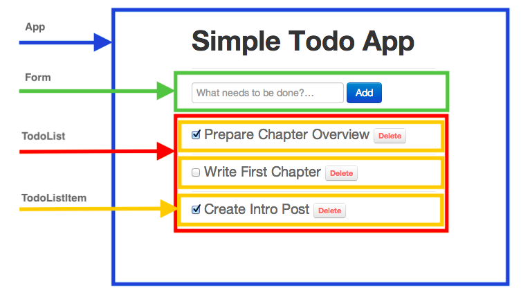
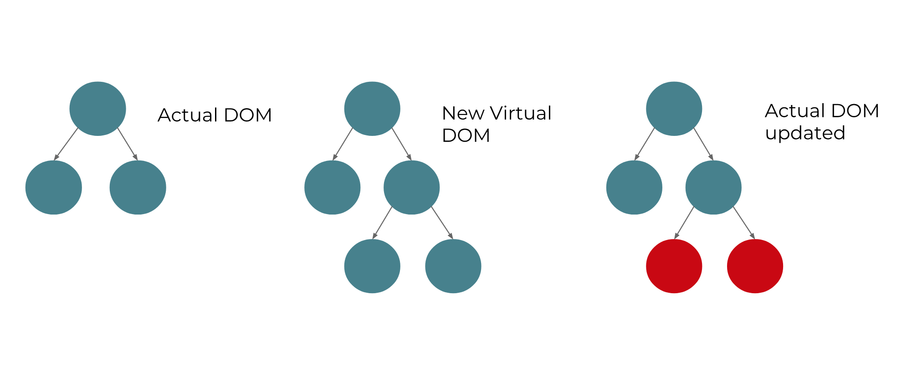

<frontmatter>
  title: React
  footer: footer.md
  head: head.md
  siteNav: mainNav.md
  pageNav: 3
</frontmatter>

{{ navbar | safe }}

<div class="website-content">

# React

**Author: [Aadyaa Maddi](https://github.com/amad-person)** <br>
Reviewers: [Amrut Prabhu](https://github.com/amrut-prabhu), [Marvin Chin](https://github.com/marvinchin)

### What is React?

**React** is an open-source JavaScript library for building the UI of web applications. It only handles the UI component of your application, and it is not a full web application framework! 

React was developed by Facebook and released to the world in 2013. It is now used in a [large number of popular applications](https://medium.com/@coderacademy/32-sites-built-with-reactjs-172e3a4bed81), including Facebook and Instagram.

### Why use React?

React has three main benefits. Let's take a look at each of them in detail.

#### Benefit 1: Simplicity

The traditional <tooltip content="Imperative programming focuses on explicitly describing how a program operates.">imperative</tooltip> approach of building a web application requires you to describe how you want your UI to change when your application data changes. Let's take a look at an example to see how this works. 

Suppose your web application displays a message and has a button. You want the message to change when this button is clicked.

One way of doing this is by using [jQuery](https://jquery.com/): 

```javascript
$("#button").click(function() {
    $(#message).text('This is the imperative approach!')
})
``` 

In the example above, we manually selected the <tooltip content="The Document Object Model, or the 'DOM', is an interface to web pages. It represents the page as nodes and objects, allowing programs to read and manipulate the page's content, structure, and styles.">DOM</tooltip> elements `button` and `message`, attached a listener to `button` for the DOM's `click` event, and wrote a function that describes how to change `message` on clicking `button`. 

This approach is good for simple applications, but most web applications usually have to interact with a lot more DOM elements and events. Also, different browsers have variations in their implementations of the [core DOM](https://quirksmode.org/dom/core/), [events system](https://www.quirksmode.org/dom/events/index.html) and even [styles](https://www.quirksmode.org/dom/w3c_css.html)! If you want your application to work across different browsers, you would need to manually take care of the variations with the imperative approach. 

React simplifies this process by taking a <tooltip content="Declarative programming focuses on what the program should accomplish without specifying how the program should achieve the result.">**declarative**</tooltip> approach to building UIs. 

To see how this works, let's build the same web application as before, using React instead:

<box type="info">
    The sandbox below is editable. You can play around with the application data (or <code>state</code>) and see how the UI automatically gets updated. 
</box>

<iframe src="https://codesandbox.io/embed/p564px0j47?fontsize=12" style="width:100%; height:400px; border:0; border-radius: 4px; overflow:hidden;" sandbox="allow-modals allow-forms allow-popups allow-scripts allow-same-origin"></iframe>

As you can see above, the declarative approach is useful because it abstracts the complexity of interacting with the actual DOM elements and <tooltip content="React provides its own event system so that events can work in the same way across different browsers.">events</tooltip>. With React, you just need to specify *what* you want to show in the UI when the application data changes.

#### Benefit 2: Reusability

Suppose you have a web application with the following markup in its UI:

```html
<h3>This is line 1.</h3>
<h3>This is line 2.</h3>
<h3>This is line 3.</h3>
```

The only difference in the three headings above is the number at the end of each line. Wouldn't it be nice if we could reuse the same markup for each heading and just pass in a different number each time?

We can do this with React! Let's see how:

<iframe src="https://codesandbox.io/embed/884m88wr90?fontsize=12" style="width:100%; height:400px; border:0; border-radius: 4px; overflow:hidden;" sandbox="allow-modals allow-forms allow-popups allow-scripts allow-same-origin"></iframe>

<box type="info">
    Notice the HTML-like syntax within the JavaScript method <code>render()</code>. This is <a href="https://reactjs.org/docs/introducing-jsx.html">JSX</a>, and it is a JavaScript syntax extension developed by the React team. React <a href="https://reactjs.org/docs/introducing-jsx.html#why-jsx">recommends</a> developers to use JSX, but it is optional to use it.
</box>

In the example above, we reused the markup for each heading using an `ExampleComponent`. A React **component** is just a JavaScript function that accepts arbitrary input (called `props`) and returns elements describing what should appear on the screen. 

Components can be especially useful when your UI is complex. With components, you can not only *reuse* code, but also *divide* your UI into encapsulated units that manage their own data and logic. 

For example, let's say you want to build a todo list application. As shown in Figure 1 below, the `App` component could have a `Form` component to handle adding new items and a `TodoList` component to display all the items. The `TodoList` component could further be composed of multiple `TodoListItem` components, one for each item in the todo list. 



_Figure 1. Dividing a todo list application into React components._ <sup>[source](https://i.cloudup.com/DCcBG58qYv.png)</sup>

#### Benefit 3: Better Performance

Web applications can have a lot of user interaction and data updates, which results in changes being made to the DOM. Adding and removing DOM nodes isn't slow, but the performance-bottleneck arises because the browser needs to [reflow and repaint](https://www.phpied.com/rendering-repaint-reflowrelayout-restyle/) the UI every time the DOM is changed.

React minimizes this update time by using a virtual DOM. The virtual DOM is a JavaScript object that is kept in the memory of your application.


_Figure 2. How React's actual DOM gets updated._

As shown in Figure 2 above, updates to the UI will first be made to the virtual DOM. Then, React will compare the virtual DOM with the actual DOM using a [diffing algorithm](https://reactjs.org/docs/reconciliation.html#the-diffing-algorithm). 
Finally, React updates the actual DOM only in places it differs with the virtual DOM. It batches multiple changes together and updates the actual DOM in one go, minimizing update time. 

#### Other Advantages of React

Besides the three main benefits explained above, React has the following advantages:
 - React only allows data to flow downwards (one-way data binding), which makes your application [easier to debug](https://flaviocopes.com/react-unidirectional-data-flow/) as you can be sure that the data updates the UI, and never the other way around.
 - As React is an open-source library backed by Facebook, it is constantly being updated with new features and performance optimizations.

### Disadvantages of React

Like any other library, React has its disadvantages, which are as follows:
 - The high pace of development means that you would need to regularly relearn how to do things.
 - The huge number of tools you can integrate with React don't always have comprehensive documentation.
 - React is just a UI library. As React only allows one-way data binding, you can't use it in applications that follow the <tooltip content="MVC, or Model-View-Controller is a popular application structure for building web applications. It separates the UI and the data of your application, and changes can be made to your application using controllers.">MVC</tooltip> architecture. You would have to use [Flux](https://github.com/facebook/flux), an application architecture that favours unidirectional data flow instead.

### React and Other Competing Alternatives

There are a lot of JavaScript frameworks and libraries that you can use to build your next web application. Some popular alternatives to React are [Angular](https://angular.io/) and [Vue](https://se-education.org/learningresources/contents/javascript/Javascript-framework-VueJs.html).

How do you decide which one to use? Here are some resources to help you choose between them:
- [React, Angular, Vue: What they can do and which one is for you](https://blog.teamtreehouse.com/react-angular-vue) - guidelines for choosing which technology to learn.
- [Angular vs Vue vs React](https://www.codeinwp.com/blog/angular-vs-vue-vs-react/) - in addition to comparing the three technologies, this article aims to give a general structure for comparing JavaScript frameworks and libraries. Hence, you can use this structure to choose between any new frameworks that may arrive in the future.
- [State of JS 2018: Front-end Frameworks](https://2018.stateofjs.com/front-end-frameworks/overview/) - survey comparing the average salaries, company size, developer satisfaction, etc. for the most used JavaScript front-end technologies as of 2018.

React is best suited for projects that have a lot of **user interactions** that manipulate the DOM extensively. You should choose React if you want the flexibility to choose your application's stack, as it is not <tooltip content="An opiniated framework guides or locks you into their preferred way of doing things.">opinionated</tooltip>. 

However, if you prefer out-of-the-box solutions with a well-defined application structure, you should consider Angular or Vue. You should also prefer these alternatives if you want to follow the traditional MVC framework.

Every framework has its pros and cons, but hopefully you have managed to see that React [removes some of the complexity](https://jlongster.com/Removing-User-Interface-Complexity,-or-Why-React-is-Awesome) that comes with building user interfaces. 

### How to get started with React?

The official React [website](https://reactjs.org/) is a great place to get started. It includes:
 - A step-by-step [tutorial](https://reactjs.org/tutorial/tutorial.html) for building a React application, if you prefer to learn by doing.
 - A handy [guide](https://reactjs.org/docs/hello-world.html) to master the main concepts of React, if you prefer to learn by reading instead.
 
If you want to add React to an existing project, you can take a look at React's official [guide](https://reactjs.org/docs/add-react-to-a-website.html) for doing so. Alternatively, if you are creating a new React application, you can use one of the [recommended toolchains](https://reactjs.org/docs/create-a-new-react-app.html) to get the best user and developer experience.

[Create React App](https://github.com/facebook/create-react-app) is a comfortable environment for learning React, and it is the recommended way to create <tooltip content="A single-page application is an app that works inside a browser and does not require page reloading during use.">single-page applications</tooltip> with React.

The official website also has advanced guides if you want to understand how React works behind the scenes.

### Where to go from here?

As React is a fairly popular library, you can find a lot of comprehensive resources online. Here are some resources that can be useful:
 - React's [API Reference](https://reactjs.org/docs/react-api.html) - learn more about React's API.
 - [The React Handbook](https://medium.freecodecamp.org/the-react-handbook-b71c27b0a795) - a well-rounded overview of React.
 - A list of officially [recommended courses](https://reactjs.org/community/courses.html) (some of which are free) - if you prefer third-party books or video tutorials. 
 - The React [Blog](https://reactjs.org/blog/) - updates about React's latest features will be available here.
 - The [React DevTools](https://github.com/facebook/react-devtools) browser extension - used for inspecting and debugging React applications from within your browser's developer tools.
 </box>

You can get active support from React's [community](https://reactjs.org/community/support.html) of millions of developers that are active on [Stack Overflow](https://stackoverflow.com/questions/tagged/reactjs)
and discussion forums like [Dev](https://dev.to/t/react) and [Hashnode](https://hashnode.com/n/reactjs).

Lastly, if you want to know what to learn after getting familiar with React, [here is a comprehensive roadmap](https://github.com/adam-golab/react-developer-roadmap) that you can follow to become a full-fledged React developer.

</div>
