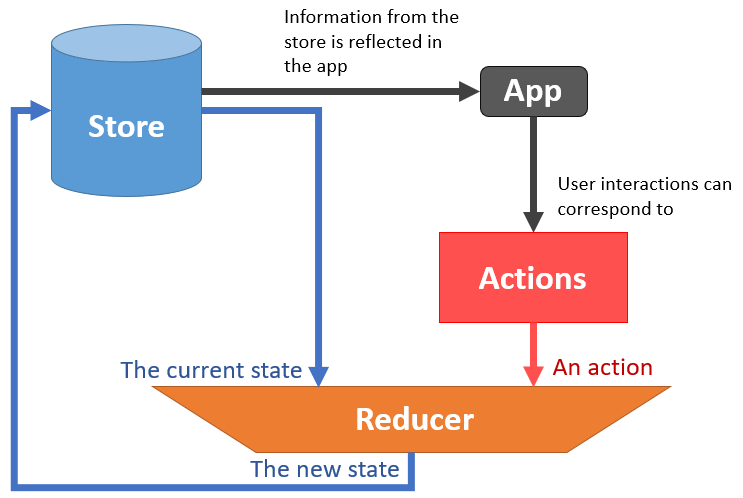

<frontmatter>
  title: Redux
  header: pagetop.md
  footer: footer.md
  head: head.md
  siteNav: mainNav.md
  pageNav: 2
</frontmatter>

<div class="website-content">
  
{{ booktitle | safe }}

# Introduction to Redux

**Author: [Labayna Neil Brian Narido](https://github.com/nbriannl)** <br>
Reviewers: [Ang Ze Yu](https://www.github.com/ang-zeyu), [Yash Chowdhary](https://www.github.com/yash-chowdhary), [James Pang Mun Wai](https://www.github.com/jamessspanggg)

<!-- update table of contents here -->
<box id="article-toc">

* [Introduction to Redux‎](#introduction-to-go)
  * [What Is Redux?](#what-is-redux)
  * [How Does Redux Work?](#how-does-redux-work)
  * [Why Use Redux?](#why-use-redux)
  * [When Not to Use Redux?](#why-not-to-use-redux)
  * [Getting Started with Redux](#getting-started-with-redux)
  * [References/Further Reading](#references-further-reading)
</box>

## What is Redux?

To understand what Redux is, we have to understand what application state is.

You can think of application state like a global object holding information that you will use for various purposes in your application. 

<box light header="Examples of application states">

- For a general application you would need to keep track of whether a user is logged in and their user information
- For a to-do list you would need to know what items are currently in the list
- For a social media application you'd need to store serveral objects and arrays representing the stories to render in the News Feed
</box>

However, modern web applications often have large amounts of state. In such applications, state is likely to be shared between components and updated from various parts of the code, making state less predictable. This is where Redux comes into the picture. 

**Redux** is a library that manages application state for Javascript applications. You can use it together with view libraries such as <tooltip content="via React Redux" placement="top">[React](https://react-redux.js.org/)</tooltip> and <tooltip content="via vuejs-redux" placement="top">[Vue](https://github.com/titouancreach/vuejs-redux)</tooltip>.

The [official website](https://redux.js.org/introduction/getting-started) describes Redux as follows:

> *Redux* is a predictable state container for JavaScript apps.
>
> It helps you write applications that behave consistently, run in different environments (client, server, and native), and are easy to test. On top of that, it provides a great developer experience, such as live code editing combined with a time traveling debugger.
>
> You can use Redux together with React, or with any other view library. It is tiny (2kB, including dependencies), but has a large ecosystem of addons available.

<!-- ([Adapted from this Medium article](https://medium.com/javascript-in-plain-english/the-only-introduction-to-redux-and-react-redux-youll-ever-need-8ce5da9e53c6)) -->

## How Does Redux Work?

The structure of Redux is relatively simple. Consisting of three components, Store, Actions and Reducer.



<center>

_The three building blocks of Redux — Store, Actions and Reducer_
</center>

For this section, let's use a simple to-do list application as an example.

The whole application state is stored in a single **store**, a plain object.

```js
{
  todos: [{
    text: 'Eat food',
    completed: true
  }, {
    text: 'Exercise',
    completed: false
  }],
  visibilityFilter: 'SHOW_COMPLETED'
}
```

<!-- TODO: no direct setters could be explained after introducing actions and reducers so that the reader has something to compare to, perhaps in a tip box -->
There are no direct setters to the store. The store is read-only. Information in the store is used for various application functionality, such as the App UI. For example, based on the array under `todos`, we can render a to-do list of tasks. Based on the `visibilityFilter`, the application decides whether to render incompleted tasks. 

The only way to change data in the state is by dispatching an **action**, which is a plain object as well. Actions must have a `type` property indicating the type of action being performed.

```js
{ type: 'ADD_TODO', text: 'Go to swimming pool' }
{ type: 'TOGGLE_TODO', index: 1 }
{ type: 'SET_VISIBILITY_FILTER', filter: 'SHOW_ALL' }
```

<!-- TODO: What else other than UI fire off actions? -->
User interactions in the application, such as button click events, can correspond to actions. For example, in our to-do list application, filling up 'Go to swimming pool' and clicking a 'Add To-do' button would correspond to a `ADD_TODO` action. 

The current state, and an action is passed into a **reducer**, a function which returns the next state of the application

Reducers are <tooltip content="A pure function is a function which: Given the same input, will always return the same output. And produces no side effects.">pure functions</tooltip>. They take the previous state and an action, and return the next state as new state objects, instead of mutating the previous state.

With the updated application state, the application will reflect the new information in the store accordingly. For example, it may render new tasks, or render incomplete tasks instead of completed tasks.

In a real-world application with a large and complex application state, having a single reducer to manage multiple parts of the state may get confusing and complicated. We can have multiple, simpler reducers instead, and combine them into one reducer.

For example, we have two simpler reducers.

Firstly, a reducer for the visibility filter `visibilityFilter`:

```js
function visibilityFilter(state = 'SHOW_ALL', action) {
  if (action.type === 'SET_VISIBILITY_FILTER') {
    return action.filter
  } else {
    return state
  }
}
```

And secondly, a reducer, that manages the todo-list items `todos`:

```js
function todos(state = [], action) {
  switch (action.type) {
    case 'ADD_TODO':
      return state.concat([{ text: action.text, completed: false }])
    case 'TOGGLE_TODO':
      return state.map((todo, index) =>
        action.index === index
          ? { text: todo.text, completed: !todo.completed }
          : todo
      )
    default:
      return state
  }
}
```

And these two reducers are called by a main reducer. With that the complete application state is managed.

```js
function todoApp(state = {}, action) {
  return {
    todos: todos(state.todos, action),
    visibilityFilter: visibilityFilter(state.visibilityFilter, action)
  }
}
```

A careful eye would notice that the above code block examples on reducers are not pure functions. If you're interested, you may see how the reducer should actually be written in the [official Redux site](https://redux.js.org/basics/reducers/#source-code). The code in the link includes some Redux API, and Javascript methods such as [`.map`](https://developer.mozilla.org/en-US/docs/Web/JavaScript/Reference/Global_Objects/Array/map) and the [spread operator](https://developer.mozilla.org/en-US/docs/Web/JavaScript/Reference/Operators/Spread_syntax) to make the functions pure. But knowing the actual syntax for Redux is not the main focus of this introductory article.

## Why Use Redux? 

<sup>[[1]](#footnote1)</sup> <sup>[[2]](#footnote2)</sup> 

Now that we know what Redux is, let us take a look at how the structure of Redux and its concepts make possible some benefits.

1. **State is made predictable**<br/>
In Redux, the single immutable store is the single source of truth for application state. Neither the view of the application, nor network callbacks directly write to it. Changes to the state are via actions, which Redux centralizes and keep in strict order. Also, reducers are pure functions, always producing the same result for the same state and action. 
<br/><br/>Hence application state is updated in a predictable and structured manner. Having a predictable state, makes it easier to implement functionality that would be otherwise difficult, such as <tooltip content="The general idea is to store the history of the state in the state! To read more, click the link.">[Undo and Redo](https://redux.js.org/recipes/implementing-undo-history/)</tooltip>.

2. **Easier to debug and inspect**<br/>
Since actions and state are plain objects, it is possible to serialize them and log them. [Redux DevTools](https://github.com/reduxjs/redux-devtools) provides first class support for application debugging. You can view a log of actions that took place, making it easy to understand errors in code. You can also print the store <tooltip content="for example using `console.log(store.getState())`">within the code itself</tooltip>. The Redux DevTools, used in the browser, also provides features such as a tree visualization of the application state, as well a time travel ability to replay state changes.


<center>

_Redux DevTools_ <sup>[image source](https://user-images.githubusercontent.com/7957859/48663602-3aac4900-ea9b-11e8-921f-97059cbb599c.png)</sup>
</center>

<!-- TODO: Research how to make easy tests for Redux -->
3. **Easier testing**<br/>
Using Redux makes for testable code. Since the reducers used to change the state are pure functions, it is easy make tests. Writing small, pure and isolated reducer functions in Redux, means we write small and isolated tests. 

<!-- TODO: either consider replacing this with a simpler and more key point or explain SSR more -->
4. **Allows for server-side rendering**<br/>
Redux is one way to fulfill server-side rendering. This can be acheived by sending the store created on the server side in response to the client's server request. Information from the store then can be used for the initial render of the application.

## When Not to Use Redux?

While Redux has its benefits, you should not add Redux for every application you make.

In general, it would be apt to use Redux is when:

1. You have reasonable amount of data changing over time
1. You need a single source of truth
1. You find keeping everything in a top-level parent component is not enough

Another good rule of thumb is to figure out if you have any problems managing state in your application without Redux. If you don't have any, then you don't really need Redux <popover effect="scale" header="As said by Dan Abramov (one of the creators of Redux)" content="_I would like to amend this: don't use Redux until you have problems with vanilla React._">If you don't have any, then you don't really need Redux.</popover>

There are many other sites and articles speaking of why you shouldn't or when you shouldn't use Redux. If you are interested, there are articles <sup>[[3]](#footnote3)</sup> <sup>[[4]](#footnote4)</sup> that provide more information and thoughts on when Redux is meant to be used.

## Getting Started with Redux

The [official Redux website]((https://redux.js.org/)) is a great place to get started. It includes:

- [Installation instructions](https://redux.js.org/introduction/getting-started/)
- A suggested list of resources encompassing [Basic](https://redux.js.org/introduction/getting-started/#just-the-basics) and [Intermediate](https://redux.js.org/introduction/getting-started/#intermediate-concepts) concepts.
- A [basic](https://redux.js.org/basics/basic-tutorial) and [advanced](https://redux.js.org/advanced/advanced-tutorial) tutorial.

This article is based on the the sections [Core Concepts](https://redux.js.org/introduction/core-concepts) and [Three Principles](https://redux.js.org/introduction/three-principles) of the introduction, so you may find the sections familiar and be able skim through those. However, it may be good to reinforce some of the cores concepts with the basic tutorial first, then proceed on with the advanced tutorial.

Installing the [Redux DevTools](https://github.com/reduxjs/redux-devtools) would greatly help in terms of seeing Redux in action with whichever project or tutorial you are working on.

Redux especially works well with React. Read up on [React Redux](https://react-redux.js.org/), which are official React bindings for Redux

Other popular frontend frameworks may have their own state management libraries more suited for them. Many of the concepts of state management libraries are borrowed from Redux, hence you may find their concepts familiar. Some other frontend libraries and their corresponding state management libraries are:

- Vue: [Vuex](https://vuex.vuejs.org/)
- Angular: [NGRX](https://ngrx.io/)

## References/Further Reading

<a name="footnote1">[1]</a>: [Why use Redux? Reasons with clear examples by Neo Ighodaro](https://blog.logrocket.com/why-use-redux-reasons-with-clear-examples-d21bffd5835/) <br />
<a name="footnote2">[2]</a>: [Redux · An Introduction by Alex Bachuk](https://www.smashingmagazine.com/2016/06/an-introduction-to-redux/)<br />
<a name="footnote3">[3]</a>: [You Might Not Need Redux by Dan Abramov](https://medium.com/@dan_abramov/you-might-not-need-redux-be46360cf367) <br />
<a name="footnote4">[4]</a>: [When should I use Redux? (Redux Official Site)](https://redux.js.org/faq/general#when-should-i-use-redux) <br />


</div>
