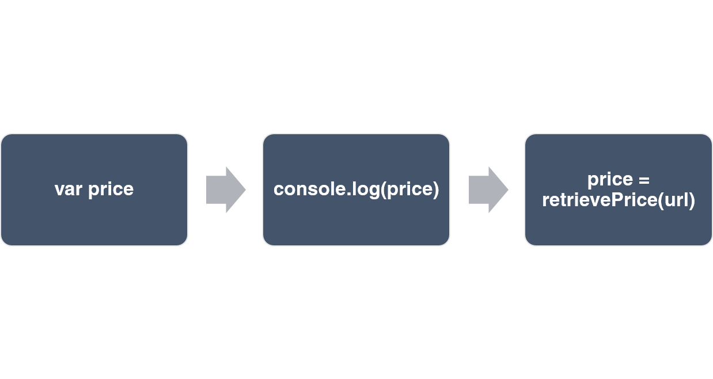
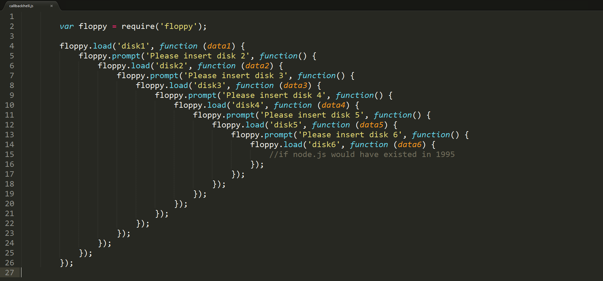

# Javascript: Promises

Author: Daniel Berzin Chua

In Javascript, there are times where an operation may not resolve instantly and as such, the code may not run in the sequence that you would expect due this asynchronous nature. It can be especially confusing for beginners learning Javascript.

In Javascript, there are times where an operation is executed asynchronously and its result may not be obtained immediately, unlike synchronous functions with a return value. It can be especially confusing to trace the code as it may not run in the sequence that you would normally expect.

We'll use `setTimeout()` as an example of this behaviour. This is an asynchronous function takes in 2 parameters, a callback and a time (in milliseconds) to wait before the callback is executed. A callback is a function that is passed as a parameter to another function (call this A), and it will be executed after A finishes. 

The following code snippet logs `Hello World` after 1 second has elapsed. The function that encapsulates the `console.log()` is the callback function.

```javascript

setTimeout(function (){
	console.log("Hello World");
}, 1000);

```

Javascript is at its core, a synchronous and single-threaded language but it is able to provide the illusion of asynchronicity through a construct known as the Event Loop. This is a loop that allows asynchronous functions to be queued for execution later on. Further information about the Event Loop can be found at [Mozilla's Event Loop documentation](https://developer.mozilla.org/en-US/docs/Web/JavaScript/EventLoop).

Another pertinent example of asynchronicity is HTTP requests. When making a HTTP request, the information from the server is not instantly returned as there is a round trip time that involves the time taken for the request to be sent, and for the response from the server to be sent back to the client. In this time, Javascript would not necessarily wait for the response to be received, but instead execute other functions first, even if those functions depend on the result of that HTTP response.

In the code snippet below, `console.log(price)` would return undefined as the asynchronous `retrievePrice()` function has not finished executing.

```javascript
var price;
price = retrievePrice("https://www.amazon.com/gp/product/B009S331VU/");
console.log(price);

```

Actual Execution Flow:


Since `retrivePrice()` is a non-blocking function and it's only handled after the `console.log()` has executed, there must be a way to ensure that these functions are executed in the sequence that's desired.

This is where Promises come in handy.


## Introduction
Promises in Javscript behave the same way as Promises do in real life. It is a proxy for a value that is not known at the time of Promise creation. It has 3 states: pending, fulfilled and rejected. Promises provide the power to control the execution flow of your program by allowing the user to wait for a promise to be resolved before carrying on with the rest of the program execution.

## How to use Promises

The Promise API is only supported natively from ES6 onwards, which is the version that modern browsers support. The code below will thus work in any modern browser and also in Node.js (from version 6). 


Promises are created in Javascript by using the `new` constructor as follows:

```javascript

var myFirstPromise = new Promise(function(resolve, reject) {
    // insert stuff to do here
    // The promise is currently 'pending'
})

```

The Promise constructor takes function that has two parameters: resolve and reject. These two parameters are functions which will change the state of the promise. They can be called with or without a parameter as follows:

```javascript

resolve(someValue);
reject(someValue);
resolve();
reject();

```

## Handling results from Promises

As promises have 2 completed states, there are 2 functions available to deal with these 2 scenarios. 

### .then

`.then` is used to deal with a Promise after it has been resolved. It takes in a function with 1 parameter, which is the result of the Promise that has just been resolved.

### .catch

`.catch` is used to deal with a Promise after it has been rejected. Like `.then`, it also takes in a function with 1 parameter.

Whenever you want to act on a result from a Promise, it is good practice to use the above 2 functions to ensure certainty and code readability.

An example would be as follows:

```javascript

var isSuccessful = false;

var myFirstPromise = new Promise(function(resolve, reject) {
    if (isSuccessful) {
        resolve('Success');
    }
    else
        reject('Failure');
}).then(function(result) {
    console.log(result);    // prints 'Success'
}).catch(function(result) {
    console.log(result);    // prints 'Failure'
});

```

## Benefits

- Avoid callback hell


(Credit: [Brett McLain](http://blog.mclain.ca/))

In Javascript, callback functions are usually used to perform some action on a value returned from another function. However, this may result in deeply nested code as shown above, especially if there are many asynchronous method calls. When using promises, the nesting is kept at a minimum and results in cleaner and readable code as shown below. 

- Chain multiple asynchronous methods

Calling asynchronous code can be tedious, especially if a later function relies on data that is produced by an earlier function. By using Promises, these asynchronous methods can be chained and variables will be correctly set instead of being undefined when the variable needs to be used.

- Control execution flow

As mentioned earlier, calling asynchronous methods in Javascript may not necessarily result in a sequential execution flow. However, it is possible to ensure that methods get called in the order that they are written in, as long as they are wrapped in a Promise.

## Other functions

Sometimes multiple promises may have to be used at a time, and Javascript provides excellent support with the `Promise.all` and `Promise.race` functions.

There is an excellent write up on these methods [here](https://davidwalsh.name/promises), which will allow you to use Promises even more efficiently.

In addition, there are other libraries such as [Bluebird](http://bluebirdjs.com/docs/getting-started.html) and [Q](https://github.com/kriskowal/q) which offer even more functionality such as Promise monitoring and synchronous inspection of Promises.