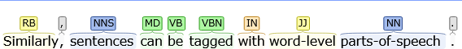
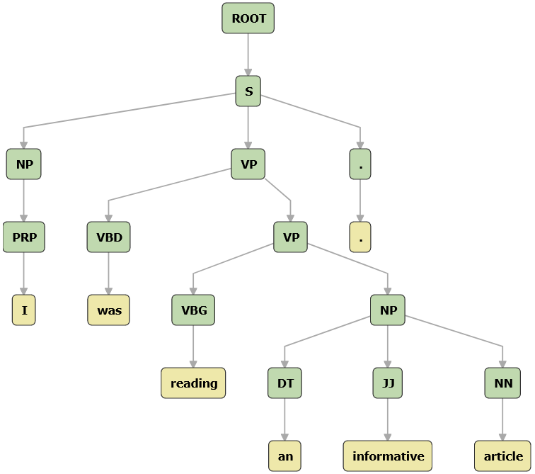
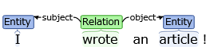
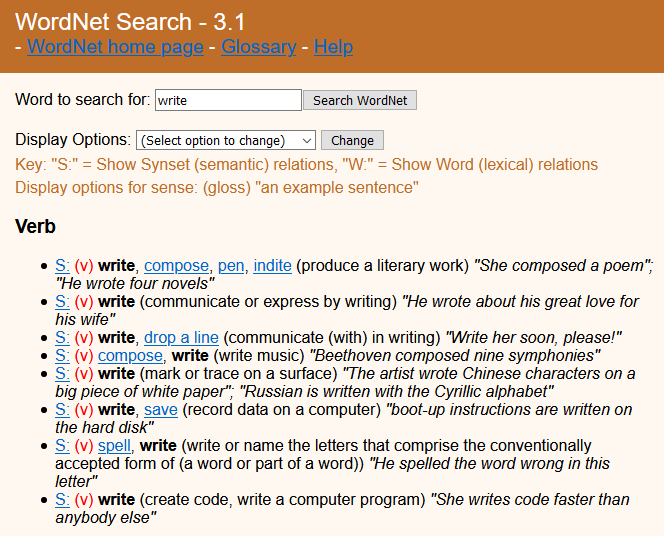
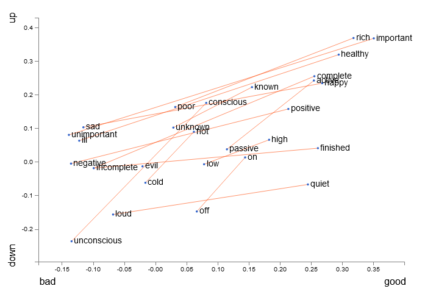

<frontmatter>
  title: Introduction to Natural Language Processing (NLP)
  header: pagetop.md
  footer: footer.md
  head: head.md
  siteNav: mainNav.md
  pageNav: 3
</frontmatter>

{{ booktitle | safe }}

# Introduction to Natural Language Processing (NLP)
Authors: [Lum Ka Fai Jeffry](https://github.com/j-lum)

* [What is NLP](#what-is-nlp)
* [Core problems in NLP](#core-problems-in-nlp)
   * [Syntax](#syntax)
   * [Semantics](#semantics)
   * [Relations](#relations)
* [Applications of NLP](#applications-of-nlp)
* [What's next](#whats-next)
* [References](#references)

## What is NLP
Natural Language Processing (NLP) is the set of methods for making human language accessible to computers.
Recent advances in NLP have given rise to useful tools that have become embedded in our daily lives: 
spam and phishing classification keeps inboxes sane[1](#footnote1);
automated chatbots lighten the load on customer support staff and provide customers with immediate feedback[2](#footnote2);
machine translation bridge the gap between cultures[3](#footnote3). 
 
NLP draws from many other fields of science, from formal linguistics to statistics. 
The goal of NLP is to provide new computational capabilities around human language: for example, holding a conversation, summarizing an article, and so on.

Even though the study of NLP covers a diverse range of tasks, most of them can be generalized to three themes.

## Themes in NLP

### Syntax
In order to leverage the power of modern machine learning techniques, raw text must be converted to a general-purpose linguistic structure.
In English, words can be decomposed to _morphemes_, the minimal unit of meaning (e.g. unhappiness to three morphemes un-happy-ness)[4](#footnote4).
Similarly, sentences can be tagged with word-level _parts-of-speech_ which describe the meaning of each word in the context of that sentence.

  
For example, 'word-level' is tagged as an adjective (JJ) and 'sentences' as a plural noun (NNS)[5](#footnote5).

  
From the parts-of-speech tags, a tree-structured representation of grammar can be produced.
This tree is the result of a _constituency parse_, an task of recognizing a sentence and assigning a syntactic structure to it.
From the tree we can see that the complex phrase 'word-level parts-of-speech' is simply a _noun phrase_.
Incidentally, this is how Microsoft Word checks for grammatical errors[6](#footnote6).
Any tree that cannot be parsed may be grammatically incorrect or difficult to understand.

### Semantics
With the knowledge of a sentence and its structure, the next step is to understand the meaning it conveys.
To this end, the representation of the meaning of a sentence should be able to link language to concepts[7](#footnote7).

Take for example the sentence: 

   > I wrote an article!

In order to understand the meaning of the sentence, a few questions need to be answered:

* Who is 'I'?
* What is 'an article'? 
* How are the two subjects related?

An approach is to represent the meaning of a sentence as a relationship triple consisting of a *Subject*, *Object* and *Relation*.

  
From this representation of the sentence, it is possible for a system to answer novel questions like "Who has written articles?" or "What the articles that I have written".
This technique, Open Information Extraction, is utilized by IBM's Watson to defeat human players in the American game show Jeopardy![8](#footnote8)

### Relations 
Relations is crucial to the understanding of natural languages.
Consider the example:

   > Geoffrey bought Mary a ring. They have been dating for months.

What is the event that prompted Geoffrey to buy a ring? 
The word _proposal_, while not stated in the example, implicitly links the two events together.
While humans are able to draw the connections instinctually, it is not easy to formalize this process computationally.

There are attempts to create semantic _ontologies_ for natural language, groupings of words by their meanings.
**WordNet** is one such attempt, a handcrafted database that classifies words by concepts that they express[9](#footnote9).

  

More recently, techniques like **word2vec**[10](#footnote10) are able to model words and phrases as vectors of real numbers. 
This ability to quantify and categorize semantic similarity allows computers to infer beyond just synonyms.

  

A simplified visualization of words in vector space shows that not only are words related in meaning close together, their antonyms are clustered together as well[11](#footnote11). 
This implies that word vectors can be somewhat meaningfully combined by just using simple vector addition.

Word2vec has been used to analyze behaviour on e-commerce sites as human do not tend to browse for random items but purchase items that are related.

### Applications of NLP

#### Input methods editors, e.g. Chinese, Japanese and Korean
Modern input method editors(IMEs) do more than simply translating input to output in the respective language.
By tackling the syntactic and relational elements of natural language, IMEs provide autocomplete functionality by suggesting words that are related or occur together frequently. 

For example, typing in "*beijing*" in Moon IME, a Chinese IME, will bring up "*olympics*" as a possible suggestion[12](#footnote12).

#### Indexing and information retrieval, e.g. Google's page rank and normalization of search terms
Search terms on Google are grouped together by semantic similarity in real time at volume to identify trends worldwide. 
This is achieved with techniques similar to **word2vec**. 

#### Aggregation and clustering of documents, e.g. Cambridge Analytica, Google News
Techniques like **doc2vec**[13](#footnote13) build upon **word2vec** and provide a representation of paragraphs in vector space.
Similar to **word2vec**, this enables classification of documents and paves the road to powerful information retrieval techniques. 

#### Machine translation, e.g. Google Translate
**seq2seq**[14](#footnote14), a algorithm developed by Google, transforms a sequence to another. 
This family of techniques uses special neural network architectures to model sentences.  

#### Automated customer support, e.g. ChatBot, Clare.AI, NanoRep
Human-curated databases (e.g. **WordNet**) are used together with techniques like **word2vec** to extract actionable words or phrases[14](#footnote15). 
For example, the two possible input from users regarding a replacement of digital banking token: 

> * I want to replace my token.
> * My old token is broken. 

  

can be mapped back to the same intent to which a predefined response can be given. 

## What's next
1. Get an intuition for the English language

    The Language Instinct by Steven Pinker provides accessible insight about how humans learn language and the basics of formal linguistics. 
    This is invaluable especially for those who grew up with English as a first language.

1. Visually explore the themes present in NLP
    
    Standford's [CoreNLP](https://corenlp.run/) provides a visual representation of NLP techniques.
    Explore how sentences are annotated with *parts-of-speech* tags and see the output of a constituency parse.
    
1. Experiment with NLP libraries

    The aforementioned [CoreNLP](https://stanfordnlp.github.io/CoreNLP/) library is a good starting point for developers comfortable in Java.
    For a simple and productive experience, [spaCy](https://spacy.io/) is a Python library suitable for experimentation and rapid prototyping.
    
1. Read research papers to gain a deeper understanding of the techniques employed

    Stay up to date with research through portals like [arxiv sanity preserver](https://www.arxiv-sanity.com/search?q=nlp).
    
    
## References

<a name="footnote1">[1]</a>: https://www.ncbi.nlm.nih.gov/pmc/articles/PMC6562150/  
<a name="footnote2">[2]</a>: https://azure.microsoft.com/en-us/services/bot-service/  
<a name="footnote3">[3]</a>: https://github.com/google/seq2seq  
<a name="footnote4">[4]</a>: https://www.cs.bham.ac.uk/~pjh/sem1a5/pt2/pt2_intro_morphology.html  
<a name="footnote5">[5]</a>: https://catalog.ldc.upenn.edu/docs/LDC95T7/cl93.html  
<a name="footnote6">[6]</a>: https://www.microsoft.com/en-us/research/project/nlpwin/  
<a name="footnote7">[7]</a>: https://medium.com/huggingface/learning-meaning-in-natural-language-processing-the-semantics-mega-thread-9c0332dfe28e  
<a name="footnote8">[8]</a>: https://www.nytimes.com/2011/02/17/science/17jeopardy-watson.html?_r=0  
<a name="footnote9">[9]</a>: https://wordnet.princeton.edu/  
<a name="footnote10">[10]</a>: https://papers.nips.cc/paper/5021-distributed-representations-of-words-and-phrases-and-their-compositionality.pdf  
<a name="footnote11">[11]</a>: https://lamyiowce.github.io/word2viz/  
<a name="footnote12">[12]</a>: https://www.aclweb.org/anthology/P18-4024.pdf  
<a name="footnote13">[13]</a>: https://cs.stanford.edu/~quocle/paragraph_vector.pdf  
<a name="footnote14">[14]</a>: https://google.github.io/seq2seq/  
<a name="footnote15">[15]</a>: https://www.microsoft.com/en-us/research/wp-content/uploads/2016/09/intent-detection-semantically.pdf  
