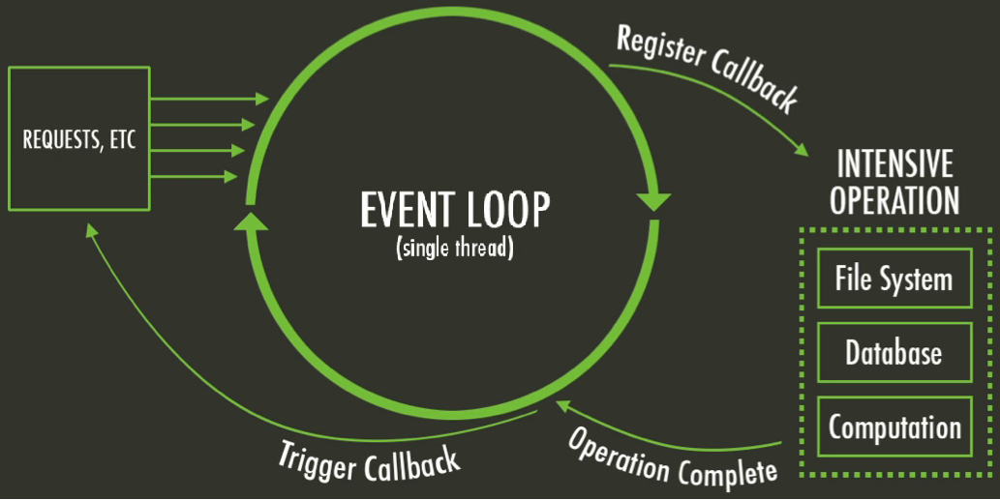

<frontmatter>
  title: Introduction to Node
  header: pagetop.md
  footer: footer.md
  head: head.md
  siteNav: mainNav.md
  pageNav: 3
</frontmatter>

<div class="website-content">

{{ booktitle | safe }}

# Introduction to Node

Author: Rachael Sim

<box type="info" light><md>
This chapter assumes that the reader is familiar with JavaScript and asynchronous programming. If you are not familiar with asynchronous programming, a good resource to checkout is the [asynchronous programming section of the You Don't Know JS guide ](https://github.com/getify/You-Dont-Know-JS/tree/2nd-ed/sync-async) as asynchronous programming is key in Node.</md>
</box>

## What is Node?

>*Node* is a JavaScript runtime built on Chrome’s V8 JavaScript engine. It uses an event-driven, non-blocking I/O model that makes it lightweight and efficient. <sub>--https://nodejs.org</sub>

Node is mostly used in back-end and server side scenarios. For example, LinkedIn mobile app backend is built on Node and Uber built its massive matching system between customers and drivers on Node. However, Node can also be used in the front-end to automate tasks such as building, testing, pre and post processing code.

## Why use Node?

Now that we know what Node is, let us look at some benefits it has to offer.

### Benefit 1: Easy to get Started

To install Node, simply download the installer from the [official Node website](https://nodejs.org/en/download/) based on your OS and run it. This should install both Node and npm. Npm is a tool which will help you to search, install and manage node packages. The use of npm will be explained [later](#benefit-5-easy-dependency-management-with-npm).

The following simple example demonstrates how a Node application imports required modules, creates a server to listen to client's request, and then reads the request and returns a response.

<box type="info" header="A Simple Hello World Server <small>from [codeburst](https://codeburst.io/node-js-by-example-part-1-668376cd4f96)</small>" light>

Create a file `server.js` with following content:

```js
const http = require('http');

const hostname = '127.0.0.1';
const port = 3000;

const server = http.createServer(function(req, res) {
  res.statusCode = 200;
  res.setHeader('Content-Type', 'text/plain');
  res.end('Hello World');
});
server.listen(port, hostname, function() {
  console.log('Server running at http://' + hostname + ':' + port + '/');
});
```

After you save the file, you can execute it from your terminal:
```
$ node server.js
Server running at http://127.0.0.1:3000/
```
To test the server, open a browser tab and navigate to http://localhost:3000/. You should see 'Hello world'.

</box>

Read on to find out about how to incorporate external dependencies, manage them and use Node's module system to organize your code.

### Benefit 2: Avoid Synchronization Problems and Overheads

<figure>

<figcaption class="text-center"><small>

Illustration of node's event loop from [these slides](https://www.slideshare.net/DevCentralAMD/introduction-to-nodejs-41469620)</small>
</figcaption>
</figure>

Node is designed to be **event-driven**. When an <tooltip content="e.g. when a I/O operation is complete, or a timer fires">event</tooltip> occurs, the event handler previously registered with the event is queued to be run by the [event loop](https://medium.com/the-node-js-collection/what-you-should-know-to-really-understand-the-node-js-event-loop-and-its-metrics-c4907b19da4c). The main event loop (where Javascript code is executed) is single-threaded.

This means that we can avoid thread overheads and synchronization problems including deadlocks and race conditions.

### Benefit 3: Fast for I/O Intensive Programs

I/O requests made in other languages such as Python or Java are typically blocking, which means the program remains idle (in the same thread) until the I/O operation completes.

In contrast, node allows for a **non-blocking** I/O model with its event-driven structure.

I/O requests are delegated to other systems (e.g. file system and databases). While an I/O operation is incomplete, the event loop can still process subsequent requests. When the I/O request is complete, the handler registered with the request is scheduled to be executed on the event loop again.

### Benefit 4: Use JavaScript for Both Front and Back-end Development

Using Node for back-end development makes it possible to share common code functionality between the front-end and back-end, which leads to less code maintainence. It also decreases the potential communication overhead between front and back-end developers, since they share the same code base, and may hence also lead to a more multidisciplinary team.

### Benefit 5: Easy Dependency Management With npm

Node Package Manager (npm) is used to
* Search for node packages online
* Install node packages from the command line, manage versions and dependencies effectively and easily

Anyone who wants to use your project would only need to run the following command in the command shell to load the project dependencies.
```
$ npm install
```

This command will locate the `package.json` file (a file that contains all metadata information about a Node application) in the root directory and install all the dependencies specified in it.

A basic `package.json` has the following structure.
```json
{
  "name": "folder_name",
  "version": "1.0.0",
  "description": "",
  "main": "index.js",
  "scripts": {
    "test": "echo \"Error: no test specified\" && exit 1"
  },
  "keywords": ["promise", "lock"],
  "author": "",
  "license": "ISC"
}
```
The **name** and a **version** forms a unique identifier for the package. When a package is updated, the version number must be updated. A good **description** string and **keywords** helps others in discovering your package.

The `dependencies` property specifies dependencies needed in production while the `devDependencies` property specifies dependencies needed in development.

```json
{
  "dependencies": {
    "express": "~3.0.1",
    "sequelize":"latest",
    "bluebird": "^3.4.7",
    "angular":"latest",
  },
  "devDependencies": {
    "eslint": "^4.16.0",
    "eslint-config-airbnb-base": "^12.1.0",
    "eslint-plugin-import": "^2.8.0"
  }
}
```
The `dependencies` property maps to an object that has the name and
<popover header="**Version Range**" trigger="click">
<template slot="content">
It is common to find carets (`^`) and tildes (`~`) in the version range.<br>
This is part of npm's powerful <a href="https://nodesource.com/blog/semver-a-primer/">version specification system</a>, which allows
users and developers of the package to keep its dependencies compatible.
</template>
version range
</popover>
for each dependency. It is important to specify an appropriate version range to ensure consistency and so that users and developers will have compatible dependencies. For instance, using the latest version of a dependency may introduce breaking changes from API deprecation, making debugging harder.

It is also possible and easier to install a new dependency and update `package.json` directly from the command line with
``` {.no-line-numbers}
$ npm install <package_name>
```
Once a dependency is installed, the package's code will be added to the local `/node_modules` folder.

The [module section](#benefit-7-easy-to-reuse-code-from-others) describes how to import packages in your code.

### Benefit 6: Versatile npm `scripts`

`package.json` also contains a `scripts` property, which allows specifying various common commands to be run.

For example, inside your `package.json`, you might have
```json
{
  "scripts": {
      "build": "node app.js",
      "lint": "eslint **/*.js",
      "lint-fix": "eslint --fix **/*.js"
  }
}
```
Running `npm run build` in the command shell will execute `node app.js` and similarly `npm run lint-fix` will fix your linting errors in your JavaScript files.

Apart from acting as <tooltip content="See here for some common use cases of npm scripts!">[shortcuts](https://css-tricks.com/why-npm-scripts/)</tooltip> to commonly used commands, this also sets up and encourages a consistent development and build workflow in the project.

### Benefit 7: Easy to Reuse Code From Others

Node module system allows you to include other Javascript files and thus makes it easy to reuse external libraries and organize your code into separate parts with limited responsibilities.

Node comes bundled with useful [core modules](https://nodejs.org/api/) such as the `fs` (file system) module which includes classes, methods and events to deal with file I/O operations and the `http` module which helps Node to transfer data over HTTP.
There are also many useful and well-tested modules maintained by the community and external developers such as <tooltip content="A library providing various useful wrapper functions over javascript's promises">*Bluebird*</tooltip> on <tooltip content="the largest ecosystem of open source libraries in the world!">npm</tooltip>.

This makes development a breeze -- if a specific functionality has a large development overhead, you could look to such modules to speed things up.

Importing modules is simple - simply use the `require()` function and provide the module identifier or the file path.
```js
const http = require('http'); // import a core module
const Promise = require('bluebird'); // import a non-core module
```

Node will first check if the module identifier passed to `require` is a core module or a relative path. If so, it will return the core module or the value of `module.exports` in the specified file path's code. Otherwise, Node will attempt to load the module from the `node_modules` folder in the parent directory of the current module.

### Benefit 8: Support for Better Code Organization

With Node's module system, you can create separate modules in our codebase such that each is focused on a single functionality. This makes your code more maintainable and testable.

For example, we could have a module for a parser. To export the `Parser` constructor in `parser.js`,
```js
function Parser(options) {
  this._options = options || {};
}

Parser.prototype.parse = function (content) {
  ...
}
module.exports = Parser; // override the exports object
```

Elsewhere, the Parser constructor would then be imported as such, allowing Parser objects to be created in other modules.
```js
const parser = require('../parser') // import content from parser.js based on relative file path. The js extension is assumed and can be excluded.

const content = 'some content';
const newParser = new Parser();
newParser.parse(content);
```

## Use Cases

Node is **good** for
* **Processing high volumes of I/O-bound requests**. A single instance of a Node server will be more efficient and can serve more requests with the same hardware than most other servers (such as those written in Ruby on Rails). This makes the Node server faster and more scalable.
* **Real time applications** where you have to process a large volume of requests with little delay. This includes instant messaging apps and collaborative editing apps where you can watch the document being modified live such as Trello and Google Docs. Node is a good choice as it can handle multiple client requests even while waiting for responses.
* **Single-page applications** where a lot of processing and rendering is done on the client's side and the backend server only needs to provide a simple API. Node can process many requests with low response times. In addition, you can reuse and share code, such as those for validation, between the client and server.

However, Node is **not suitable** for
* **CPU-intensive jobs**. Recall that Node is single-threaded. If the thread is busy doing CPU-heavy operations, it will not be able to process incoming requests timely. This removes the biggest advantage of Node. In such cases, you could consider alternatives such as Go which supports concurrency.


To find out more about when you should or should not use Node, checkout these articles by [netguru](https://www.netguru.co/blog/use-node-js-backend) and [Node.js foundation](https://medium.com/the-node-js-collection/why-the-hell-would-you-use-node-js-4b053b94ab8e).

## Resources

* Try out Node online - [Node prototyping with Runkit](https://runkit.com/home)
* A guide on asynchronous programming in JS - [You Don't Know JS: Async & Performance](https://github.com/getify/You-Dont-Know-JS/tree/2nd-ed/sync-async)
* A comprehensive introduction to Node -  [The art of node](https://github.com/maxogden/art-of-node/)
* Making better use of npm scripts - [freeCodeCamp's Introduction to NPM Scripts](https://medium.freecodecamp.org/introduction-to-npm-scripts-1dbb2ae01633), [How to Use npm as a Build Tool](https://www.keithcirkel.co.uk/how-to-use-npm-as-a-build-tool/)
* Using `module.exports` - [Tendai Mutunhire's article](http://stackabuse.com/how-to-use-module-exports-in-node-js/).
* Advice on how to write clean code that makes it easy to add new features - [Fundamental rules of a Node.js project structure](https://blog.risingstack.com/node-hero-node-js-project-structure-tutorial/)
* A compilation of useful node modules - [Awesome Nodejs](https://github.com/sindresorhus/awesome-nodejs)
*  A summary and curation of the top-ranked content on Node best practices - [Node.js Best Practices](https://github.com/i0natan/nodebestpractices)
* Understanding node's architecture - [Node.js event loop architecture](https://medium.com/preezma/node-js-event-loop-architecture-go-deeper-node-core-c96b4cec7aa4)
* More about `package.json` - [npm official documentation on package.json](https://docs.npmjs.com/files/package.json).

</div>
