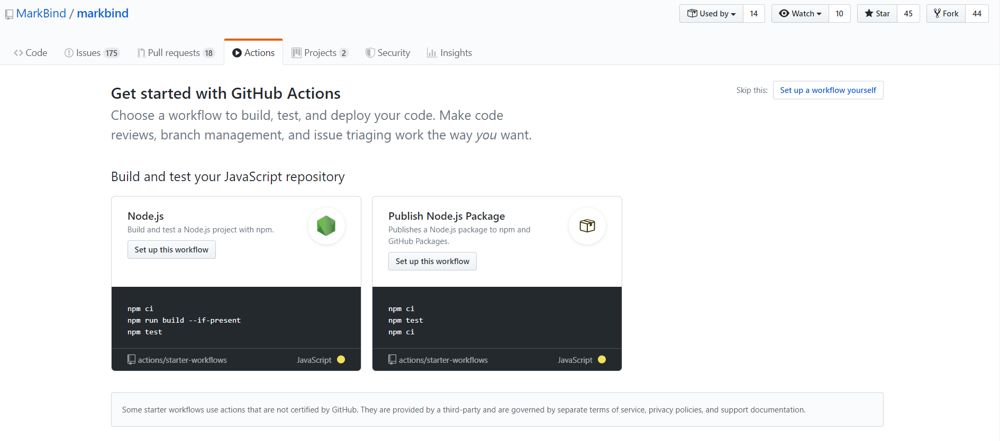
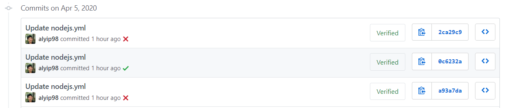
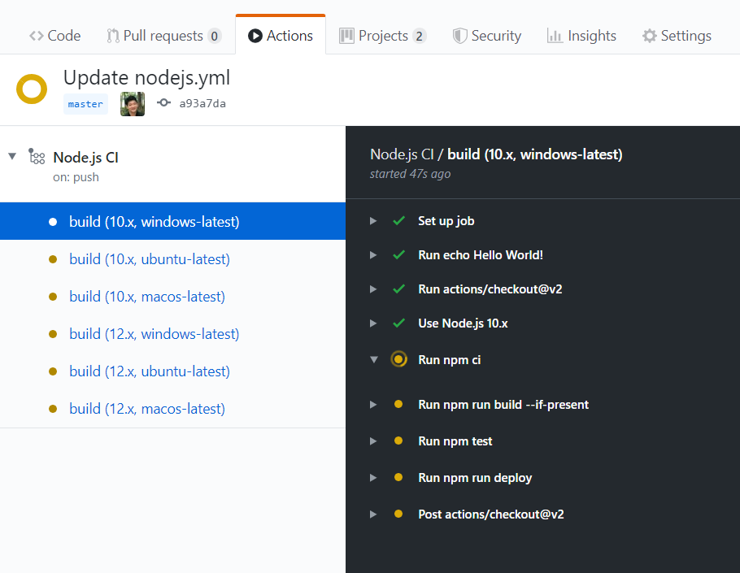

<frontmatter>
  title: Workflow Automation with GitHub Actions
  header: pagetop.md
  footer: footer.md
  head: head.md
  siteNav: mainNav.md
  pageNav: 3
</frontmatter>

{{ booktitle | safe }}

# GitHub Actions

📝 [Alfred Yip](https://github.com/alyip98)

🔎 [James Pang](https://github.com/jamessspanggg), [Tan Yuanhong](https://github.com/le0tan), [Tejas Bhuwania](https://github.com/Tejas2805)

<box id="article-toc">

* [What is GitHub Actions‎](#what-is-github-actions)
* [Why GitHub Actions‎](#why-github-actions)
* [How does GitHub Actions Work‎](#how-does-github-actions-work)
* [How is GitHub Actions Being Used‎](#how-is-github-actions-being-used)
* [How to Get Started with GitHub Actions‎](#how-to-get-started-with-github-actions)
* [Where to Go From Here‎](#where-to-go-from-here)
</box>

## What is GitHub Actions
<!--Explain how X fits into the big picture of SE. Describe it relative to topics the reader is likely to know.-->
GitHub Actions is a workflow automation solution that is tightly integrated into the GitHub ecosystem. It is commonly used to provide end-to-end continuous integration and continuous deployment (CI/CD) directly in your repository. With its tight integration with GitHub's ecosystem of services, users have the potential to automate more than just CI/CD.

---

## Why GitHub Actions
<!--Motivate the reader to learn about X. Describe benefits of X to make the reader interested in X. Try to give a balanced view of by mentioning also WHY NOT X i.e., mention both advantages and disadvantages.-->

### 1. Easy to Use
Setting up a workflow in a repository is easy and hassle-free. [Starter workflows](https://github.com/actions/starter-workflows) for popular languages are available and the built-in editor offers code completion and documentation at a glance.

### 2. Reusable Actions
Actions are small, reusable units in a workflow. When setting up a workflow, we can reuse actions written by the community. These actions are available at the marketplace.

### 3. Cross OS Support
GitHub Actions gives you the option to [run workflows](https://help.github.com/en/actions/reference/virtual-environments-for-github-hosted-runners#supported-runners-and-hardware-resources) on Ubuntu, Windows and macOS.

### 4. Docker Support
GitHub Actions provides the ability to run docker images for projects that use a dockerized environment.

### 5. Powerful
Integration with the GitHub ecosystem allows GitHub Actions to do more than just build/test/deploy. You can automate everything related to your GitHub project, including bug triaging, labeling, automated dependency updating etc.
Workflows can be triggered by events that happen on GitHub and will have access to the context of the issue/PR/commit that triggered it. 

### 6. Affordable
Like many of its competitors, GitHub Actions provides **free unlimited runner time for public repositories**. 

For private repositories, the free plan offers 2000 minutes of runner time per month and a pay-per-minute plan for additional minutes.

---

## How does GitHub Actions Work
<!--This is a simple high-level overview of the tool to give the reader some concrete sense of X (as opposed to limiting to an entirely abstract description). It's useful to give concrete examples such as code examples. Do not try to 'teach' how to use the X (assuming your in the style of a tutorial. If the tool is worth learning, there must be good tutorials about it already.-->
### Workflow
A workflow describes a sequence of jobs to be run when a trigger event occurs. 
Each job consists of a series of steps, which may be actions or shell commands. 
Each workflow is defined as a `.yml` file in the `.github/workflows` directory of a repository.

### Action
An action is a piece of code that performs an atomic task. 
For example, [checking out a repository](https://github.com/actions/checkout), or [caching dependencies](https://github.com/actions/cache).

### Triggers
Workflows can be triggered by events on the GitHub repository, ranging from opening pull requests or issues, making commits to scheduled events, or even from an external event by calling GitHub's REST API endpoint.

---

## How is GitHub Actions Being Used

**Simple CI [workflow](https://github.com/actions/starter-workflows/blob/master/ci/node.js.yml) for a Node.js app**
1. Trigger when a commit/pull request is made to the master branch
2. Install dependencies
3. Build
4. Run tests with multiple versions of Node on Ubuntu

**[Issue Labeling](https://github.com/facebook/react-native/blob/master/.github/workflows/needs-attention.yml)**
1. Trigger when a new issue is opened
2. Check issue body for required information
    1. If issue is missing information (e.g. steps to reproduce) 
    2. Add comment to ask author to provide missing information
    3. Add `Needs Author Feedback` label
3. Otherwise,
    1. Add `Needs Attention` label

---

## Set Up a Simple Workflow for a Node.js App
<!--
Provide a learning path for the reader. Try to give one good learning path rather than many random resources.
--> 

GitHub has made it extremely easy to set up a simple workflow without even leaving the browser. 

1. Head to the Actions tab on your repository
2. You can choose to set up a workflow from a template or from scratch. We will use the Node.js template in this example
3. The online editor is powerful and easy to use, boasting features such as inline documentation and autocomplete

4. The template workflow (same as the example above) will
    1. Begin when a commit is pushed or a pull request is opened to `master`
    2. Checkout the current repo (using `actions/checkout`)
    3. Install dependencies `npm ci`
    4. Build `npm run build --if-present`
    5. Run tests `npm run test`
    6. Report the status of the workflow via a status badge
    
5. Since we set the workflow up on the `master` branch, when we commit the newly-created workflow file, we can see GitHub Actions in action by navigating to the Actions tab
    

---

## Where to Go From Here
<!--
Give more resources. Instead of listing a lot of links, provide a brief summary of what value each resource can provide the reader.
-->
The official [documentation](https://help.github.com/en/actions) is a good resource to learn more about GitHub Actions.
The [starter workflows](https://github.com/actions/starter-workflows) repository contains good examples of 
CI workflows for popular languages as well as automation workflows for GitHub.
Here are a list of [awesome actions](https://github.com/sdras/awesome-actions) that you can use when writing your workflow.
 

A powerful extension to GitHub Actions is to use the [github-script](https://github.com/actions/github-script) action 
to run JavaScript within the workflow using GitHub's [Octokit](https://octokit.github.io/rest.js/v17/) API. 
The Octokit API allows you to create workflows that span across GitHub's ecosystem of services.

I have also compiled a list of popular repositories that use GitHub Actions that you can use as a reference. Do note that this is far from a comprehensive list and is more of a sample of how organizations are leveraging GitHub Actions in their development and production workflow.

### Repositories That Use GitHub Actions

Org/Project | Workflows | Notes
--- | --- | ---
Bootstrap | [test](https://github.com/twbs/bootstrap/blob/master/.github/workflows/test.yml) | Comprehensive set of tests including custom tests and coveralls
Oh My Zsh | [test](https://github.com/ohmyzsh/ohmyzsh/blob/master/.github/workflows/main.yml) | Workflow uses mainly shell commands
React Native | [needs-attention](https://github.com/facebook/react-native/blob/master/.github/workflows/needs-attention.yml), [process-label-actions](https://github.com/facebook/react-native/blob/master/.github/workflows/process-label-actions.yml) | Automatically apply labels to newly created issues and adds comments to issues based on labels
Node.js | [workflows](https://github.com/nodejs/node/tree/master/.github/workflows) | Linters, tests and build jobs
Chart.js | [CI](https://github.com/chartjs/Chart.js/blob/master/.github/workflows/ci.yml) | Conditional workflow for windows and ubuntu
Next.js | [workflows](https://github.com/zeit/next.js/tree/canary/.github/workflows) | Complex yet well structured build/test/deploy workflow. Automatically reports bundle size statistics in pull requests and on releases. Scheduled tests that run every 12 hours.
