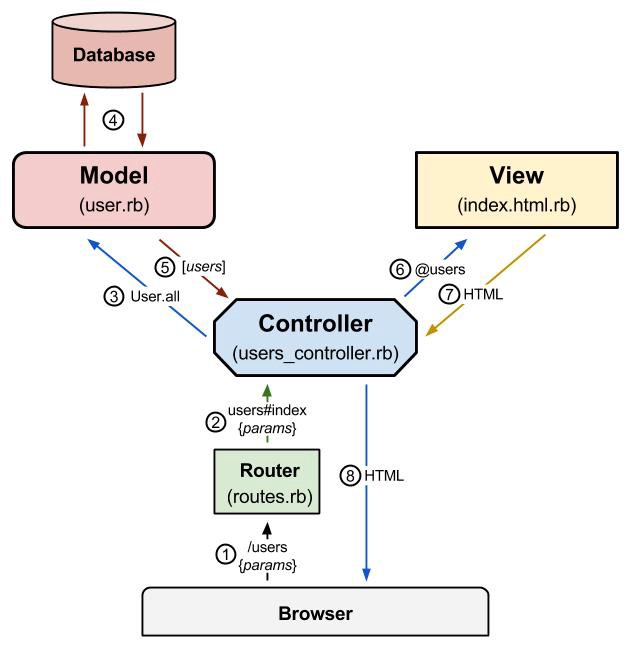

<frontmatter>
  title: Introduction to Ruby on Rails
  footer: footer.md
  head: head.md
  siteNav: mainNav.md
  pageNav: 3
</frontmatter>

{{ navbar | safe }}

<div class="website-content">

# Introduction to Ruby on Rails

Authors: [Chattoraj Ayush](https://github.com/AyushChatto)

## Ruby on Rails overview

**Ruby on Rails** is a web application framework written in the Ruby programming language. It was designed with the intention of making programming web applications easier and quicker by reducing the amount of code you write. Rails achieves this by being an "opinionated framework", which means that the developers believe that there is a certain approach - often called "The Rails Way" - that is ideal for building most types of web applications. By adhering to this approach, Rails allows you to focus primarily on the logic, and fills in much of the boilerplate code for you. 

The Rails philosophy includes two major principles, namely:
1. **Don't Repeat Yourself (DRY)**
2. **Convention over Configuration** 

### The Rails Way 

One of the core tenets of Rails is "Convention over Configuration", which means that many decisions regarding the structure of your Rails application are made for you in advance, so that there is less effort needed to come up with your own set of best practices. This is perhaps most evident in Rails' decision to follow a Model-View-Controller (MVC) architecture by default.

The structure of an app written in the MVC framework is as follows:

<center>


_Figure 1. Model-View-Controller Framework_ <sup>[source](https://medium.com/@matthewmain/rails-request-response-cycle-819e9cd8fa4e)</sup>
</center>

Let us follow the diagram, and trace the control flow as a Rails app responds to a request by the client. In this example, the client is making a query for all users in the database. 

#### Router

When Rails receives the URL, it first looks up the 
<tooltip effect="scale" content="A URI (Uniform Resource Identifier) is a string of characters that are used to identify a resource. URLs are a subset of URIs.">
<a href="">URI</a>
</tooltip> in the `routes.rb` file, which defines, by default, all the routes in the application. Each valid URI is mapped to a function located inside a Controller, that is then invoked to provide a response to the request. 

In order to achieve this, Rails exposes a convenient abstraction called a "Resource". A resource can refer to an object upon which you can perform CRUD (create, read, update, and delete) operations. These operations are often invoked via a HTTP request of the appropriate request verb (POST, GET, PUT, and DELETE respectively). In order to declare a resource called `user`, you would mention it inside your `routes.rb` in the following manner: 

```ruby
resources :users
```

Now, you can check all the routes that you have in your application by running `rails routes` in the command line. This should include:

```
                   Prefix Verb   URI Pattern                                                                              Controller#Action
                    users GET    /users(.:format)                                                                         users#index
                          POST   /users(.:format)                                                                         users#create
                 new_user GET    /users/new(.:format)                                                                     users#new
                edit_user GET    /users/:id/edit(.:format)                                                                users#edit
                     user GET    /users/:id(.:format)                                                                     users#show
                          PATCH  /users/:id(.:format)                                                                     users#update
                          PUT    /users/:id(.:format)                                                                     users#update
                          DELETE /users/:id(.:format)                                                                     users#destroy
```

As can be seen, the common routes that you would need for the resources have already been mapped to their respective URI's. This is equivalent to manually declaring the 7 resourceful routes for the `user` resource. By convention, Rails will then look for a controller called `users_controller.rb` and invoke the name of the function mapped to the particular URI and Verb. More information about Rails routes and how they work can be found [here](https://guides.rubyonrails.org/routing.html#resource-routing-the-rails-default).

#### Controller
<center>

```ruby
class UsersController < ApplicationController
  def index
    ..
  end
end
```
`users_controller.rb` with an `index` method 
</center>

In the standard Rails convention, once inside the application directory, if you navigate to `app/controllers/`, you should be able to see all the controllers in your project. Rails will look for the controller with the `<name>_controller.rb`, where `<name>` would be replaced by the result under the `Controller` heading in the list of routes above, in this case, "users". It will then look for the function name under the `Action` heading mapped to the URI function inside the Controller, and then call it. This is where the bulk of the business logic of your application would be. So if the person makes a GET request to `/users`, then Rails will open `users_controller.rb`, and call its `index` method.

#### Model

The Model is very similar to a Class (à la Object-Oriented Programming), and is a useful abstraction for representing and encapsulating objects in your application. This is also known as the Active Record pattern in Rails. In this pattern, the Models are mapped to tables in the database, and you can query a model's fields directly in Ruby, instead of writing your own SQL queries. Models also have generic methods such as `find`, `all`, `create`, `save`, `update`, `delete` included in them by default, so you don't need to implement them yourself.

In our diagram, the Controller calls the `all` method in the `User` model, which is, by convention in a file called `User.rb`, which is stored along with all other models at `app/models/`. The model then acts as an intermediary between the application and the database, and returns the results of the corresponding query. 

#### View

After the Controller has fetched all the data necessary and applied whatever transformations are needed, it passes in the requisite fields to its view. The View is what the client sees, and is a collection of `.erb` (**E**mbedded **R**u**B**y) files, which are basically just HTML files with lines of Ruby code embedded in it to modify its appearance and behavior. When the controller is generated using the Rails CLI, a corresponding folder of views is made inside `app/views/`. All the `.erb` files are stored here, and Rails will look for the file mapped to the controllers actions to serve up to the client at the end of the request-response cycle. 

## Why Rails

Many popular and very technically mature websites started off using, and continue to use Rails. These include: GitHub, Airbnb, Twitter, Hulu, Shopify, and Twitch, among others. Some of the key features that makes Rails the framework of choice for these users are:

### Fast iteration speed for product developement 

As an opinionated framework, Rails helps to automate trivial tasks by following certain conventions, which can make the development process faster. For example, in a Rails project that is connected to a database, each class is mapped to a table, as described in the Active Record Pattern, and the table name is just a pluralised version of the class's name - the `User` class becomes the `Users` table, the `Person` class becomes the `People` table, etc. This means that you don't need to spend any time deliberating on the name of the tables, nor do you have to juggle multiple concepts while mapping out the database and application, as Rails will automatically connect the two and spare you from deliberating about the exact name of the table. A similar approach is used to handle resources, which also automates much of the process.

The automation of these mundane tasks could make development a more enjoyable (more on that in a bit) and faster process. All of these optimizations can make developing an application between 30-40% faster on Rails [source](https://www.forbes.com/sites/quora/2018/04/03/is-ruby-a-dying-language/#10eb4d0b6a3d). It also makes Rails relatively easy to learn, as you do not need to understand HTTP verbs to make a basic Rails application (while mastery of the topic will certainly help). Furthermore, programmers experienced in Rails usually find it easier to start on existing Rails projects, since the conventions followed are usually the same, giving you the same directory structure and route naming conventions everywhere. 
  
### Optimized for Programmer Happiness

One of the primary tenets of Ruby was to make it the "Least Surprising Language", where the language was designed to feel intuitive and perform exactly as a developer would expect. In Rails, even more syntactic sugar is added on top of its Ruby foundations, in an effort to optimize for programmer happiness. As a result, Rails code tends to look very "neat" and feels inherently "nice" to write (as subjective as that sounds).

For example, in order to fetch yesterday's date in Python, one may have to write

```python
import datetime
datetime.datetime.now() - datetime.timedelta(days = 1)
```

The same action in Rails is done using
```ruby
1.day.ago
```

Similarly, Rails also added a new method to access an array element. Instead of following the C convention of using square-brackets to access the second element in the array "elements" like

```c
elements[1]
```

Rails developers can use ordinal representation to access the same element with the command

```ruby
elements.second
```

And while this may not reduce the amount one has to type, most Rails enthusiasts agree that it makes the code much more readable, easy to work with, and, consequently, happiness-inducing.

### Large and Active Community of Developers

The Ruby language has a very passionate and extensive community of developers, and there is a vast array of libraries (called "Gems"), that can be used with your Rails projects. These libraries provide a lot of functionalities, and can be used to add flexibility to Rails projects when required. 

Furthermore, as a result of its popularity, it is very likely that any problems you encounter with Rails will have a solution that you can find on Google or StackOverflow. For any new problems, you are also likely to receive a response very quickly, because the Ruby community prides itself for being welcoming and helpful. 

However, Rails might not be best suited for all use cases, and there are certain areas where other frameworks might be more suitable. For instance:

### Drawbacks

#### Lack of Flexibility

Although Rails is highly optimized for most types of web applications, there are inevitably some cases where following an MVC architecture isn't suitable. In those cases, it might be better for developers to use frameworks that allow for more flexibility. You may also wish to have a different directory structure, or give your routes different names, and find Rails' defaults very stifling. While there are ways for you to configure Rails to your needs, it might be less painful to avoid those conventions from the beginning.

#### Performance

While newer releases have combated this problem to a large degree, many of the old releases of Rails have had a reputation for being very bloated and slow to respond. Applications in other frameworks, or purely client-side applications with a minimal backend, tend to have a much lower delay between an action and a response. While it should be noted that the vast majority of delays in applications occur due to poor optimization, and not the inherent speed of the framework, Rails still remains more bulky and slower than many of its competitors. 

#### Learning Curve

Rails' tendency to do things "automagically" can also be very confusing to new users, who might be more used to configuring routes and directory structures themselves. You may also find it challenging to switch to other frameworks, where you may be required to configure routes and write SQL queries yourself, instead of having the framework do it for you. You will also have to learn the Ruby language, and it might be harder considering that most front-end applications are in JavaScript and its variants, and you will have to juggle multiple languages while you develop your application. 

## Getting Started

To install Rails on your computer, you will first need to install [Ruby](https://www.ruby-lang.org/en/). After this, you simply need to run:

```rb
gem install rails
```
`gem` is a package manager for Ruby that allows you to install Rails (as well as all the other Gems in Ruby). Once you're done with the setup, you can start developing applications right away. Here are some resources you might find helpful: 

1. The [Ruby Guides](https://www.rubyguides.com/) are a must read, as you cannot use Rails without knowing the underlying language.
2. The [Rails Guides](https://guides.rubyonrails.org/) are the definitive guide for Rails and you can be assured that it will always be up to date with the latest releases.
3. [Go Rails](https://gorails.com/) also has great screencast tutorials that really hold your hand through the multitude of features Rails has, and can be used by more visual learners.
4. [Rails Tutorial](https://www.railstutorial.org/book) is a book with a lot of advanced topics, so if you really want to study Rails in depth, consider this.
</div>

