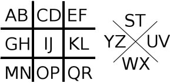

<frontmatter>
  title: Introduction to Password Storage
  header: pagetop.md
  footer: footer.md
  head: head.md
  siteNav: mainNav.md
  pageNav: 3
</frontmatter>

<div class="website-content">

{{ booktitle | safe }}

# Introduction to Password Storage

**Author: [Jeremy Choo](https://github.com/ChooJeremy)** <br>
Reviewers: [Amrut Prabhu](https://github.com/amrut-prabhu), [Marvin Chin](https://github.com/marvinchin), [Tan Zhen Yong](https://github.com/Xenonym), [Wang Junming](https://github.com/junming403)

<box id="article-toc">

* [Overview‎](#overview)
* [Encryption‎](#encryption)
* [Hashing‎](#hashing)
  * [Why isn't hashing enough?‎](#why-isn-t-hashing-enough)
* [Salting‎](#salting)
  * [What if there is a server breach?‎](#what-if-there-is-a-server-breach)
* [Getting started‎](#getting-started)
* [Other resources‎](#other-resources)
</box>

## Overview

Many software applications use a username and password combination as user account credentials for authentication. Obviously, it is not a good idea for the software to store these credentials as <trigger for="pop:plaintext">plain text</trigger> because if someone else were to gain access to them either lawfully (e.g., an employee who has access to the data) or unlawfully (e.g., someone hacking into the data storage), that person can use those credentials directly to impersonate the account owner. This article explains some techniques that can be used to store user credentials more securely:

- Encryption
- Hashing
- Salting

<popover id="pop:plaintext" header="_Plaintext_ refers to unencrypted information" placement="top">
  <div slot="content">
It is a cryptography term generally referring to text before encyption or after decrypting it. Another term for it is cleartext.
  </div>
</popover>

## Encryption

_Encryption_ is the process of converting plaintext into <trigger for="pop:ciphertext">ciphertext</trigger> along with an <trigger for="pop:encrypt-key">encryption key</trigger>. To <tooltip content="The opposite of encryption">decrypt</tooltip> the message, a <trigger for="pop:decrypt-key">decryption key</trigger> is required to convert the ciphertext back into it's original plaintext for it to be read. This process is called _decryption_. Without the decryption key, the ciphertext is simply a bunch of meaningless data. There are two main types of <tooltip content="When you choose to encrypt data, you must choose a specific algorithm to encrypt with. There are many, such as AES, DES and RSA">encryption algorithms</tooltip>: _Symmetric key algorithms_, where encryption and decryption keys are identical or closely related, and _Asymmetric key algorithms_, where encryption and decryption keys are different.

<popover id="pop:ciphertext" header="_Ciphertext_ refers to encrypted information" placement="top">
  <div slot="content">
It is a cryptography term generally referring to data after encrypting it.
  </div>
</popover>

<popover id="pop:decrypt-key" header="All decryption algorithms require a _decryption key_" placement="top">
  <div slot="content">
Without this decryption key, decryption cannot be performed. Only the intended recipient of the data should have the decryption key.
  </div>
</popover>

One common example of encryption is the use of shifting each letter of the alphabet to the left or right by a number of positions. This is known as the _Caesar cipher_ For example, if we chose to shift all the letters by 3, then the encryption key (and decryption key) for this algorithm would be 3. This would result in the following encryption algorithm:

```
Plaintext:  ABCDEFGHIJKLMNOPQRSTUVWXYZ
Ciphertext: DEFGHIJKLMNOPQRSTUVWXYZABC
```

This would mean that encrypting the message `I love you` would result in `L oryh brx`

Naturally, this isn't a very good encryption method because even if one doesn't know the decryption key, the method can be easily <trigger for="pop:brute">brute forced</trigger> by trying all <tooltip content="25 combinations because shifting by 26 simply results in the ciphertext being identical to the plaintext">25</tooltip> possible combinations and seeing if any of the results in a readable message. 

<popover id="pop:brute" header="A brute force attack is an attack where all possible combinations are tested to see if they work." placement="top">
  <div slot="content">
 A brute force attack usually takes very long to carry out.
  </div>
</popover>

Another encryption method is the _Pigpen Cipher_, where letters are <tooltip content="Substitution is a common technique in encrypting data by converting all instances of one letter to something else">substituted</tooltip> with symbols. The encryption key usually looks something like this:

 

In this case, each letter is substituted with a symbol that matches the exterior walls of where that letter is. For example, the letter `W` would be encrypted to the symbol  . If the letter is located on the right side instead, then a dot is placed in the middle of the symbol to indicate that it refers to the right letter instead of the one on the left. For example, the letter P would be encrypted to the symbol 

Naturally, the decryption key would be the encryption key itself, as it can be re-used to decrypt the ciphertext. Compared to the Caesar cipher, The Pigpen cipher is more resilient to brute force attacks if one doesn't know the decryption key, as it could result in one trying all possible substitution for each symbol. 

I had a secret agent send me information about the secret ingredient of Mick's cheeseburgers earlier, as they were delicious and I found myself constantly eating it. I suspect it's some addictive substance to make customers keep coming back for more. To ensure that Mick didn't know their secret ingredient was being leaked, I had my agent send it in Pigpen cipher:

 

Encryption might seem like a good idea because the ciphertext is meaningless without the decryption key, which prevents all of the problems with storing the data directly in plaintext. However, because encryption is <tooltip content="If a function is reversible, and it converts from x to y, then it can also convert from y back to x"> reversible</tooltip>, it is always possible to regain the original password from the ciphertext. Since the password is encrypted, the decryption key must also be stored somewhere. This means that if someone manages to hack into the application and read the encrypted passwords, it is also likely that they will be able to read the decryption key. With the decryption key, they will be able to decrypt all the passwords and read them anyway. This makes encryption unsuitable for password storage.

<popover id="pop:encrypt-key" header="All encryption algorithms require an _encryption key_" placement="top">
  <div slot="content">
The key is usually randomly generated text that is used to encrypt the original data.
  </div>
</popover>

## Hashing

_Hashing_ is a <tooltip content="A one way function is a function that is easy to compute the result of, but whose results are difficult to reverse back to the original input">one-way</tooltip> function that transforms a set of data into another set of data. Unlike encryption, when hashing is done, information that describes the original set of data is lost irrevocably in the process. This means that it is impossible to recover the original input from the <tooltip content="A hash is the output of a hashing algorithm">hash.

<popover id="pop:hashing-algo" header="A _hashing algorithm_ is a specific type of operation that hashes the input" placement="top">
  <div slot="content">
Different types of hashing algorithms will result in different output.
  </div>
</popover>

Some examples of cryptographic <trigger for="pop:hashing-algo">hashing algorithms</trigger> are [MD5](https://www.quora.com/How-does-the-MD5-algorithm-work) and [SHA1](https://deadhacker.com/2006/02/21/sha-1-illustrated/). However, when you perform hashing for passwords, you should use password hashing algorithms (such as [Argon2](https://github.com/P-H-C/phc-winner-argon2), [SCrypt](https://passlib.readthedocs.io/en/stable/lib/passlib.hash.scrypt.html) and [bcrypt](https://security.stackexchange.com/questions/4781/do-any-security-experts-recommend-bcrypt-for-password-storage)). The main difference between these are that password hashing algorithms are designed to be slow to prevent brute force attacks, unlike cryptographic hashing algorithms which are built for speed. Despite that, if you plan on learning more about hashing algorithms, we recommend starting with MD5 and SHA1, as they are easier algorithms to learn about.

For example, a simple hashing algorithm that acts on numbers could add up all the digits in that number. This would mean hashing the number `1013` would result in 1+0+1+3 = `5`. Hashing the number `761` would result in `14`. Note that after hashing the number, there is no way to regain back the original number - data about the original number (such as number and position of digits) have been irrevocably lost in the process. Additionally, many different numbers could result in the same hash. For example, the numbers `101` and `20` both result in the hash of `2`. This is called a _hash collision_. A good hashing algorithm attempts to minimize the amount of hash collisions such that the probability of it happening is close to 0. In the case of the MD5 algorithm, the probability of a hash collision given any two inputs is 1 in 2<sup>128</sup> which is 1 in 340,282,366,920,938,463,463,374,607,431,768,211,456.

### Why Isn't Hashing Enough?

A _[rainbow table](https://en.wikipedia.org/wiki/Rainbow_table)_ is a precomputed table of hashes for some set of passwords. Basically, people build huge tables of hashes wherein the plaintext is already known, so that attempting to crack hashes becomes a simple problem of looking up the hash in the table and its corresponding value, instead of attempting to reverse the hash. Through this method, it is very easy to crack simple hashes by simply doing a lookup.

An example of a service that provides this is [Crackstation](https://crackstation.net/).

Since attacks like rainbow tables exist, passwords need another layer of security.

## Salting

_Salting_ refers to appending a string of text, unique to each user, to their password before hashing them. Since each user has a unique salt, this makes rainbow tables ineffective, as the majority of the precomputed hashes won't even contain the salt, so they wouldn't even matter anyway! In this way, the salt forces the attacker to recompute the rainbow table for each password in order to be able to effectively use it. This effectively converts the attack to brute force, as each hash must be recomputed for each possible password. Additionally, the computed rainbow table would only be useful for that specific user, as each user would have a different salt. It could take years before a password is cracked!

Note that the salt should be randomly generated, as opposed to choosing a static value that is different for every user. For example, if an application used the username of the user as the salt, then attackers can pre-generate rainbow tables for common usernames, causing users with common username to be vulnerable to a rainbow table attack, even with salt applied to their passwords.

Thus, the way to store passwords properly is to use a _salted hash_ - take the user's password, append some data to it, and hash the result. That hash is the user's hashed password. When the user attempts to log in again, perform the same procedure again. If the hash matches, then you know that the user is who he says he is, even if you don't actually know the original password that the user provided. 

One question that is commonly asked by developers is where to store the salt. The salt can be stored in plaintext, along with the user in the database. Since the goal of the salt is only to prevent precomputed rainbow tables from being used, it doesn't need to be encrypted in the database.

Many good password hashing algorithms today have built-in salts, such as [Argon2](https://github.com/P-H-C/phc-winner-argon2), [SCrypt](https://passlib.readthedocs.io/en/stable/lib/passlib.hash.scrypt.html) and [bcrypt](https://security.stackexchange.com/questions/4781/do-any-security-experts-recommend-bcrypt-for-password-storage). A good password hashing algorithm or library will salt automatically.

### What if There Is a Server Breach?

A common question asked by developers is how much all of these security measures actually matter. After all, if an attacker has gained access to the entire application, does it matter if passwords are stored in plaintext or not?

If an attacker has already gained access to the entire application, then he already has all the information that he could possibly want from the server. He would have access to all of the application's data, including data from users or from any analytics software that might be running. However, by adding salt and hashing passwords, the attacker still doesn't know customer's passwords and could take years to find out. Otherwise, since 59% of people use the same password across multiple sites <sup>[source](https://securityboulevard.com/2018/05/59-of-people-use-the-same-password-everywhere-poll-finds/)</sup>, the attacker could quickly try other websites such as banks to attempt to break into those accounts, which can potentially yield great returns in terms of information and/or money.

Additionally, when a user signed up on your website and provided you a password, they implicitly trusted you to keep that information safe and secure for them. In a sense, you do have a responsibility to keep their passwords secure. By doing proper password storage, if your servers ever get breached, you can assure your customers that their passwords are properly secured, and still maintain some of their trust in you.

## Getting Started

<box type="danger">
It is far too easy to screw up and make a mistake. Instead, use one of the free libraries that provide a crypto function that has already been well-tested by the community. <b>Do not write your own crypto library.</b>
</box>

Here are some libraries you can use to implement password storage:
* PHP: [password_hash](https://secure.php.net/manual/en/function.password-hash.php)
* Java: [SecretKeyFactory](https://www.owasp.org/index.php/Hashing_Java) 
* Python: [PassLib](https://passlib.readthedocs.io/en/stable/narr/hash-tutorial.html)
* JavaScript: [bcrypt](https://www.npmjs.com/package/bcrypt)

## Other Resources

* [Secure Salted Password Hashing - How to do it properly](https://crackstation.net/hashing-security.htm) is an excellent resource that explains how to perform salted password hashing correctly, including links to other good libraries and what else can be done.
* [Awesome Cryptography](https://github.com/sobolevn/awesome-cryptography) is a curated list of resources on cryptographic algorithms - articles, blogs, books, libraries and more.

</div>
