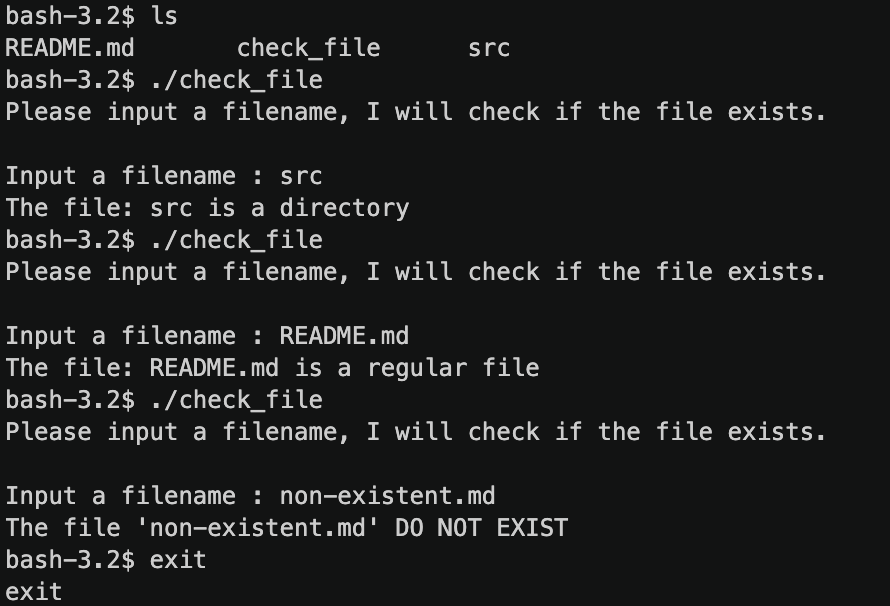
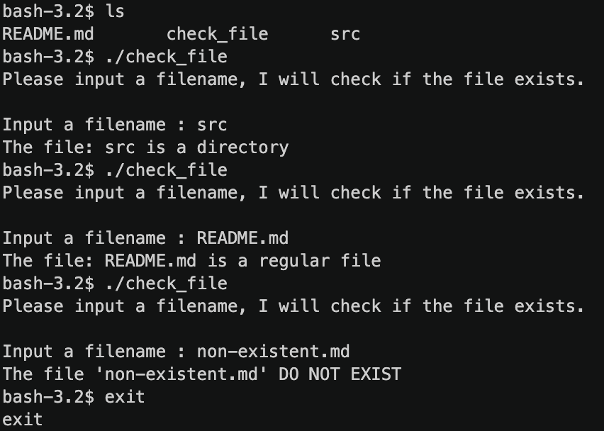

<frontmatter>
  title: Introduction to bash shell
  footer: footer.md
  head: head.md
  siteNav: mainNav.md
  pageNav: 3
</frontmatter>

{{ navbar | safe }}

<div class="website-content">

# Introduction to Linux bash shell 

Author: [Wang Junming](https://github.com/junming403)

Reviewers: [Rahul Rajesh](https://github.com/rrtheonlyone), [Ong Shu Peng](https://github.com/ongspxm), [Jeremy Choo](https://www.github.com/ChooJeremy), [Tan Zhen Yong
](https://github.com/Xenonym)

## What is the shell?

In general, a computer can be divided into 3 abstraction layers, hardware, kernel and applications. Users cannot control the hardware directly; instructions have to be given through kernel as the kernel is the one that controls the hardware.


<sub>source of image: [What (really) happens when you type ls -l in the shell](https://medium.com/meatandmachines/what-really-happens-when-you-type-ls-l-in-the-shell-a8914950fd73)</sub>

The **shell** is the interface through which we pass instructions to the kernel. These instructions will then be executed through the hardware. In this article, we will look into **Linux bash shell**.


<sub>source of image: [The Best Keyboard Shortcuts for Bash](https://www.howtogeek.com/howto/ubuntu/keyboard-shortcuts-for-bash-command-shell-for-ubuntu-debian-suse-redhat-linux-etc/)</sub>

[**bash**](https://www.gnu.org/software/bash/manual/html_node/) stands for **Bourne Again SHell**, an enhanced version of the original Unix Shell program. It has become the standard shell of various linux distributions. 

### Bash scripts

Bash supports a powerful language for writing scripts, which we usually refers to as **bash scripts**.

Here's one example of bash scripts, suppose you have to check if some given file exist periodically. The following script will ask for your input and output the results.

```bash
#!/bin/bash
 
echo -e "Please input a filename, I will check if the file exists.\n"

# waiting for user input.
read -p "Input a filename : " filename

# check if file exists.
test -z $filename && echo "You MUST input a filename." && exit 0
test ! -e $filename && echo "The file '$filename' DO NOT EXIST" && exit 0
test -f $filename && filetype="regular file"
test -d $filename && filetype="directory"

# output result.
echo "The file: $filename is a $filetype"
```

Here is an example output of running the script. You can also find a video demonstration [here](https://asciinema.org/a/gGqI8rPSGTRM7Ndot7B6aLNEF).



The above bash script is still just a collection of bash commands, which means you can get the same results by typing those commands one at a time. What raises bash scripts to a whole new level is the support for `conditionals`, `loops` and `functions`.

The following is an example of bash scripts that make use of conditionals and loops. Suppose you want to let user input a directory name, check if it exists, and then output the write permission for all files inside that directory.

```bash
#!bin/bash

# read user input and check if directory exists.
read -p "Please enter a directory name: " dir
if [ "$dir" == "" -o ! -d "$dir" ]; then
  echo "The $dir is NOT exist in your system"
  exit 1
fi

# output permissions for each of the file under the directory.
filelist=$(ls $dir)
for filename in $filelist
do 
  perm="readable"
  test -w "$dir/$filename" && perm="$perm writable"
  echo "The file $dir/$filename 's permission is $perm" 
done
```
Here is an example output of running the script. You can also find a video demonstration [here](https://asciinema.org/a/pNnG9krPxUBmQpJ00nWr8pvxM).



**Functions** in bash scripts are just like functions in normal programming languages. More information about bash scripts can be found [here](https://www.gnu.org/software/bash/manual/html_node/). 

### Combining of scripts via stream redirection

In Linux, you can redirect the output of one application to the input of another, combining the two applications together as if there is a pipe between them. In fact, Linux can pipe data between programs, files, and input/output devices seamlessly. You can take advantage of these abilities in your shell commands/scripts to perform complex tasks with just a few commands.

For example, suppose you wrote an executable calculate which takes a user input, do a calculation, and gives the output. To run it, you simply type:

```bash
./calculate
```

But you are not satisfied with manual testing, instead, you want to test with larger data set file `DataBundle`. And verify the output with another executable `verify`, which takes in the result as input and verify its correctness and output **PASS** or **FAIL**. Here's how we can do it.

```bash
./calculate < DataBundle > result
./verify < result
```
Notice in this case, `calculate` uses the data in `DataBundle` as input, and output the results to the file `result`. Then, `result` is taken as input to `verify`, and the final verification result is printed on screen.

Furthermore, if the code we write is buggy, it throws exception and error messages are directed to error output, then our result file will be empty! To handle it properly, we can also redirect error output to a file `errors`, and verify it is empty(such that no error occurs during execution) before we execute `verify`.

```bash
#!/bin/bash
./calculate < DataBundle > result 2> errors
if [ -s errors ]
then
     ./verify < result
else
     echo "error occured during execution."
fi
```
Another useful command is `|`, which chained linux commands together, as such the output of previous commands is passed as input to the next command.

The following command make use of shell command [ps](http://man7.org/linux/man-pages/man1/ps.1.html) and [grep](http://man7.org/linux/man-pages/man1/grep.1.html). ps displays information about a selection of the active processes and grep searchs for the pattern in given input. Suppose you want to check the status of process `p` running on your system. Thus you typed in `ps aux`, and all the processes' information are listed, but there are too many processes that you can't find `p`. As such, you can pass the result of `(ps) aux` to `grep 'p'` to capture process `p`'s status. Thus the command will be look like `ps aux | grep 'p'`.

A more detailed introduction to I/O stream redirection can be found [here](https://www.digitalocean.com/community/tutorials/an-introduction-to-linux-i-o-redirection).

## Why use shell?

A common question many people ask is: Why type commands in a shell when we can do the same things using GUI applications? Here are some reasons:

- **Faster**: Often, performing a task via the shell is faster than doing the same via a GUI application because the shell doesn't get slowed down by other overheads such as GUI rendering. For example, when performing tasks on a remote server using a shell, the lag will be less.
- **Uniform**: Unlike GUI apps whose availability and usage can vary between Linux distributions, the shell is always available and the usage is almost the same across different Linux distributions. 
- **More powerful**: GUIs tends to simplify things, giving the user fewer options. With a shell, you will have complete control of every option. While the shell has a steep learning curve, once you are familiar with it, you can do more things more efficiently with a shell compared to GUI applications. For example, you can automate things with a shell, something not easy to do with a GUI application.

- **Task automation**: bash scripts allows us to automate the frequently performed operations, it is easy to use and can be executed on any Unix-like operating systems without any modifications.

## How to get started?

In our opinion, there is no need to learn the shell in one go. Instead, whenever you use a GUI tool to accomplish a task, try to learn how to do the same using the shell. For example, when using git, use it via the shell instead of a GUI tool such as Source Tree. That way, you can learn the shell incrementally, over time.

However, if you really wish to learn bash systematically, below are some resources you might find useful.

- [Bash Reference Manual](https://www.gnu.org/software/bash/manual/html_node/) is a good reference manual of linux bash shell. 
- The [Google Shell Style Guide](https://google.github.io/styleguide/shell.xml) is a good baseline for good shell scripting style.
- Gentoo has a good [`bash` shell reference](https://devmanual.gentoo.org/tools-reference/bash/).
- Apple's [Shell Scripting Primer](https://developer.apple.com/library/archive/documentation/OpenSource/Conceptual/ShellScripting/Introduction/Introduction.html) is a in-depth introduction to shell scripting for beginners.

In addition, you can always use the [`man`](https://en.wikipedia.org/wiki/Man_page) command to find more information about a bash command. For example, the command `man grep` will give you the built-in help page about the `grep` command. These help pages are written in a programmer-friendly format and are very comprehensive.

```
GREP(1)                   BSD General Commands Manual                  GREP(1)

NAME
     grep, egrep, fgrep, zgrep, zegrep, zfgrep -- file pattern searcher

SYNOPSIS
     grep [-abcdDEFGHhIiJLlmnOopqRSsUVvwxZ] [-A num] [-B num] [-C[num]]
          [-e pattern] [-f file] [--binary-files=value] [--color[=when]]
          [--colour[=when]] [--context[=num]] [--label] [--line-buffered]
          [--null] [pattern] [file ...]

DESCRIPTION
     The grep utility searches any given input files, selecting lines that
     match one or more patterns.  By default, a pattern matches an input line
     if the regular expression (RE) in the pattern matches the input line
     without its trailing newline.  An empty expression matches every line.
     Each input line that matches at least one of the patterns is written to
     the standard output ......

```
</div>
