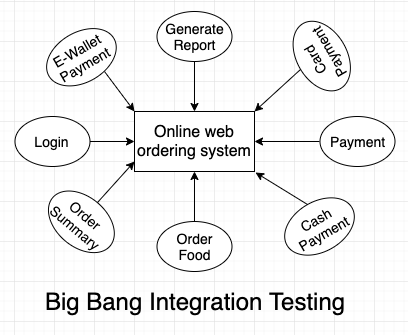

<frontmatter>
  title: Integration Testing
  footer: footer.md
  head: head.md
  siteNav: mainNav.md
  pageNav: 3
</frontmatter>

{{ navbar | safe }}

# Integration Testing

**Author(s): [Jacob Li PengCheng](https://github.com/jacoblipech)**

Reviewers: [Amrut Prabhu](https://github.com/amrut-prabhu), [Marvin Chin Kun Song](https://github.com/marvinchin), [Lin Si Jie](https://github.com/sijie123)

## What is integration testing?

Integration testing is a part of software testing where individual parts of your application are combined and tested as a group. This usually happens after the [<tooltip content="Testing of individual module units within a system">unit testing stage</tooltip>](https://www.guru99.com/unit-testing-guide.html) and before the [<tooltip content="Evaluation of the software against requirements gathered from users and system specifications">system testing stage</tooltip>](https://www.guru99.com/system-testing.html).
Integration testing combines individually tested modules as a group and aims to discover faults related to the interactions between these modules.

Let's look at an example to better understand what these means.
Suppose that you have built an online food ordering system and the architecture diagram of your application is shown as follows:

Zooming in on the food ordering aspect of this system, a unit test on the `Order Summary` checks for the correctness of the order details recorded and a unit test on the `Order Food` checks that the food ordered is in the correct format.

After completion of unit testing on individual modules, an **integration test** on `Order Food` and `Order Summary` checks that upon ordering food, the order summary reflects the correct food orders.

After completion of integration testing, a system test on the entire application could mimic a customer's point of view and checks that the functionalities such as `Order Food`, `Payment` and `Generate Report` work as intended.

## Why is integration testing important?

In a software application, each software module is usually designed and unit tested by different programmers.
Since these programmers may work in isolation and have different understandings of the software requirements, integration testing is necessary to ensure that the software modules work in unity and expose any faults in the interaction between different units.

Suppose the `Order Food` module mentioned earlier allows each user to submit up to 10 orders each time. If the `Order Summary` module can only record a maximum of 5 orders each time, when the orders from `Order Food` are passed to the `Order Summary` module, 5 of the orders may not be taken into account. 
Hence, there is potential for problems such as such as **data loss**, **inaccurate results** and even **system errors**.
Integration tests find these discrepancies before any serious damage is done.

Although system testing also help to uncover faults between modules, integration testing is still highly encouraged as it is able to **better isolate** the scope of the features during testing, making it **easier** and **faster** to test.
In fact, many integration problems can be detected and resolved in the early stage of development, making a developer's life easier to debug when a problem arises in the future.
More advantages of doing integration testing before system testing can be found [here](https://bitwaretechnologies.com/integration-testing-important-software-testing-life-cycle/).

Hence, integration testing can be useful in the development of any non-trivial software product. 
Concepts shared in this article can be adopted by different software applications.

On top of that, in the current era of <tooltip content="Practice of merging developers' work continuously into a shared repository">Continuous Integration</tooltip> (CI), integration testing is useful to help with early detecion of defects while maintaining the quality of the product throughout further developments.
The concept of [Continuous Integration Testing](https://crossbrowsertesting.com/blog/continuous-integration/continuous-integration-testing-delivery/) is also formed to combine integration testing with continuous integration.

:fas-info-circle: More information on instances where integration testing is important can be found in [this article](https://www.guru99.com/integration-testing.html).

## How does integration testing work?

Using this specific system as an example, below is a list of things you should follow to execute effective integration testing:

1. Prepare the integration test plan.
1. Design the test scenarios, cases and scripts.
1. Execute the test scripts and report defects if any.
1. Track defects and re-test application.

### 1. Prepare the integration test plan

Before the actual implementation of your integration tests, it is important to decide on the approach used.
There are a few different approaches of integration testing in which you can adopt depending on the development progress of your application.

#### Big bang approach:

This approach involves integrating all the modules in your design diagram together and testing everything at once in a complete state. 
This is convenient but it is difficult to isolate defects and there is a high chance of missing critical underlying defects.
Big bang integration testing is usually used for smaller applications with few modules.

An example of how big bang integration testing can be applied to our given example is shown below:

:fas-info-circle: You can find more use details on the big bang approach [here](https://www.tutorialspoint.com/software_testing_dictionary/big_bang_testing.htm).

#### Incremental testing approach:

This approach involves integrating two or more logically related modules. The other related modules are added and tested for proper functioning. This is repeated until all the modules are joined (or _integrated incrementally_) and tested successfully. It is usually preferred for applications with many modules.

Incremental integration testing is further split into the 3 approaches shown below:

| | [Top-down approach](https://www.guru99.com/integration-testing.html#9) | [Bottom-up approach](https://www.guru99.com/integration-testing.html#8) | [Hybrid / sandwich approach](https://www.guru99.com/integration-testing.html#10) |
| -- | -- | -- | -- |
| **Description**| Based on the dependency order of modules, high level modules are tested first, followed by lower level modules. | The reverse of top-down approach. | A mix of both top-down bottom-up approaches. |
| **Advantages**| Early discovery of high level architecture / design defects. | Easier to create test cases bottom up. | Beneficial for big project to distribute tasks on testing.
| | Main control points of the system are tested early. | Critical modules on functionalities are tested first. | Allow top-down and bottom-up approach to run side by side. |
| **Disadvantages** | Significant low level modules are tested late in the cycle. | There is no testable working system until the higher level modules are build. | It is difficult to test for highly interconnected modules. |
| | A [<tooltip content="A program that simulates the behaviours of software modules">stub</tooltip>](https://stackoverflow.com/questions/463278/what-is-a-stub) is not perfect to simulate data flow as it only contain very basic, hardcoded data of the module. | A [<tooltip content="Module with dummy code to temporarily replace a module">driver</tooltip>](http://www.professionalqa.com/test-driver) test is even harder to write than stub. | Higher cost from using both driver and stub. You can understand the difference [here](https://www.quora.com/What-is-the-difference-between-stubs-and-drivers-in-software-testing).

:fas-info-circle: A more detailed guide on using specific methods for incremental testing together with examples can be found [here](https://www.softwaretestinghelp.com/incremental-testing/).

:fas-info-circle: [NUS Software Engineer textbook](https://se-education.org/se-book/integration/#integration) also offer some concrete examples of different approaches of integration testing.

### 2. Design the test scenarios, cases and scripts

Before the actual coding is done, a basic test strategy deciding the test cases and test data used should be crafted. This usually involves setting a test case ID, objective, description and expected result.
Using the example shown above, below shows a sample integration test used for the `login` and `ordering` modules:

~~~
Test case ID: 1
Objective: Check the link between login and ordering modules
Description: Enter login credentials and click on login button
Expected result: To be directed to order food page based on the login user
~~~

<box type="warning">As integration test cases are <tooltip content="It generally takes longer time due to additional overheads such as waiting for dependent modules to respond">expensive operations</tooltip> compared to unit testing, it should focus mainly on the integration of modules together and not on specific actions within the same module.</box>

:fas-info-circle: More details about the ways to structure incremental testing can be found on [this article](https://www.softwaretestinggenius.com/various-approaches-in-integration-testing/)

### 3. Execute the test scripts and report defects if any

Depending on the approach you have chosen for your integration plan and the test cases, the way you execute your code for testing will differ.

- Big bang approach usually requires all the modules to be developed before you can start with the integration testing.

- Incremental approach is usually conducted simultaneously with the module's development. Stubs and drivers are used to mimic the modules for writing tests since not all modules are developed at the point of integration testing.
[NUS Software Engineer module site](https://nus-cs2103-ay1819s1.github.io/cs2103-website/se-book-adapted/chapters/testing.html#stubs) provides concrete codes for using stubs.

:fas-exclamation-circle: Either way, such test scripts can help you in singling out specific integration errors to be resolved before it gets more serious. Hence, you should ensure that all high prioritized bugs are fixed before moving on. 

:fas-info-circle: [This article](https://www.guru99.com/test-environment-software-testing.html) shows more details on how to set up a test environment for better integration testing.

### 4. Track defects and re-test application

In the event of failing your integration test case, it is important to learn how to track down the [<tooltip content="Incorrect behavior observed from the system">defects</tooltip>](https://qacomplete.com/resources/articles/what-is-a-software-defect/) occured. 
Thereafter, you should make changes to your application to fix them and re-test your application with integration testing to ensure that the defects are no longer there.

:fas-info-circle: [This article](http://www.professionalqa.com/defect-tracking-process) covers more details on how to effectively track down defects in a system and fix them.

## Tips for better integration tests

- **Make sure that each module is unit tested before integration testing** 
By ensuring that each unit test is completed properly, integration testing will be smoother as we can focus mainly on the flow of data between modules.

- **Prioritize the modules to be tested** 
Despite the need to cover all areas of integration of the application, it is important to ensure that critical modules needs to be tested first.

- **Keep testing suites separate** 
Integration tests should be run separately from unit tests. Developers working on backend logic can run unit tests frequently and get immediate result.
They do not have to meddle with integration testing unnecessarily.

- **Ensure that all executed test cases are documented** 
This helps you to identify errors quickly through an integration test.
It also helps to standardize the way integration testing is carried out in your application so that everyone can conform to the given standard.

- **Automate your tests (optional)** 
As far as possible, automate all your tests, especially when you use the incremental approach since regression testing is important each time you integrate a new unit, and manual regression testing can be inefficient. 
You can find a list of most commonly used [automation tools](https://medium.com/@briananderson2209/best-automation-testing-tools-for-2018-top-10-reviews-8a4a19f664d2) for integration testing.

:fas-info-circle: [This article](https://techbeacon.com/devops/6-best-practices-integration-testing-continuous-integration) provides more useful tips for CI projects.

## Tools to get started with integration testing

Generally integration test can be implemented based on your existing unit testing tools.
However, if you do not have an existing testing tool in place, here are some useful tools that you can consider for your integration testing:

- [VectorCast](http://www.vectorcast.com/) tool operates based on executing unit tests first before integration tests as discussed in this article.

- [Gauge](https://gauge.org/) acts as a plugin which can be incorporated to any language or IDE. 
It is an lightweight cross-platform test automation tool which makes testing easier to maintain, more readable and scalable.

- [Selenium](https://www.seleniumhq.org/) is an open source test automation framework focusing on web applications. 
It supports a wide range of programming languages, cross-browser testing with extensive libraries and the ability to create robust test scripts to handle many scenarios.

- [Google EarlGrey](https://google.github.io/EarlGrey/) is a native iOS automation test framework allowing developers to write and maintain clear concise tests. 
It has a powerful built-in synchornization which allows it to reproduce any UI interactivity and test them.

:fas-info-circle: Although there are many integration testing tools available, more research needs to be conducted to ensure the compatibility of the tools with your application.

## Concluding Remarks

Ultimately, as a developer, it is important to recognize the importance of integration testing in your application. 
To better complete integration testing, follow the integration plan and ensure that all of the interfaces in your application are tested.

## Useful Resources

Here are some resources to help you with integration testing:

- [Dos and donts of integration testing](https://www.fogbugz.com/blog/9-integration-testing-dos-and-donts/). This article shows further advices on specific details to take note when writing your own integration test.

- [Other testing tools to start your integration testing](https://www.softwaretestinghelp.com/integration-testing-tools/). Depending on your application, you can refer to more tools which can assist you in getting started with integration testing.

- [Getting started with Selenium for automated website testing](https://wiki.saucelabs.com/display/DOCS/Getting+Started+with+Selenium+for+Automated+Website+Testing). This article gives an overall guide to integrating selenium to automate integration testing for your web application.

