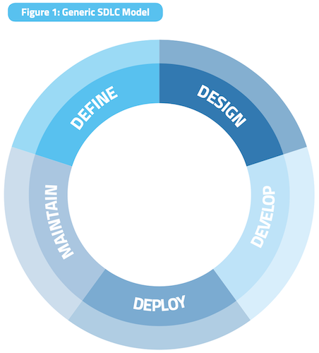

<frontmatter>
  title: Introduction to Security Testing
  header: pagetop.md
  footer: footer.md
  head: head.md
  siteNav: mainNav.md
  pageNav: 3
</frontmatter>

{{ booktitle | safe }}

# Introduction to Security Testing

**Author(s): [Ahmed Bahajjaj](https://github.com/madanalogy)** 
Reviewers: [James Pang](https://github.com/jamessspanggg)

<box id="article-toc">

* [Introduction to Security Testing](#introduction-to-security-testing)
    * [What Is Security Testing?‎](#what-is-security-testing)
    * [Why Have Security Testing?](#why-have-security-testing)
    * [How to Get Started with Security Testing?](#how-to-get-started-with-security-testing)
    * [Additional Resources‎](#additional-resources)
</box>

## What Is Security Testing?

Security Testing is a type of Software Testing that uncovers vulnerabilities, threats, risks in a software application and prevents malicious attacks from intruders. 

The goal of security testing is to:
- Identify threats in the system.
- To measure the potential vulnerabilities of the system.
- To help in detecting every possible security risks in the system.
- To help developers in fixing the security problems through coding.

### Types of Security Testing
- **Vulnerability Scanning**: This is done through automated software to scan a system against known vulnerability signatures.
- **Security Scanning**: It involves identifying network and system weaknesses, and later provides solutions for reducing these risks. This scanning can be performed for both Manual and Automated scanning.
- **Penetration Testing**: This kind of testing simulates an attack from a malicious hacker. This testing involves analysis of a particular system to check for potential vulnerabilities to an external hacking attempt.
- **Risk Assessment**: This testing involves analysis of security risks observed in the organization. Risks are classified as  Low, Medium and High. This testing recommends controls and measures to reduce the risk.
- **Security Auditing**: This is an internal inspection of Applications and Operating systems for security flaws. An audit can also be done via line by line inspection of code.
- **Posture Assessment**: This combines Security Scanning, Penetration Testing, and Risk Assessments to show an overall security posture of an organization.

## Why Have Security Testing?

A comprehensive security testing framework deals with validation across all layers of an application. Through this, the organization can evaluate their application code for vulnerabilities and take remedial measures for the same. Recently, many of the software development organizations have been making use of secure software development life cycle methodologies to ensure identification and rectification of vulnerability areas early on in the application development process.

Security Testing helps to ensure:
- Confidentiality of Information.
- Integrity of Information.
- Authenticity of Identity.
- Availability of information and services.
- Authorisation: The process of determining whether a requester is allowed to receive a service or perform an operation (e.g. Access Control).

## How to Get Started with Security Testing?

As a subset of software testing, security testing operates in tandem with your SDLC. It is a conscious decision that needs to be made for a more secure application.

<box id="info">:fas-info-circle: Knowledge of Software Development Life-Cycles (SDLCs) would be useful but not necessary. If you would like to find out more about SDLC Processes please click [here](https://nus-cs2103-ay1920s1.github.io/website/se-book-adapted/chapters/processModels.html).</box>

### Phase 1: Before Development Begins

Define a SDLC and review policy standards. Ensure that there are appropriate policies, standards, and documentation in place. Documentation is extremely important as it gives development teams guidelines and policies that they can follow. 

People can only do the right thing if they know what the right thing is.

### Phase 2: During Definition and Design

Review security requirements, always make sure you have a <tooltip content="A security policy is a written document in an organization outlining how to protect the organization from threats, including computer security threats, and how to handle situations when they do occur.">__security policy__</tooltip>! Security requirements define how an application works from a security perspective. It is essential that the security requirements are tested. Testing in this case means testing the assumptions that are made in the requirements and testing to see if there are gaps in the requirements definitions.

### Phase 3: During Development

Theoretically, development is the implementation of a design. However, in the real world, many design decisions are made during code development. These are often smaller decisions that were either too detailed to be described in the design, or issues where no policy or standard guidance was offered. If the design and architecture were not adequate, the developer will be faced with many decisions. If there were insufficient policies and standards, the developer will be faced with even more decisions.

### Phase 4: During Deployment‎

Perform a penetration test of your application. Having tested the requirements, analyzed the design, and performed code review, it might be assumed that all issues have been caught. Hopefully this is the case, but penetration testing the application after it has been deployed provides a last check to ensure that nothing has been missed.

### Phase 5: Maintenance and Operations

Conduct periodic health checks and ensure change verification. After every change has been approved and tested in the QA environment and deployed into the production environment, it is vital that the change is checked to ensure that the level of security has not been affected by the change. This should be integrated into the change management process.

## Additional Resources

- [Overview by Guru99.com](https://www.guru99.com/what-is-security-testing.html) - A very brief overarching summary of Security Testing and it's role in Software Testing.
- [Breakdown by SoftwareTestingHelp.com](https://www.softwaretestinghelp.com/how-to-test-application-security-web-and-desktop-application-security-testing-techniques/) - Breakdown of security testing into common attack vectors and recommended tools.
- [OWASP Testing Guide](https://www.owasp.org/images/1/19/OTGv4.pdf) - An extremely comprehensive guide from the Open Web Application Security Project (OWASP) on security testing with in-depth coverage of web-application security testing.

