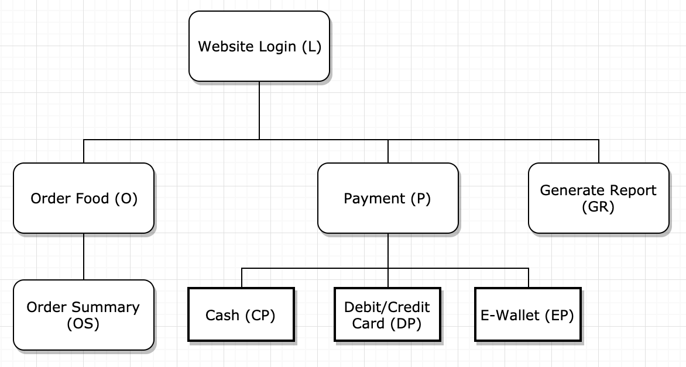
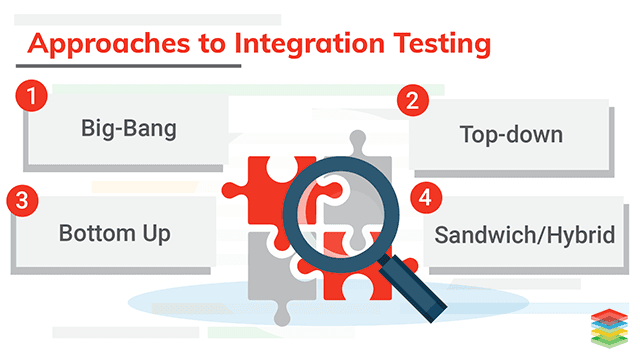

<frontmatter>
  title: Integration Testing
  footer: footer.md
  head: head.md
  siteNav: mainNav.md
  pageNav: 3
</frontmatter>

{{ navbar | safe }}

# Integration Testing

**Author(s): [Jacob Li PengCheng](https://github.com/jacoblipech)**

Reviewers:

## What is integration testing?

Integration testing is a part of software testing where individual units of your application are combined and tested as a group. This usually happens after [unit testing stage](http://softwaretestingfundamentals.com/unit-testing/) and before the [system testing stage](https://www.guru99.com/system-testing.html).

## Why is integration testing important to SE?

In a software application, each software module is usually designed and unit tested by different programmers. Hence, with different understanding of the software requirements, integration testing is necessary to ensure that software modules work in unity and expose any faults in the interaction between different parts of the units. 

<box type="info">Suppose you are in charge of the **data collection component** and it passed the **data** collected from the users to the **data analysis component**. If the **data analysis component** assumed your **data** to be of maximum 100 lines but the data you sent has no limit on the number of lines, it is then the integration test that is supposed to find this discrepancy.</box>

Hence, integration testing is an important aspect which can be applied to any software such as web, mobile and desktop applications. I will be mainly focusing on integration testing in terms of the web application. Similar concepts can be adopted by other applications.

:information_source: More information on instances where integration testing is important can be found on [this article](https://www.guru99.com/integration-testing.html).

## How does integration testing work?

Given a sample architecture diagram of your application shown:

Below are a list of things to follow to execute effective integration testing:

1. Prepare the integration test plan.
1. Design the test scenarios, cases and scripts.
1. Executing the test scripts and report defects if any.
1. Tracking and re-testing the defects.
1. Repeat testing until all integration tests are successful.

### Integration Test Plan
Before the actual implementation of your integration tests, it is important to decide on the approach used. Using a concrete example where by you are designing a online web ordering system. Your application may be split into different modules as shown below:

As shown, there are a few different approaches of integration testing in which you can adopt depending on the development progress of your application.

#### [Big bang approach](https://www.tutorialspoint.com/software_testing_dictionary/big_bang_testing.html): 
 
This approach involves integrating all the components in your design diagram together and test everything at once in a complete state. This is convenient but it is difficult to isolate defects and raises high chances of missing critical defects.

It is usually used for smaller applications with a few components.

#### [Incremental testing approach](https://www.quora.com/What-is-incremental-testing-in-software):

This approach involves integrating two or more logically related components. The other related components are added and tested for proper functioning. Repeat these steps until all the components are joined and tested successfully.

It is usually preferred with any bigger applications with more than 10 different components. It is further split into the 3 approaches shown below.

| | [Top-down approach](https://www.guru99.com/integration-testing.html#9) | [Bottom-up approach](https://www.guru99.com/integration-testing.html#8) | [Hybrid / sandwich approach](https://www.guru99.com/integration-testing.html#10) |
| -- | -- | -- | -- |
| **Description**| Higher level modules are tested with lower level modules until all modules are tested. | Lower level modules are tested with higher level modules until all modules are tested. | A mix of both top-down bottom-up approaches. |
| **Advantages** | Early discovery of high level architecture / design defects | Easier to create test cases bottom up | Beneficial for big project to distribute tasks on testing
| | Main control points of the system are tested early | Critical modules on functionalities ae tested first | Allow top-down and bottom-up approach to run side by side | 
| **Disadvantages** | Significant low level moduls are tested late in the cycle | There is no working system until the last module is build | It is difficult to test for highly interconnected modules |
| | A [stub](https://stackoverflow.com/questions/463278/what-is-a-stub) is not perfect to simulate data flow | A [driver](http://www.professionalqa.com/test-driver) test is even harder to write than stub | Higher cost from using both driver and stub. You can understand the difference [here](https://www.quora.com/What-is-the-difference-between-stubs-and-drivers-in-software-testing)

:information_source: A more detailed guide on using specific methods for incremental testing together with examples can be found [here](https://www.softwaretestinghelp.com/incremental-testing/).

### Designing test scenarios, cases and scripts

Before the actual coding is done, a basic test strategy deciding the test cases and test data used should be crafted. This usually involves setting a test case ID, objective, description and expected result. Using the example shown above, below shows a sample integration test used for log in and order food module:

~~~
Test case ID: 1
Objective: Check the link between login and order food module
Description: Enter login credentials and click on login button
Expected result: To be directed to order food page based on the login user
~~~

<box type="warning">As integration test cases are expensive operations compared to unit testing, it should focus mainly on the integration of modules together and not on specific actions within the same module. Hence, with should differ from other test cases. </box>

:information_source: More details about the ways to structure incremental testing can be found on [this article](https://www.softwaretestinggenius.com/various-approaches-in-integration-testing/)

### Executing test scripts and report defects

Depending on the approach you have chosen for your integration plan and the test cases, the way you execute your code for testing will differ.

A big bang approach usually involves all the modules to be developed before you can start with the integration testing.

As for incremental approach, it is usually conducted simultaneously with the modules development. Hence, stubs and drivers are used to mimic the modules for writing tests.

In both cases, always ensure that all high prioritzed bugs are fixed and closed before moving on.

:information_source: [This article](https://www.guru99.com/test-environment-software-testing.html) shows more details on how to set up a test environment for better integration testing. 

## Tips for better integration tests

### :thumbsup: Make sure that each component is unit tested before integration testing
By ensuring that each unit test is completed properly, integration testing will be smoother as we can focus mainly on the flow of data between modules.

### :thumbsup: Prioritize the modules to be tested
Despite the need to cover all areas of integration of the application, it is important to ensure that critical modules needs to be tested f irst.

### :thumbsup: Automate your tests (strongly encouraged)
As far as possible, automate all your tests, especially when you use the incremental approach, since regression testing is important each time you integrate a unit, and manual regression testing can be inefficient. You can find a list of most commonly used [automated tools](https://medium.com/@briananderson2209/best-automation-testing-tools-for-2018-top-10-reviews-8a4a19f664d2) for integration testing.

### :thumbsup: Ensure that all executed test cases are documented
This helps you to identify errors quickly through an integration test. It also helps to standadize the way integration testing is carried out in your application so that everyone can conform to the given standard.

## Tools to get started with integration testing

Here are some useful tools that you can use for your integration testing:

- [Selenium](https://www.seleniumhq.org/). Selenium is an open source test automation framework focusing on web applications. It supports a wide range of programming languages, cross-browser testing with extensive libraries and the ability to create robust test scripts to handle many scenarios.

- [Google EarlGrey](https://google.github.io/EarlGrey/). EarlGrey is a native iOS automation test framework allowing developers to write and maintain clear concise tests. It has a powerful built-in synchornization which allows it to reproduce any UI interactivity and test them.

- [Robotium](https://github.com/RobotiumTech/robotium). Robotium is an Android test automation framework made to simplify black-box tests/ It can handle multiple activities atuomatically, producing fast and robust tests cases.

- [Gauge](https://gauge.org/). Gauge acts as a plugin which can be incorporated to any language or IDE. It is an lightweight cross-platform test automation tool which makes testing easier to maintain, more readable and flexible.

Note that although there are many integration testing tool available, more research needs to be conducted to ensure the compatibility of the tool with your application.

## Concluding Remarks

Ultimately, as a developer, it is important to recognize the importance of integration testing in your application. To better complete integration test, it is important to put yourself in the users' perspective and ensure that your application works from the user's point of view. 

## Useful Resources

You are ready to work on your integration testing! Here are some resources to help you along the way:

- [Dos and donts of integrationo testing](https://www.fogbugz.com/blog/9-integration-testing-dos-and-donts/). This article shows further advices on specific details to take note when writing your own integration test.

- [Other testing tools to start your integration testing](https://www.softwaretestinghelp.com/integration-testing-tools/). Depending on your application, you can refer to more tools which can assist you in getting started with integration testing.

