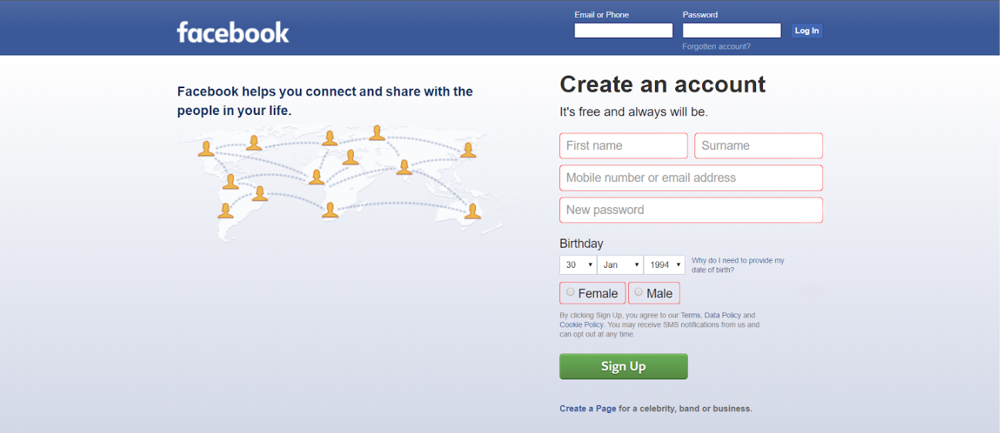
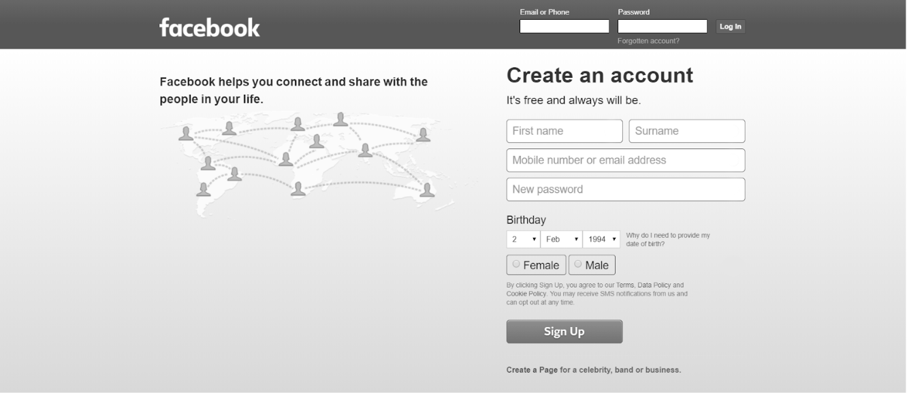
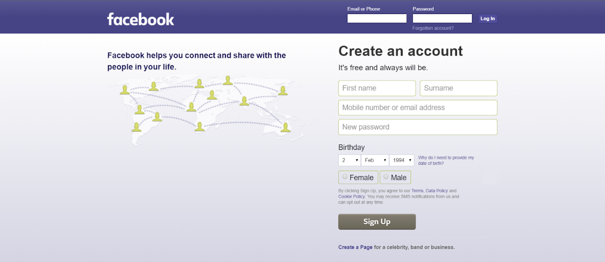
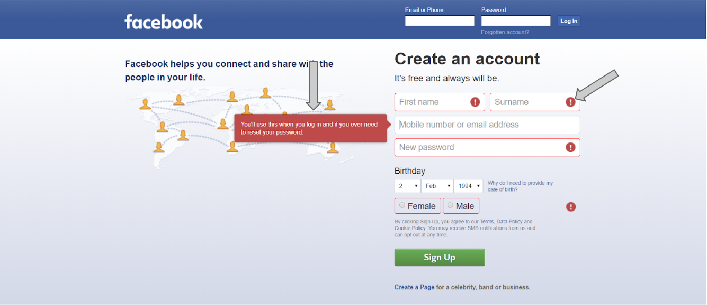
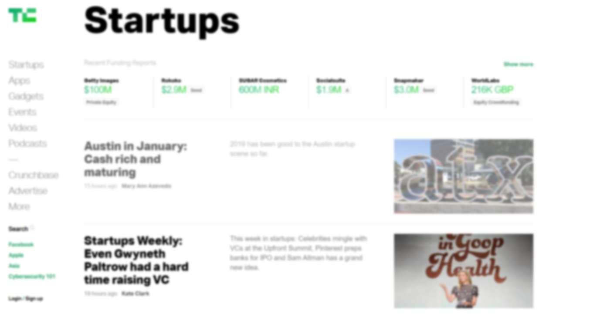
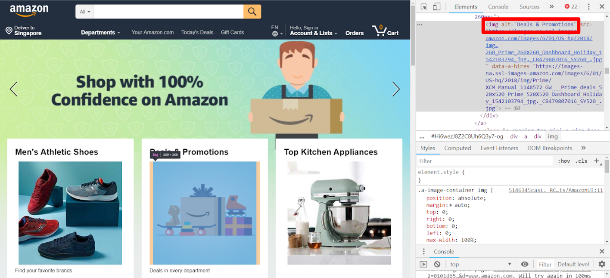
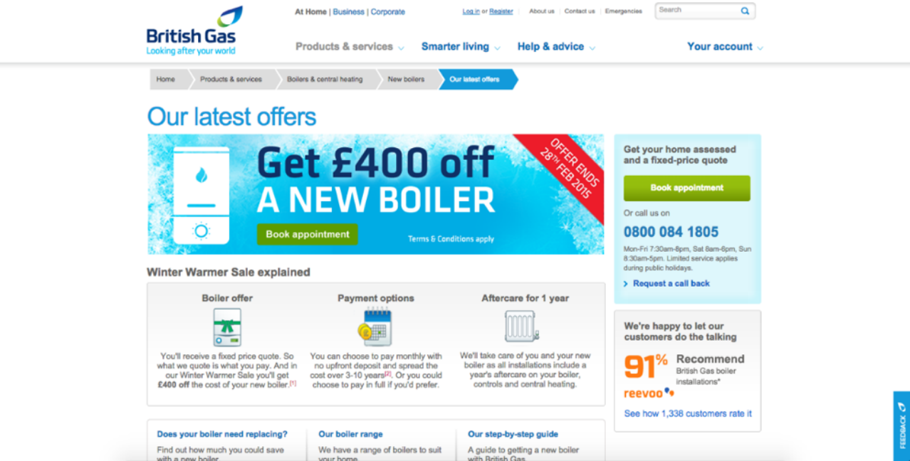
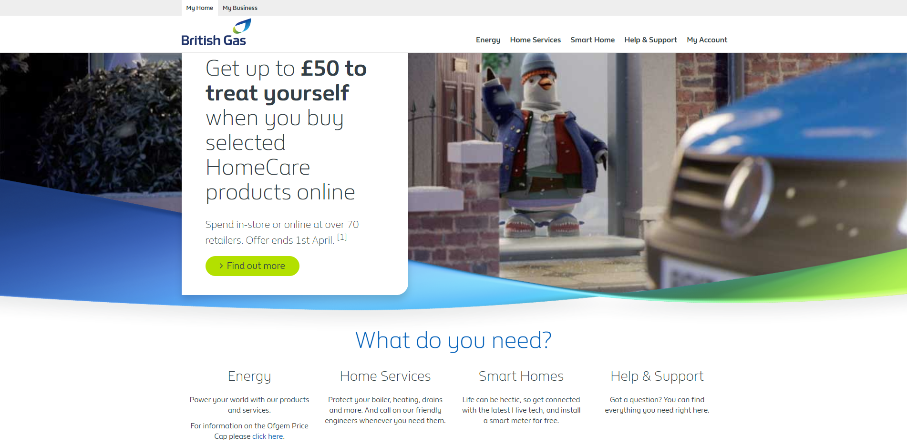
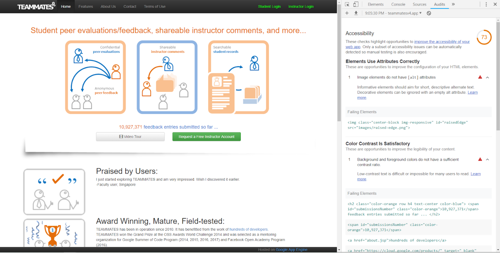

<frontmatter>
  title: Accessibility
  header: pagetop.md
  footer: footer.md
  head: head.md
  siteNav: mainNav.md
  pageNav: 3
</frontmatter>

# Accessibility

**Author(s): [Monika Manuela Hengki](https://github.com/monmanuela)**

Reviewers: [Rahul Rajesh](https://github.com/rrtheonlyone), [Jacob Li Pengcheng](https://github.com/jacoblipech), [Tan Heng Yeow](https://github.com/tanhengyeow)

<box type="info">
Note that although the scope of this article covers the accessibility of websites, many of the points also apply to accessibility and UI/UX of other softwares too.
</box>

## What is accessibility?

> Accessibility is the practice of making your websites usable by as many people as possible — we traditionally think of this as being about people with disabilities, but really it also benefits other groups such as those using mobile devices, or those with slow network connections. --[MDN Web Docs](https://developer.mozilla.org/en-US/docs/Learn/Accessibility/What_is_accessibility)

## Why is accessibility important?

Accessibility is important for users with disabilities to access the Web. There are many kinds of disabilities, including:
   * Visual %%e.g., partial blindness, full blindness, color blindness, cataract, glaucoma, etc.%%
   * Auditory %%e.g., hard of hearing, deafness, etc.%%
   * Cognitive %%e.g., ADHD, autism spectrum, etc.%%
   * Mobility %%e.g., quadriplegia, muscular dystrophy, etc.%%

At the same time, accessibility also benefits people _without_ disabilities, for example:
   * Device limitations %%e.g., using mobile phones, smart watches, smart TVs, and other devices with small screens, different input modes, etc.%%
   * Age-related limitations %%e.g., poor dexterity, poor eyesight%%
   * Temporary limitations %%e.g., broken arm, lost glasses%%
   * Situational limitations %%e.g., under bright sunlight, an environment where one cannot listen to audio%%
   * Internet-related limitations %%e.g., slow Internet connection, limited bandwidth%%

More information on the above can be found on [this article](https://www.w3.org/WAI/fundamentals/accessibility-intro/#what).

Improving accessibility also brings some benefits to you as a developer:
1. **Accessibility is a right**. Caring about accessibility demonstrates good ethics/morals.
2. **Accessibility helps you improve your website's UX**. [W3C](https://www.w3.org/standards/webdesign/accessibility) notes that accessibility practices are good design practices in general, which improve the UX of your website.
3. **Accessibility makes your website more discoverable**. Web pages with good accessibility practices are ranked higher by search engine crawlers, making your website more discoverable and marketable to new users. %%(Read more on accessibility and search engine [here](https://blogs.perficientdigital.com/2018/01/12/website-accessibility-benefit-seo/))%%
4. **Accessibility helps you increase your user base**. According to the [World Health Organization world report on disability](https://www.who.int/disabilities/world_report/2011/report/en/), about 15% of the world's population live with some form of disability. That makes up more than 1 billion people. It is a significant population of users, so improving accessibility can help you reach more people.
5. **Accessibility is part of the law in some places**. In [some countries](https://www.w3.org/WAI/policies/), abiding by accessibility guidelines is mandatory. Be careful not to break the law!

## How can I improve the accessibility of my website?

There are many ways to improve the accessibility of your website. Below are some tips, based on the type of disabilities they address.

### Visual
Users with visual impairments rely on assistive technologies such as a magnifier or a screen reader.

##### :fas-thumbs-up: Best practice: Use more visual indicators to convey a message
  
Let us look at the Facebook sign up page. Suppose I want to sign up for a new account, but I have not put in all the necessary information. So, it is supposed to tell me that my attempt to sign up has failed.

This page below uses a red color border around the text box to show that the information needed is missing. As red usually signifies failure, this seems enough.

However, to someone with a type of color blindness called [achromatopsia](https://en.wikipedia.org/wiki/Achromatopsia), this is how the page looks like:

To someone with another type of color blindness, [deuteranopia](https://en.wikipedia.org/wiki/Deuteranopia), the page looks like this:

It may be unclear to color-blind users that the sign up has failed. To avoid confusion, we should not rely on colours alone to convey a message. Instead, we should use more visual indicators such as icons or an explanation box.

##### :fas-thumbs-up: Best practice: Maintain good color contrast
  
Look at this page taken from Tech Crunch.

To users with good vision, the design may look minimalist and clean. However, to someone suffering from cataract, the page looks like this.

It gets difficult to read the news snippets because of the poor color contrast (grey on white). On the other hand, the black colored texts are still legible. Thus, we should maintain good color contrast ratio in our websites for ease of reading.

##### :fas-thumbs-up: Best practice: Use `alt` attribute for images
  
The `alt` attribute provides alternative information for an image that can be read out by a screen reader to describe an image.

The above are some examples of best practices to follow when developing for web accessibility. More can be found in [this article on developing for accessibility](https://www.w3.org/WAI/tips/developing/).
  
### Auditory
Hearing-impaired users do use assistive technologies such as a [hearing aid](https://en.wikipedia.org/wiki/Hearing_aid) or a [cochlear implant](https://en.wikipedia.org/wiki/Cochlear_implant), but these are not specific for accessing websites.

For users with hearing impairment, we should provide text alternatives to audio content, such as:
  * Text transcripts
  * Captions

Here's a [tutorial on adding transcripts](https://www.w3.org/2017/04/xsmedia-tute/page5.html). Adding captions is commonly supported in video hosting websites such as Youtube or Vimeo.

More information can be found on [this article on transcripts and captions](https://webaim.org/techniques/captions/).
  
### Cognitive
Cognitive disabilities range from mental illnesses to learning difficulties, difficulties in comprehension and concentration, etc. Some examples include [Attention Deficit Hyperactivity Disorder (ADHD)](https://en.wikipedia.org/wiki/Attention_deficit_hyperactivity_disorder), and [autism](https://en.wikipedia.org/wiki/Autism).

Such disabilities might affect how the user uses a website. It could be due to difficulty in understanding how to complete a task, remembering how to do something that was previously accomplished, increased frustration due to confusing workflows or inconsistent layouts/navigation/other page features.

Unlike other web accessibility issues, there is no quick fix to issues arising from cognitive disabilities. The rule of thumb you can follow is to always design your websites to be as logical, consistent, and usable as possible. Here are some best practices mentioned by [MDN Web Docs](https://developer.mozilla.org/en-US/docs/Learn/Accessibility/What_is_accessibility#People_with_cognitive_impairments) and [National Autistic Society](https://www.autism.org.uk/professionals/others/website-design.aspx):

##### :fas-thumbs-up: Best practice: Avoid distractions  
People with cognitive disabilities are more easily distracted, or they may have heightened sensory awareness where cluttered pages can be overwhelming.
  * Avoid unnecessary movements from animations or moving elements
  * Have a clean and uncluttered design
  
  Here's a comparison of a cluttered vs clean website landing page taken from [British Gas website](https://www.britishgas.co.uk/).
  
  Cluttered page:
  

  Clean page:
  

##### :fas-thumbs-up: Best practice: Be logical
  * Multi-stage processes should be broken down into logical steps, with regular reminders of how far through the process you are, and how long you've got left to complete the process, if appropriate.
  * Workflows are logical, simple, and require as little interaction as possible to complete.

##### :fas-thumbs-up: Best practice: Be consistent
  * Navigation, header, footer, and main content are always in the same places.
  * Navigation mechanisms are consistent in appearance and behaviour.

##### :fas-thumbs-up: Best practice: Communicate well  
People with cognitive disabilities are more likely to take things literally and can benefit from more visual cues.
  * Pages are not overly long or dense in terms of the amount of information presented at once.
  
    > [An article](https://www.lifewire.com/web-page-length-3468959) says a rule of thumb is "No article should exceed 2 printed pages of double-spaced, 12 point text." whereas [another article](https://www.greenmellenmedia.com/how-long-should-my-website-content-be/) says "There is no "magic number" for a number of characters for content. As long as the web page content is clear, to the point and written for people". Ultimately, what's most important is what _your_ users think, so validation during user testing is paramount.

  * The language used is as plain and easy to follow, and not full of unneccessary jargon and slang.
  * Important points and content are highlighted in some way.
  * User errors are clearly highlighted, with help messages to suggest solutions.

More importantly, after following the best practices, you should conduct user testing with people with cognitive disabilities. Sometimes the web page may look fine to someone without disabilities, but it could be difficult for someone with autism or ADHD to navigate through the web page.

WebAIM's [Cognitive](http://webaim.org/articles/cognitive/) page provides a useful expansion of the ideas above, and is certainly worth reading.

### Mobility
Mobility impairments include paralysis, physical weakness or loss of control in limbs. This can cause users to find it difficult or impossible to use a mouse as the main form of interaction with websites.

Assistive devices include a [switch access](https://en.wikipedia.org/wiki/Switch_access), or a [head pointer](https://www.performancehealth.com/baseball-cap-head-pointer). Users may also use a keyboard instead of a mouse to interact with the website.

The key to improve accessibility for mobility is to make the website keyboard accessible. Keyboard accessible means that users can navigate through the website using the keyboard. For example, users can use `Tab`, `Shift` + `Tab` keystrokes to navigate through interactive elements on a page, click `Enter` to open a hyperlink, etc.

WebAIM's article on [keyboard accessibility](https://webaim.org/techniques/keyboard/) provides a thorough tutorial for this.

## Tools for Developers
Here are some useful tools that you can use to improve the accessibility of your website:

* [**Google Lighthouse**](https://developers.google.com/web/tools/lighthouse/). Google Lighthouse is an automated tool that audits the accessibility level of your websites. It can be found in Chrome DevTools. Given a URL to audit, Lighthouse runs a series of audits and generates a report. The failing audits will show which part of the page causes it, and how to fix it.  
Here's how an audit report looks like:

* [**Color Safe Palette Generator**](http://colorsafe.co/). This website can help you to create a color palette that is based on the Web Content Accessibility Guidelines (WCAG) for text and background contrast ratios.

* [**ChromeLens**](http://chromelens.xyz/). This Chrome extension has 2 useful features:
  * **Filters**: To simulate various color blindness so you can browse your website as how a color blind person sees it.
  
  * **Tracker**: To show the pathway a blind user will go through when browsing your web page with a screen reader. You can check if your web page goes through a logical flow and that the important content is included for the screen reader to narrate.
  

Note that although there are many accessibility testing tools available, user testing with actual users with disabilities is still important. The automated testing tools may not point out all of the accessibility issues that actual users face.

## Concluding Remarks
Ultimately, the most important thing you need to start designing accessible websites is empathy for your users. Each user is unique, and each user has different needs. As a developer, you need to put yourself in the users' shoes, understand their pain points, and then develop solutions for them so that everyone can navigate through your website freely.

## Useful Resources
You are ready for your accessibility journey! Here are some resources to help you get started:
* [**The A11Y Project**](https://a11yproject.com/resources). The Accessibility Project is an open-source resource library on accessibility. It seeks to make it easier for developers to implement accessible websites by providing tips, tutorials and a widget and pattern library.
* [**Web Content Accessibility Guidelines (WCAG)**](https://www.w3.org/WAI/standards-guidelines/wcag/). WCAG provides a single shared standard for web content accessibility that meets the needs of individuals, organizations, and governments internationally.
* [**Web Accessibility in Mind (WebAIM)**](https://webaim.org/articles). WebAIM contains well-written articles on specific topics on accessibility issues and how to tackle them.

